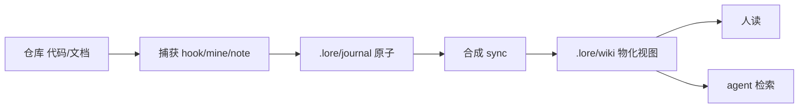

# lore

把代码仓库变成「活文档」：代码、文档、决策、数据流都折叠进**人和 agent 都能用**的 wiki 页。第一次打开从这里读起。

<!-- LORE_HOME_STATUS:START -->
## Status

- Version: `0.4.1`
- Code: `e105652`
- Updated: `2026-06-06`
- Axes: `component 1 · docs 33`
- Language: `zh` default · `zh, en` available
- Translations: `0 ready` · `0 stale` · `34 missing`
<!-- LORE_HOME_STATUS:END -->

## 知识流

## 理解项目

- [[lib]] —— 引擎核心：捕获 → journal → 合成 → 消费 + lint 全流程

## 排查问题

- [[ROADMAP]] —— 路线图与已知缺口

## 决策与时间线

- [[changelog]] —— 版本变更史（最新在上）
