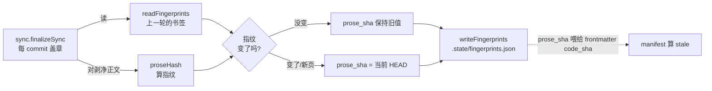

# component: fingerprint

## 概览

**一句话**：`fingerprint.js` 是引擎的**「正文新鲜度」存储层**——它不参与盖章、不算 stale，只干一件事：**为每张 wiki 页存一条 `{prose_hash, prose_sha}` 小记录**，让别人能判断「这页的架构正文自上次以来到底动没动」。

**为什么需要它（类比）**：把一张 wiki 页想成一篇文章。它身上混着两种东西——
- **机械戳**：日期、`code_sha`、原子数、页尾的「决策史」区块。每次 commit 后台盖章都会刷新，跟「人写的内容」无关。
- **人写的正文**：agent 读源码后写的那段架构讲解。它**只有 agent 重写时才变**。

如果直接拿「整页文本」判断新鲜度，机械戳一刷新就会让你误以为「正文变了」。fingerprint 的活儿就是**把机械戳剥掉、只给人写的正文留一个指纹**，于是「正文新鲜度」和「机械盖章」彻底解耦。

**两个术语就地说人话**（全篇只此两个，先认下）：
- `prose_hash` —— **正文的指纹**。算法：把整页文本**剥掉 frontmatter（开头 `---` 区）、剥掉哨兵区（`<!-- LORE_*:START -->…END -->` 包住的机械块）**，对剩下的纯正文取 sha256。改日期 / 改 `code_sha` / 改决策史区块 → 指纹**不变**；agent 重写架构正文 → 指纹**变**。
- `prose_sha` —— **正文上次被重写时的那个 commit**（git short sha）。它是「这页正文定格在哪个版本」的书签。

**它在流水线的位置**：



> fingerprint 自己只提供四个**纯函数 + 一个路径**（图里 `readFingerprints` / `proseHash` / `writeFingerprints` / `fingerprintsPath`）；中间那个「指纹变没变 → prose_sha 保持还是推进」的判断逻辑住在调用方 `resolveProseSha @ lib/sync.js`，不在本模块。

**一个具体场景看懂「诚实 stale」**：

> 你改了 `lib/a.js` 一行、**没动**这页的架构正文，commit。后台 finalize 跑起来：
> 1. `readFingerprints` 读出这页上一轮的 `{prose_hash: H, prose_sha: 旧sha}`。
> 2. 对**剥净正文**算 `proseHash` → 还是 `H`（正文一个字没改）。
> 3. 指纹没变 → `prose_sha` **保持旧sha 不动** → 盖进 frontmatter 的 `code_sha` 也停在旧sha。
> 4. manifest 算 `stale = 旧sha..HEAD 的 commit 数 = 1`：**「这页正文落后 1 个 commit」**——诚实提醒你「源码动了、该让 agent 重写正文了」。
>
> 反过来你让 agent 重写了正文 → `proseHash` 变 → `prose_sha` 推到当前 HEAD → 下轮 `stale` 归零。

**为什么这么设计**：盖章纯机械、能在 commit 后**后台自动跑**（提交即刷新）；而重写正文要 LLM（贵、慢）。fingerprint 这层让两者解耦——机械盖章天天刷，正文只在「源码真的动了」时按需重写，且 manifest 能据此**诚实地**标出哪页正文过期，而不是被机械戳的抖动骗到。状态文件是**本地缓存、gitignored、可随时重建**（删了下次 finalize 自动重灌），所以它不是「真相源」，只是加速 stale 判断的书签本。

想查 BUG 或改 fingerprint？展开下面机制档 👇

## 机制详解

<details>
<summary><b>⓪ 调用入口 & I/O</b> —— 谁调它、读写哪些文件</summary>

- **唯一调用方**：`finalizeSync @ lib/sync.js`（每次 commit 后台盖章时跑一次）。
  - 开头 `readFingerprints(stateDir)` 读上一轮书签 → 装进闭包。
  - 逐页用 `resolveProseSha @ lib/sync.js` 调 `proseHash @ lib/fingerprint.js` 算指纹、决定 `prose_sha`。
  - 结尾 `writeFingerprints(stateDir, nextFingerprints)` 整体写回（顺带 GC 孤儿页，见 ⑤）。
- **读写文件**：`<loreDir>/.state/fingerprints.json`（路径由 `fingerprintsPath @ lib/fingerprint.js` 拼）。
  - **gitignored、本地缓存、可重建**：删掉 → 下次 finalize 把每页当「新页」seed，`prose_sha` 重置为当前 HEAD（代价：那一刻所有页 stale 归零，但不崩）。
- **测试调用方**：`test/fingerprint.test.js`（直接调四个导出，不经 sync）。

</details>

<details>
<summary><b>① 接口 / 能力面</b> —— 导出与签名</summary>

| 导出 | 签名 | 干什么 | 锚点 |
|---|---|---|---|
| `fingerprintsPath` | `(stateDir) → string` | 拼 `stateDir/fingerprints.json` 路径 | `fingerprintsPath @ lib/fingerprint.js` |
| `proseHash` | `(pageText) → "sha256:…"` | 算正文指纹（剥 frontmatter + 哨兵区） | `proseHash @ lib/fingerprint.js` |
| `readFingerprints` | `(stateDir) → map` | 读书签；缺/坏/非对象 → `{}` | `readFingerprints @ lib/fingerprint.js` |
| `writeFingerprints` | `(stateDir, map) → void` | 整体写回（建目录、尾换行） | `writeFingerprints @ lib/fingerprint.js` |

> `proseHash` 是 i18n 的 `translationSourceHash @ lib/i18n.js` 的 **re-export 别名**（同一函数、同一剥离规则），只换了个贴合「prose 新鲜度」语义的名字。两边天然同步：哨兵区剥离规则一处改、两处生效。

</details>

<details>
<summary><b>② 数据流</b> —— 模块内 + 与调用方接缝</summary>

本模块四个函数都是**无状态纯 I/O / 纯计算**，真正的「指纹变没变 → prose_sha 怎么走」决策在调用方。完整一轮（站在 finalize 视角）：

1. finalize 开头：`readFingerprints(stateDir)` → `fingerprints`（上一轮 map），另起空 `nextFingerprints = {}`（`readFingerprints @ lib/fingerprint.js`）。
2. 逐页：先把页文本经 `foldJournal` / `finalizeHomeText` 折成**本轮将写盘的稳定文本**，再对它调 `proseHash`（关键：对**折叠后**文本算，不是读入文本，见 ⑤）。
3. `resolveProseSha @ lib/sync.js`：`prev = fingerprints[rel]`；`prose_sha = (prev && prev.prose_hash === h) ? prev.prose_sha : codeSha`——**指纹同 → 保持旧 sha；指纹异 / 无 prev（新页）→ 推到当前 HEAD**。同时把 `{prose_hash:h, prose_sha}` 记进 `nextFingerprints[rel]`。
4. 该 `prose_sha` 当作 `code_sha` 盖进页 frontmatter（`stampFrontmatter @ lib/sync.js`）。
5. finalize 结尾：`writeFingerprints(stateDir, nextFingerprints)` 整体落盘（`writeFingerprints @ lib/fingerprint.js`）。
6. 下游：frontmatter 的 `code_sha`（=`prose_sha`）被 manifest 用来算 `stale = code_sha..HEAD 的 commit 数`（按页的 staleScope 限定，见 [[manifest]]）。

</details>

<details>
<summary><b>③ 数据契约</b> —— fingerprints.json schema</summary>

`<loreDir>/.state/fingerprints.json`：键是页相对路径，值是书签。

```json
{
  "component/sync.md":        { "prose_hash": "sha256:3f…", "prose_sha": "3fbb170" },
  "component/fingerprint.md": { "prose_hash": "sha256:a1…", "prose_sha": "c8f0721" },
  "HOME.md":                  { "prose_hash": "sha256:9e…", "prose_sha": "7e37b19" }
}
```

- **键**：页相对 `wiki/` 的路径（如 `component/<mod>.md`、`HOME.md`）。INDEX **不进**指纹（纯机械 TOC、永远当前）。
- **`prose_hash`**：`"sha256:" + 64 位十六进制`，即 `proseHash(剥净正文)`。
- **`prose_sha`**：git short sha（正文上次重写时的 HEAD）。
- **写盘格式**：`JSON.stringify(map, null, 2) + '\n'`（2 空格缩进 + 尾换行，diff 友好）。
- **整体语义**：每轮 finalize 用**全新的** `nextFingerprints` 覆盖旧文件——只装本轮处理过（仍存在）的页，已删页天然不在 → 见 ⑤ 的孤儿 GC。

</details>

<details>
<summary><b>⑤ 边界 / 坑</b> —— 查 BUG 必看</summary>

- **`readFingerprints` 全方位退化为 `{}`**（`readFingerprints @ lib/fingerprint.js`）：文件不存在、JSON 解析抛错、解析出 `null` / 非对象 / **数组** → 一律返回 `{}`，绝不抛。后果：每页被当「新页」seed，`prose_sha` 重置为当前 HEAD（那一刻 stale 归零），不崩。**这是「可重建缓存」的设计兜底，不是 BUG。**
- **`proseHash` 的剥离边界**（复用 `translationSourceHash @ lib/i18n.js`）：剥 frontmatter（`parseFrontmatter().body`）+ **所有** `<!-- LORE_*:START -->…END -->` 哨兵区 + 尾部 `trimEnd()`，再 sha256。含义：改日期 / `code_sha` / 决策史哨兵内容 / HOME 状态块 → 指纹**不变**；只有哨兵**外**的人写正文动了才变。**坑**：若某页把本该机械的内容写在哨兵**外**，会被误算进指纹（正文一动就推 prose_sha）；反之哨兵**内**的任何变化对指纹隐形。
- **必须对「折叠后」文本算指纹，不是读入文本**（接缝在 `resolveProseSha @ lib/sync.js` 的调用点）：`{{LORE_JOURNAL}}` token ↔ 哨兵区形态在**首次** finalize 时跳变；若对读入文本算，seed 后第一次机械刷新会被误判成「正文变了」而错误推进 `prose_sha`（A 期实测踩过的坑）。本模块只负责「给什么算什么」，喂错文本的风险在调用方。
- **`writeFingerprints` 整体覆盖 + 隐式 GC**：每轮传**全新** `nextFingerprints`（只含本轮处理页），已删页的旧条目天然丢弃 → 孤儿自动清。它会 `mkdirSync(dirname, {recursive})` 建好 `.state/`，故首跑无需预创建目录。

</details>

<details>
<summary><b>⑥ 故障地图</b> —— 症状 → 定位</summary>

| 症状 | 很可能的原因 | 先看哪里 |
|---|---|---|
| 改了源码、没改正文，stale 却**没涨** | `prose_sha` 被错误推进 → 多半是对「读入文本」而非「折叠后文本」算了指纹 | `resolveProseSha @ lib/sync.js` 调 `proseHash` 的入参 |
| 没改正文，stale 却**归零** | 指纹被误判变化 → 机械内容写在了哨兵**外**，或哨兵标记拼写不符 `LORE_*` | 该页哨兵区 + 剥离规则 `translationSourceHash @ lib/i18n.js` |
| 所有页 stale 突然全归零 | `.state/fingerprints.json` 被删 / 损坏 → 全量 seed | `readFingerprints @ lib/fingerprint.js`（退化为 `{}`） |
| `fingerprints.json` 写不出 | `.state/` 不可写 | `writeFingerprints @ lib/fingerprint.js`（`mkdirSync` 后 `writeFileSync`） |
| 指纹格式不是 `sha256:…` | 调到了别的 hash / 改了 i18n 算法 | `proseHash @ lib/fingerprint.js` → `translationSourceHash @ lib/i18n.js` |

</details>

<details>
<summary><b>⑦ 测试锚点</b> —— test/fingerprint.test.js</summary>

| 测试 | 锚的不变量 | 锚点 |
|---|---|---|
| `writeFingerprints → readFingerprints round-trips` | 写进去什么、读出来一模一样（deepEqual） | `test/fingerprint.test.js` |
| `readFingerprints: missing file → {}` | 文件缺失退化为 `{}` | `test/fingerprint.test.js` |
| `readFingerprints: corrupt JSON → {}` | 坏 JSON 退化为 `{}`（不抛） | `test/fingerprint.test.js` |
| `proseHash ignores frontmatter + sentinel regions, tracks prose body` | 改 frontmatter（日期/sha）+ 改决策史哨兵内容 → 指纹**不变**；改架构正文 → 指纹**变**；格式 `sha256:[0-9a-f]{64}` | `test/fingerprint.test.js` |

</details>

<details>
<summary><b>⑧ 不变量</b> —— 这些永远成立</summary>

- **指纹对机械戳免疫**：frontmatter（日期 / `code_sha` / 计数）+ 任意 `LORE_*` 哨兵区内容变化 → `prose_hash` 不变。
- **指纹随正文变化**：哨兵**外**的人写正文改一个字 → `prose_hash` 必变。
- **格式恒定**：`proseHash` 输出恒为 `sha256:` + 64 位小写十六进制。
- **读永不抛**：`readFingerprints` 对缺失 / 坏 / 非对象输入恒返回 `{}`。
- **重建安全**：删掉 `fingerprints.json` 不破坏正确性，只让下次 finalize 全量 seed（`prose_sha` 重置为当前 HEAD）。
- **写即 GC**：`writeFingerprints` 落盘后，文件里只剩本轮传入 map 的键，孤儿条目消失。

</details>

## 依赖 / 邻居

- **依赖**：`i18n`（`proseHash` 即 `translationSourceHash @ lib/i18n.js` 的 re-export；剥离规则、`sha256:` 前缀都源自这里）· `node:fs` · `node:path`。**无第三方依赖。**
- **被调**：`sync` 的 `finalizeSync @ lib/sync.js`（每 commit 盖章时读 → 算 → 写）。
- **下游消费**：`manifest`（用 frontmatter 的 `code_sha`=`prose_sha` 算 `stale`，按页 staleScope 限定）。
- **相关页**：[[sync]]（总装线、`resolveProseSha` 三态决策住这）· [[manifest]]（stale 计算）。

## Cross-links

- [[lib]]（鸟瞰页）· [[sync]] · [[manifest]]
