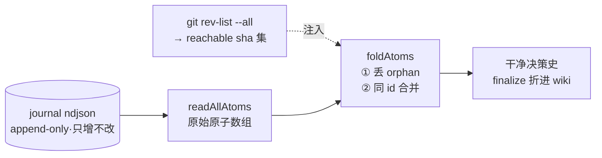

# component: fold

## 概览

**一句话**：`fold.js` 是 journal 的**去重对账员**——append-only 的原子流里，同一条决策被记了好几次、被 `git commit --amend` 抛弃的旧 commit 也还躺着；fold 在**读取的那一刻**把同一条的多份折成一条、把已经没人要的旧 commit 原子悄悄丢掉，下游拿到的就是一份干净账本。它**只读不写**，原始 ndjson 一个字节都不动。

**它在流水线的位置**：



**为什么 journal 会「脏」**：journal 是**只增不改**的——每记一笔就往当天的 `.ndjson` 文件尾巴上追加一行，从不回头删改。这条规矩很神圣（追加永远 <50ms、永不丢历史、并发安全），代价就是同一条决策会留下多份：先有 hook 自动记的骨架（skeleton），后有 agent 补上「为什么」的丰满版（enriched）；而你一旦 `git commit --amend`，旧 commit 的 sha 就**从 git 历史里消失**了，但当初记下的那条原子还赖在 journal 里——成了一条**孤儿（orphan）**，指向一个谁都到不了的 sha。

**一个场景看懂**：

> 你刚提交了一个 commit `abc123`，hook 自动往 journal 追加一条 `commit:abc123` 原子。
> 改了点东西，`git commit --amend` —— git 把这次提交重写成新 sha `def456`，**旧的 `abc123` 在历史里再也找不到**。
> hook 又追加一条 `commit:def456`。现在 journal 里**两条都在**：一条指向死掉的 `abc123`，一条指向活着的 `def456`。
> finalize 跑 `git rev-list --all` 拿到「当前所有可达 sha」喂给 `foldAtoms`。fold 一看：`abc123` 不在可达集里 → 这是 amend 抛弃的 orphan，**丢**；`def456` 在 → **留**。
> 决策史里这次提交**只出现一次**，没有幽灵旧 sha。

**为什么把对账放在「读取层」而不是「写入时清理」**：因为「写」必须神圣不可侵——append-only 才能保证记录快、并发安全、历史永不丢失。脏数据（重复、orphan）不在写入时清，而是**每次读取时按当下的 git 真相重新对账**。git 历史是会变的（amend、rebase），但只要每次读都重新比对一次可达性，账本就永远跟 git 当前状态一致。fold 因此被设计成一个**纯函数**：给它原子数组 + 可达 sha 集，它算出干净账本，自己不碰任何文件、不调 git——git I/O 由调用方（finalize）注入，所以 fold 极好测、极可控。

想查 BUG 或改 fold？展开下面机制档 👇

## 机制详解

<details>
<summary><b>⓪ 调用入口 & I/O</b> —— 谁调它、读写什么</summary>

- **被谁调**：`finalizeSync @ lib/sync.js`——盖章总入口的**第一步**就是 `foldAtoms(rawAtoms, { reachableShas })`，把折叠后的干净原子喂给下游（决策史折叠、HOME/INDEX 计数）。
- **输入**：① `readAllAtoms @ lib/journal.js` 递归读出的原始原子数组；② 一个 `reachableShas`（`Set<string>`），由调用方跑 `git rev-list --all` 算出「当前 git 可达的全部 commit sha」后注入。
- **I/O 边界**：`foldAtoms` 是**纯函数**——不读文件、不写文件、不调 git、不依赖时钟。所有副作用（读 ndjson、跑 git）都在调用方完成。这让本模块零环境依赖、可被单元测试直接喂 fixture 验证。
- **输出**：一个新的原子数组（同 id 已合并、orphan 已丢），首次出现顺序保持。

</details>

<details>
<summary><b>① 接口签名</b> —— 导出与参数</summary>

| 导出 | 签名 | 干什么 | 锚点 |
|---|---|---|---|
| `foldAtoms` | `(atoms, { reachableShas } = {}) → Atom[]` | 折叠总入口：先丢 orphan、再按 id 合并 | `foldAtoms @ lib/fold.js` |

参数：

- `atoms`：原始原子数组（`readAllAtoms` 的产出，未折叠）。
- `reachableShas`：可选。`Set<string>` 时按可达性丢 orphan commit；`null` / `undefined` / `{}`（非 Set）→ **不丢任何 orphan**，只做合并。

内部私有助手（不导出）：`union`（并集去重保序）· `mergeGroup`（合并同 id 一组原子）。

</details>

<details>
<summary><b>② 折叠数据流</b> —— 模块内 step-by-step</summary>

`foldAtoms @ lib/fold.js` 两步：

1. **① dropOrphans** —— 仅当 `reachableShas instanceof Set` 时过滤：丢掉 `kind === 'commit'` **且** `commit` 非空 **且** sha 不在可达集里的原子。decision 原子（`kind !== 'commit'` 或 `commit == null`）**恒保留**，绝不被可达性误伤。非 Set → 整组原样透传。
2. **② mergeById** —— 顺序扫一遍 kept，按 `id` 分组并记下**首次出现顺序**（`order` 数组）；每组交给 `mergeGroup`，最后按 `order` 还原顺序返回。

`mergeGroup @ lib/fold.js`（组内只有 1 条 → 原样返回；≥2 条才合并）：

- **基底 = ts 最早那条**（按 `ts` 升序排，取第一条）——决策在时间线上的位置，由它**第一次被记录**的时刻钉死，不随后续 enrich 漂移。
- **why**：基底的 why 起头，再依次追加后续 `enriched` 原子里**不同的、非空的** why（用 `\n\n` 拼接）——留下「骨架 → 丰满」的演化痕迹，不互相覆盖。
- **title / what_changed**：`firstNonEmpty`——基底优先，基底为空才取后续第一个非空。
- **refs.files / refs.related**：跨全组**并集去重**（保序）。
- **refs.pitfall**：扫全组，取**最后一个非 null** 的值（后写覆盖先写）。
- **enriched**：全组 **OR**——任一条 enriched 则结果 enriched。

</details>

<details>
<summary><b>③ 数据契约</b> —— 原子长什么样</summary>

输入原子（journal 原子，关键字段）：

```json
{
  "id": "commit:abc123",
  "ts": "2026-06-06T01:00:00-07:00",
  "kind": "commit",
  "commit": "abc123",
  "title": "feat: widget",
  "why": "",
  "what_changed": "",
  "refs": { "files": ["a.js"], "pitfall": null, "related": [] },
  "enriched": false
}
```

- `id`：折叠的**分组键**。`commit:<sha>`（commit 原子）或 `note:<n>`（decision 原子）。
- `kind` / `commit`：dropOrphans 的判据——只有 `kind==='commit'` 且 `commit` 非空才参与可达性检查。
- `ts`：决定合并基底（最早者）。
- `enriched`：标记 agent 是否补过料；决定 why 是否被追加、参与 OR。
- `refs.{files,related,pitfall}`：合并时分别走并集 / 并集 / 最后非 null。

折叠后原子：**与输入同构**（`{ ...base, 覆盖若干字段 }`），下游无需感知是否折叠过。

</details>

<details>
<summary><b>④ 合并规则表</b> —— 每个字段怎么合</summary>

| 字段 | 合并规则 | 直觉 |
|---|---|---|
| `ts` | 全组**最早** | 时间线位置由首次记录钉死 |
| `id` | 不变（分组键） | 同 id 才进同一组 |
| `why` | 基底起头 + 追加后续 enriched 的不同非空 why（`\n\n`） | 留 skeleton→enriched 演化痕迹 |
| `title` | `firstNonEmpty`（基底优先） | 标题以最早确定者为准 |
| `what_changed` | `firstNonEmpty`（基底优先） | 同上 |
| `refs.files` | 全组**并集去重**（保序） | 历次涉及文件汇总 |
| `refs.related` | 全组**并集去重**（保序） | 关联汇总 |
| `refs.pitfall` | 全组**最后一个非 null** | 后写的坑覆盖先写 |
| `enriched` | 全组 **OR** | 任一丰满则结果丰满 |

</details>

<details>
<summary><b>⑤ 边界 / 坑</b> —— 查 BUG 必看</summary>

- **`reachableShas` 缺省即退化**：`null` / `undefined` / `{}` / 任何非 `Set` → **跳过 dropOrphans，只合并不丢孤儿**。判据是 `reachableShas instanceof Set`，普通对象 `{}` 不是 Set，会被当「没传」。这是有意的安全退化：拿不到 git（非 git 仓库 / rev-list 失败）时宁可保留全部、不误删历史。
- **空集 ≠ 不传**：`reachableShas: new Set()`（空集）= 「啥都不可达」，会把**所有 commit 原子**判为 orphan 丢掉（但 decision 原子仍全保留）。要「不过滤」必须传非 Set，别传空 Set。
- **decision 原子对可达性免疫**：`note:*` 这类 `commit == null` 的原子，哪怕在空可达集下也**永不被丢**——它们本就不对应 git commit。
- **合并只看 `id`，不看 title/sha**：amend 重生的新旧两条是**不同 id**（旧 sha vs 新 sha），不会被合并成一条；旧的靠 dropOrphans 丢、新的靠可达留——而不是靠 merge。
- **why 追加只认 `enriched` 标志**：后续原子若 `enriched=false`，它的 why **不会**被追加（防 hook 重复骨架噪声灌进决策史）。

</details>

<details>
<summary><b>⑥ 故障地图</b> —— 症状 → 定位</summary>

| 症状 | 大概率原因 | 看哪 |
|---|---|---|
| 决策史里同一 commit **出现两次**（一旧 sha 一新 sha） | orphan 没被丢：调用方没传 `reachableShas`，或传了非 Set（如 `{}`），或可达集漏了该 sha | 调用方 `git rev-list --all` 是否成功、是否 `instanceof Set`；见 `foldAtoms @ lib/fold.js` ① |
| 决策史**整段消失** / commit 全没了 | 传了**空 Set**当可达集 → 全 commit 判 orphan | 调用方可达集为何为空（rev-list 跑空 / 仓库无提交） |
| 同一条决策的 why **被覆盖**、丢了骨架/丰满版 | 误解合并语义；why 是追加非覆盖，只认 enriched | `mergeGroup @ lib/fold.js` 的 `pushWhy` |
| 决策史时间线**位置乱跳** | 误以为 enrich 会更新 ts；基底恒取最早 | `mergeGroup @ lib/fold.js` 排序取 `sorted[0]` |
| decision 原子（note）被莫名丢掉 | 不应发生——note 对可达性免疫；检查其 `kind`/`commit` 是否被误写成 commit 形态 | `foldAtoms @ lib/fold.js` 的 filter 条件 |

</details>

<details>
<summary><b>⑦ 测试锚点</b> —— 行为由哪些用例钉死</summary>

`test/fold.test.js`（全部直接喂 fixture，无 git、无 IO）：

| 用例 | 钉死的不变量 |
|---|---|
| `empty → empty` | 空入空出 |
| `single atom passes through unchanged` | 单条原样透传（不进 merge 分支） |
| `distinct ids kept in first-seen order` | 不同 id 保首次出现顺序 |
| `same id merges — ts earliest, why appended, files union, pitfall last-non-null, enriched OR` | 合并五条规则一次性钉死 |
| `drops orphan commit atoms (sha not in reachable set)` | dropOrphans 丢不可达 commit |
| `no reachableShas (omitted / {} / null) → nothing dropped` | 三种非 Set 入参都退化为不过滤 |
| `decision atoms ... never dropped by reachability` | 空集下 note 仍保留 |
| `amend biting — orphan(old) + reborn(new), same title diff id → only reborn survives` | amend 场景端到端：旧死新活 |

</details>

<details>
<summary><b>⑧ 不变量</b> —— 这些永远成立</summary>

- **append-only 神圣**：fold 永不写 ndjson、永不改原始原子（合并产出是 `{ ...base }` 新对象，原对象不动）。
- **ts 取最早**：合并后 `ts` = 全组最早，决策时间线位置稳定，不随 enrich 漂移。
- **refs 并集**：`files` / `related` 跨全组并集去重且保序，历次信息只增不漏。
- **顺序保真**：输出按 id **首次出现顺序**排列。
- **纯函数 / 可达性注入**：无 IO、无时钟、无随机；git 真相由调用方注入，相同输入恒得相同输出。
- **decision 原子免疫**：非 commit / `commit==null` 的原子永不被可达性过滤丢弃。

</details>

## 依赖 / 邻居

- **被调**：`finalizeSync @ lib/sync.js`（盖章第一步折叠原始原子）。
- **配合**：`journal.js`（`readAllAtoms` 供原始原子）· git `rev-list --all`（调用方注入可达 sha 集）。
- **相关页**：[[sync]]（折叠后折进决策史 + 计数）· [[mine]] / hook（往 journal 追加 commit 原子的源头）。

## Cross-links

- [[lib]]（鸟瞰页）· [[sync]] · [[mine]]
