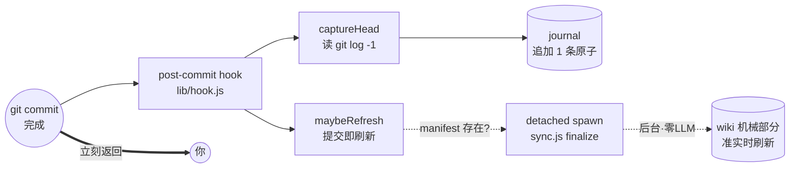

# component: hook

## 概览

**一句话**：`hook.js` 是装在 git 上的 **post-commit 钩子**——你每提交一次，它在后台**记一条流水账**（这次 commit 动了哪些组件）、再**踢一脚 wiki 让它自动刷新**，然后立刻闪开，绝不让你的 commit 多等一秒。

**类比**：像超市收银台的小票打印机。你结账（commit）的那一刻，它「啪」地吐一张小票存档（journal 原子），顺手通知后厨补货（finalize 刷 wiki）——但收银（commit）本身从不为它停顿，打印机卡纸了你照样拿东西走人。

**主干图**：



**一个场景串到底**：

> 你改完 `lib/a.js`，敲 `git commit`。提交一落地，git 自动跑这个 hook：
> ① `captureHead` 跑 `git log -1` 拿到刚才这条 commit，算出它的「原子」（标题、改了 `lib` 这个组件、来源 `hook`），**追加**进 journal——这就是那张存档小票。
> ② `maybeRefresh` 看一眼「这仓库 sync 过没有」（有没有 `.manifest.json`），有就 **detached spawn** 一个后台进程跑 `sync.js finalize`，然后 `unref` 撒手不管。
> ③ 你的 `git commit` **此刻已经返回**了——你已经能敲下一条命令。后台那个 finalize 慢慢把 wiki 的机械部分（决策史、docs、状态、stale 计数）刷新到准实时，零 LLM、不要你操心。

**为什么这么设计**：钩子的铁律是**绝不能挡住 commit**。所以三条贯穿全文——
**best-effort**：任何一步出错都默默吞掉、当无事发生，宁可漏记一条也不让你 commit 失败；
**detached + unref**：刷新进程从 git 进程上**剪断脐带**独立活，git 不等它、它也不随 git 退出而被杀；
**manifest 闸门**：没 sync 过的仓库（没 manifest）压根不触发刷新——还没 wiki，刷什么。

想查 BUG 或改 hook？展开下面机制档 👇

## 机制详解

<details>
<summary><b>⓪ 调用入口 & I/O</b> —— 谁触发它、它读写什么</summary>

**触发**：git 的 `post-commit` 钩子（由 `/lore:init` 安装到 `.git/hooks/post-commit`）。每次 commit **成功后**由 git 自动以 `node lib/hook.js <repoRoot>` 调起，CLI 段（`process.argv[1] === 本文件` @ `lib/hook.js`）是入口。

**读**：
- `git log -1 --no-merges --name-only HEAD`（读最新这条 commit + 它改的文件名）。
- `.lore/config.yml`（取 `code_roots` / `themes` / `flows`，给原子打 facet 标签）。
- `.lore/journal/`（读已有原子 id，做幂等去重）。
- `.lore/wiki/.manifest.json`（**只判存在**，不读内容 —— 决定刷不刷新）。

**写**：
- `.lore/journal/`（**追加** 1 条 commit 原子；幂等时不写）。

**spawn**：`sync.js finalize <loreDir>`（detached 后台进程，机械刷新 wiki；本模块不读它的输出、不等它结束）。

</details>

<details>
<summary><b>① 接口 / 能力面</b> —— 导出与签名</summary>

| 导出 | 签名 | 干什么 | 锚点 |
|---|---|---|---|
| `captureHead` | `({repoRoot, journalDir, codeRoots, themes=[], flows=[]}) → {added: 0\|1}` | 把 HEAD commit 记成 1 条 journal 原子（幂等） | `captureHead @ lib/hook.js` |
| `maybeRefresh` | `({loreDir, spawnFn=spawn}) → {spawned: bool}` | manifest 存在则 detached spawn `finalize` | `maybeRefresh @ lib/hook.js` |

`spawnFn` 是**注入点**：默认就是 `node:child_process` 的 `spawn`，测试时换成桩函数断言「用什么参数 spawn 了」（见 ⑦）。

</details>

<details>
<summary><b>② 数据流</b> —— 模块内 step-by-step</summary>

**`captureHead`**（`captureHead @ lib/hook.js`）：

1. `execFileSync('git', ['log','-1','--no-merges','--name-only','HEAD'])` 拿最新 commit 文本（`GIT_FORMAT` 来自 `mine.js`）。
2. `parseGitLog(stdout)` 解析成 raw；**空（无 commit）→ 直接 `{added:0}` 返回**。
3. `commitAtom(raws[0], codeRoots, 'hook', themes, flows)` 造原子（来源固定 `'hook'`，按 `code_roots`/`themes`/`flows` 打 facet）。
4. `existingIds(journalDir).has(atom.id)` 命中 → **幂等短路 `{added:0}`**（重复跑 hook 不会写两条）。
5. 否则 `appendAtom(journalDir, atom)` 追加，返回 `{added:1}`。

**`maybeRefresh`**（`maybeRefresh @ lib/hook.js`）：

1. `existsSync(<loreDir>/wiki/.manifest.json)` 为假 → **`{spawned:false}` 直接返回**（manifest 闸门）。
2. 解析同目录的 `sync.js` 路径（`fileURLToPath(import.meta.url)` → `dirname` → `join`）。
3. `spawnFn(process.execPath, [syncJs,'finalize',loreDir], {detached:true, stdio:'ignore'})`。
4. `child.unref()` —— 让 git 父进程能在不等该子进程的情况下退出。
5. 返回 `{spawned:true}`；**整段包在 `try/catch`，任何异常 → `{spawned:false}`**。

**CLI 段**（`lib/hook.js` 末尾）：读 config → `captureHead` → `maybeRefresh`，**外层再裹一层 `try/catch` + `process.exit(0)`**（双保险，见 ⑤⑧）。

</details>

<details>
<summary><b>③ 关键数据契约</b> —— 输入/输出长什么样</summary>

**commit 原子**（`captureHead` 写进 journal 的那条，结构由 `commitAtom @ lib/mine.js` 定）：

```json
{
  "id": "<commit 唯一 id>",
  "title": "add b",
  "source": "hook",
  "facets": { "component": ["lib"], "theme": ["quality"], "flow": ["pipe"] }
}
```

- `source` 恒为 `"hook"` —— 区别于 `/lore:mine` 回填的 `"mine"`，标明「提交即记」来路。
- `facets.component` = commit 改过的文件落在哪些 `code_roots`；`theme`/`flow` 按 config 的 `match`/`spans` 规则打（见 ⑦ 测试）。
- `id` 幂等键：同一 commit 重跑 hook → id 相同 → 不重复追加。

**manifest 存在性判断**（`maybeRefresh` 的唯一前置条件）：

- 只看 `<loreDir>/wiki/.manifest.json` **文件存在与否**，**不解析内容**。存在 = 「这仓库 sync 过、有 wiki 可刷」→ 才 spawn finalize；不存在 = 还没 wiki → 不刷。
- 推论：新仓库 init 后、首次 `/lore:sync` 之前，hook 只记 journal、不触发刷新（无 manifest）。

</details>

<details>
<summary><b>⑤ 边界 / 坑</b> —— 查 BUG 必看</summary>

- **detached + unref 缺一不可**：`detached:true` 让子进程脱离 git 进程组、`unref()` 让 Node 事件循环不等它——两者齐活，git commit 才能在 finalize 还在后台跑时就返回。少 `unref` → 父进程可能挂着等子进程；少 `detached` → 子进程可能随父进程组一起被信号带走。
- **双层 try/catch + exit 0**：`maybeRefresh` 内层 try/catch 吞 spawn 失败；CLI 段外层 try/catch 再兜整体 + `process.exit(0)`。**任何异常都不冒泡成非零退出码**——git 看到 hook 失败也只是打条 warning，但这里连 warning 都不给，commit 永远干净。
- **manifest-gated**：没 manifest 不 spawn（见 ③）。别误以为「装了 hook 就会刷 wiki」——得先 sync 过一次。
- **`--no-merges`**：merge commit 被 git log 过滤掉、`parseGitLog` 返回空 → `captureHead` 走「空→`{added:0}`」分支，不为 merge 记原子（测试 `captureHead on a merge HEAD …` 兜的就是这条幂等性）。
- **Windows EPERM 隔离**：detached spawn 在 Windows 上偶发权限/句柄异常，全被内层 try/catch 吞进 `{spawned:false}`——刷新可能这次没起来，但**绝不污染 commit**。下次 commit 再触发即可，丢的只是一次准实时刷新。
- **极速连续 commit**：两次 commit 可能各 spawn 一个 finalize 叠跑——finalize 自身幂等全量重建、最后写赢、无锁（这是 [[sync]] 侧的决策，hook 不加锁）。

</details>

<details>
<summary><b>⑥ 故障地图</b> —— 症状 → 定位</summary>

| 症状 | 多半在哪 | 怎么查 |
|---|---|---|
| commit 后 journal 没多出原子 | `captureHead`：走了「空 / 幂等」短路 | 是不是 merge commit（`--no-merges` 滤掉）？该 commit 是否已记过（id 撞）？ |
| 原子的 `facets.component` 是空 | `code_roots` 没传到 / commit 没动 code_root 下的文件 | 查 `.lore/config.yml` 的 `code_roots`；查 commit 改的文件路径 |
| commit 后 wiki 机械部分一直不刷 | `maybeRefresh`：manifest 闸门没过 | `.lore/wiki/.manifest.json` 在吗？没在先跑一次 `/lore:sync` |
| 装了 hook 但似乎没跑 | post-commit 没装好 / 不是 git 仓库 | 看 `.git/hooks/post-commit`；CLI 段非 git 会被 try/catch 静默吞（见测试 `CLI never throws …`） |
| 后台 finalize 起了但 wiki 没变 | 问题在 `sync.js finalize`，不在 hook | hook 只负责 spawn；手动跑 `node lib/sync.js finalize .lore` 看真实报错 |
| Windows 上偶发不刷 | detached spawn EPERM 被吞 | 见 ⑤ Windows EPERM；下次 commit 自愈，或手动 finalize |

</details>

<details>
<summary><b>⑦ 测试锚点</b> —— 行为被哪条测试钉住</summary>

全在 `test/hook.test.js`，`maybeRefresh` 用**注入 `spawnFn`** 断言而不真起进程：

| 测试 | 钉住的行为 |
|---|---|
| `captureHead writes HEAD commit atom (source=hook), idempotent` | 记 1 条、`source='hook'`、`facets.component=['lib']`；重跑 `added:0` 不重复 |
| `captureHead on a merge HEAD …` | merge HEAD 第二次调用不新增（幂等 / `--no-merges` 兜底） |
| `CLI never throws / exits 0 even on a non-git dir` | 非 git 目录跑 CLI **不抛**（外层 try/catch + exit 0） |
| `captureHead tags theme from config themes` | `themes:[{id,match}]` → 原子 `facets.theme` |
| `captureHead tags flow from config flows` | `flows:[{id,spans}]` → 原子 `facets.flow` |
| `integration: init installs hook → a real commit auto-writes …` | 端到端：init 装 hook → 真 commit 自动落原子 |
| `maybeRefresh: 有 manifest → spawn finalize（detached）` | 注入 `spawnFn` 断言 `args=[syncJs,'finalize',lore]` |
| `maybeRefresh: 无 manifest → 不 spawn` | manifest 闸门：无 manifest → `spawned:false` |
| `maybeRefresh: spawn 抛错也不抛出（best-effort）` | `spawnFn` 抛错 → 吞掉、`spawned:false` |

</details>

<details>
<summary><b>⑧ 不变量</b> —— 任何改动都不能破</summary>

- **永不挡 commit**：`captureHead` / `maybeRefresh` / CLI 段三处都 best-effort，异常一律吞、退出码恒 `0`。这是 hook 存在的前提，高于一切。
- **幂等**：同一 commit 多次触发 hook，journal 至多一条原子（id 去重）。
- **manifest-gated 刷新**：无 `.manifest.json` 绝不 spawn finalize。
- **来源诚实**：hook 写的原子 `source` 恒为 `'hook'`。
- **零阻塞刷新**：finalize 必须 detached + unref，git 进程不为它停留。

</details>

## 依赖 / 邻居

- **依赖**：`mine`（`parseGitLog` / `commitAtom` / `GIT_FORMAT` 解析 commit、造原子）· `journal`（`existingIds` / `appendAtom` 幂等追加）· `config`（`parseConfigCodeRoots` / `parseConfigThemes` / `parseConfigFlows` 取 facet 规则）。
- **spawn（运行时调起，非 import）**：`sync.js finalize`（detached 后台机械刷新）。
- **被调**：git `post-commit` 钩子（由 `/lore:init` 安装）。
- **相关页**：[[mine]]（同源造原子，回填 vs 提交即记）· [[sync]]（finalize 是被 spawn 的那一头）。

## Cross-links

- [[lib]]（鸟瞰页）· [[sync]] · [[mine]]
