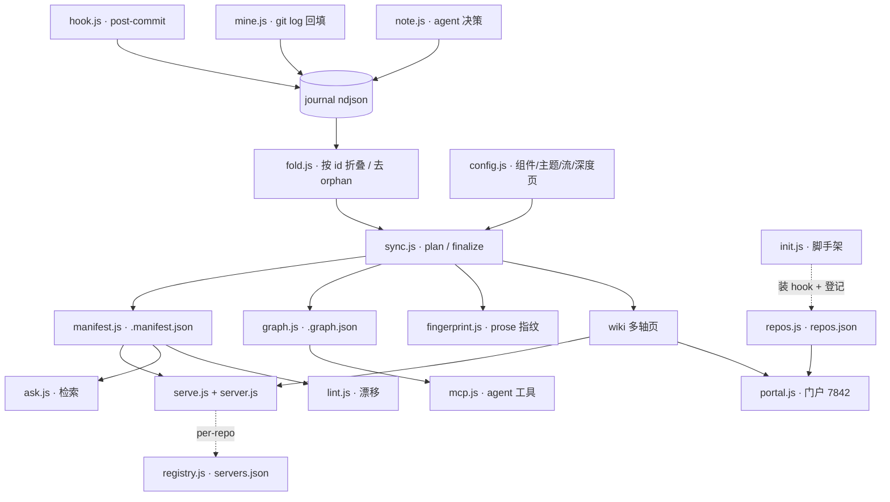

# component: lib

## Current architecture

一句话：`lib/` 是 lore 的全部引擎——纯 Node 内置、零依赖，把仓库变更沿「捕获 → 合成 → 消费」单向流水线变成 wiki。

> 📐 **本页是鸟瞰**，只讲模块间怎么拼。复杂模块各有**深度页**（完整机制 + 故障地图 + 测试锚点，点进去看）：
> [[sync]] · [[manifest]] · [[fingerprint]] · [[hook]] · [[fold]] · [[mine]]。

### 捕获：每次变更记成 journal 原子

- [[hook]] — post-commit 钩子，每次 commit 自动记一条原子（<50ms、不阻断 commit），并触发后台机械刷新。
- [[mine]] — 从 `git log` 全量回填历史，按 sha 幂等，据 config 打 component/theme/flow facet。
- `note.js` — agent 当场记决策原子（带 why）。
- `journal.js` — 三源都落成 append-only ndjson（按日分片、去重）。
- [[fold]] — 读取层按 id 折叠（why 追加 / refs 并集 / ts 最早），丢弃 amend、rebase 留下的 orphan。

### 合成：journal + 源码 → wiki

[[sync]] 三步走：**plan**（机械列页，增量）→ **写正文**（agent 读源码写「当前架构」）→ **finalize**（机械盖 frontmatter、折决策史、建 INDEX、产 `.manifest.json` + `.graph.json`）。

配套模块：

- `config.js` — 解析组件 / 主题 / 数据流 / **深度页**配置，驱动多轴打标。
- [[manifest]] · `graph.js` — 产出给壳和 agent 用的索引（含诚实 `stale`）与图谱。
- [[fingerprint]] — prose 指纹，解耦「正文新鲜度」与「机械 finalize」。
- `home.js` — HOME 首页 + 机械状态块（版本 / sha / 轴 / 语言）。
- `docs.js` — 把 `docs/` 等物化成 docs 轴（零 LLM）。
- `i18n.js` + `translate.js` — 双语翻译页（按需生成、防陈旧）。

### 消费：人读 + agent 读

- **人读 · 单仓**：`server.js`（**仓库根**的零依赖 HTTP server —— 静态 serve wiki + i18n 写 API + Host / 目录穿越防护）；`serve.js`（start/stop 生命周期 + python/node 运行时探测）+ `registry.js`（中央登记）+ 每仓稳定端口。
- **人读 · 门户**（v0.6）：`portal.js` 一个常驻端口 `7842` 聚合本机所有仓库；`repos.js` 发现各仓；按 `/<仓库>/` 路由。只读、仅绑本机。
- **agent 读**：`ask.js`（关键词检索）+ `mcp.js`（MCP 工具，顺 `.graph.json` 图谱推理）。深度页让图谱可遍历到**模块级**。

### 检查

- `lint.js` — 只读报告漂移（stale / orphan / missing），不自动改。

---

`init.js` 是一次性脚手架：建 `.lore/`、自动发现组件、拷壳、装 hook，并登记到门户。

## Decision history

<!-- LORE_JOURNAL:START -->
- **feat(sync): finalize maps deep pages to per-file staleScopes (honest per-module stale)** — Co-Authored-By: Claude Opus 4.8 <noreply@anthropic.com> (7e37b19, 2026-06-08)
- **feat(sync): planSync lists per-file deep-page worklist items (incremental by source file)** — Co-Authored-By: Claude Opus 4.8 <noreply@anthropic.com> (b94e048, 2026-06-08)
- **feat(config): parseConfigDeep — per-file deep-page declarations** — Co-Authored-By: Claude Opus 4.8 <noreply@anthropic.com> (6335e61, 2026-06-08)
- **feat(init): auto-register repo in ~/.lore/repos.json on init CLI (best-effort)** — Co-Authored-By: Claude Opus 4.8 <noreply@anthropic.com> (57a30e7, 2026-06-07)
- **feat(portal): portal lifecycle CLI (start/stop/list) on fixed port 7842** — Co-Authored-By: Claude Opus 4.8 <noreply@anthropic.com> (e7de56d, 2026-06-07)
- **feat(repos): ~/.lore/repos.json repo registry for portal discovery** — Co-Authored-By: Claude Opus 4.8 <noreply@anthropic.com> (6a45fe5, 2026-06-07)
- **fix(meta): docs pages show last-updated only (no atoms/code_sha chips)** — Co-Authored-By: Claude Opus 4.8 <noreply@anthropic.com> (e6a87e3, 2026-06-07)
- **fix(home): omit empty HOME sections instead of INDEX fallback** — Co-Authored-By: Claude Opus 4.8 <noreply@anthropic.com> (88c0515, 2026-06-07)
- **fix(i18n): exclude sentinel regions from translation source hash** — Co-Authored-By: Claude Opus 4.8 <noreply@anthropic.com> (179ae87, 2026-06-07)
- **feat(serve): stable per-repo port + registry list/stop-all** — Co-Authored-By: Claude Opus 4.8 <noreply@anthropic.com> (21e2bf7, 2026-06-07)
- **feat(registry): ~/.lore/servers.json server registry** — Co-Authored-By: Claude Opus 4.8 <noreply@anthropic.com> (cb31cf4, 2026-06-07)
- **feat(mcp): zero-dep stdio MCP server — lore_ask/page/neighbors** — Co-Authored-By: Claude Opus 4.8 <noreply@anthropic.com> (d3c3f90, 2026-06-07)
- **feat(graph): neighbors + resolvePagePath query helpers** — Co-Authored-By: Claude Opus 4.8 <noreply@anthropic.com> (939b988, 2026-06-07)
- **feat(sync): emit wiki/.graph.json (agent graph) in finalizeSync** — Co-Authored-By: Claude Opus 4.8 <noreply@anthropic.com> (43d4277, 2026-06-06)
- **refactor(manifest): runManifestCli returns { manifestPath, manifest }** — Co-Authored-By: Claude Opus 4.8 <noreply@anthropic.com> (b219e9e, 2026-06-06)
- **feat(graph): buildGraph — atom/page nodes + facet/refs_related edges** — Co-Authored-By: Claude Opus 4.8 <noreply@anthropic.com> (00251a1, 2026-06-06)
- **fix(sync): foldJournal warns only on first migration, not literal in-content tokens** — dogfood 暴露：决策史里若有 commit message 字面引用 {{LORE_JOURNAL}}（讲该 token 的 (94c1269, 2026-06-06)
- **fix(sync): rebuild decision-history section idempotently (sentinel region)** — foldJournal 从一次性 token 替换改为 ## Decision history section 整段重建 + (bb4c05f, 2026-06-06)
- **feat(sync): fold journal atoms in finalizeSync (orphan-free decision history)** — finalizeSync 先 foldAtoms(rawAtoms, {reachableShas: rev-list --all}) 再喂下游：决策史去重 + HOME/INDEX 计数一致。6 个旧单元测试改用真实可达 sha 的 fixture（realSha helper），反映 journal commit sha 是真实 commit 的前提；断言意图不变。 (cb06d75, 2026-06-06)
- **feat(fold): drop unreachable (amend/rebase orphan) commit atoms** — Co-Authored-By: Claude Opus 4.8 <noreply@anthropic.com> (632d5b8, 2026-06-06)
- **feat(fold): foldAtoms merge-by-id (why append, refs union, ts earliest)** — Co-Authored-By: Claude Opus 4.8 <noreply@anthropic.com> (9f73a55, 2026-06-06)
- **fix(config): parseConfigLanguage tolerates comment + CRLF on language: line** — v0.5.0's block regex required `language:` to end in whitespace+newline, so (988d48e, 2026-06-06)
- **feat(serve): prefer node server for bilingual repos** (4974cb2, 2026-06-05)
- **feat(translate): add sidecar translation command** (e2b85b9, 2026-06-05)
- **feat(manifest): read language and preferences** (4477a26, 2026-06-05)
- **feat(init): include language defaults** (36b7101, 2026-06-05)
- **feat(sync): generate human home page** (19aa253, 2026-06-05)
- **feat(manifest): expose home and translations** (ee22de0, 2026-06-05)
- **feat(i18n): add translation sidecar helpers** (b04feb8, 2026-06-05)
- **feat(config): parse wiki language preferences** (5d99c32, 2026-06-05)
- **feat(manifest): sort docs axis pages by last_updated desc** — Co-Authored-By: Claude Sonnet 4.6 <noreply@anthropic.com> (9f8cc7a, 2026-06-05)
- **feat(docs): buildDocsAxis returns specs sorted by date desc** — Co-Authored-By: Claude Sonnet 4.6 <noreply@anthropic.com> (c7187a7, 2026-06-05)
- **feat(docs): renderDocsPage embeds full body + plain-text source ref (no 404)** — Co-Authored-By: Claude Opus 4.8 (1M context) <noreply@anthropic.com> (2c3158e, 2026-06-05)
- **feat(docs): extractors carry source body for embedding** — Co-Authored-By: Claude Sonnet 4.6 <noreply@anthropic.com> (cd62734, 2026-06-05)
- **fix(docs): no empty docs axis when zero specs; tolerate trailing-slash glob** — Co-Authored-By: Claude Sonnet 4.6 <noreply@anthropic.com> (93aa86f, 2026-06-05)
- **feat(docs): shell dot + init config example + sync.md note; align INDEX/sidebar axis order** — Co-Authored-By: Claude Opus 4.8 (1M context) <noreply@anthropic.com> (1eb0ad8, 2026-06-05)
- **feat(sync): finalize builds docs axis; AXIS_ORDER + buildIndex include docs** — Co-Authored-By: Claude Opus 4.8 (1M context) <noreply@anthropic.com> (2fe6669, 2026-06-05)
- **feat(docs): buildDocsAxis (nuke-rebuild wiki/docs from current files)** — Co-Authored-By: Claude Sonnet 4.6 <noreply@anthropic.com> (171f2b5, 2026-06-05)
- **feat(docs): renderDocsPage (front-matter + source link + entries)** — Co-Authored-By: Claude Sonnet 4.6 <noreply@anthropic.com> (11d0225, 2026-06-05)
- **feat(docs): pitfallsExtractor (CLAUDE.md Problem/Fix/Prevention)** — Co-Authored-By: Claude Sonnet 4.6 <noreply@anthropic.com> (32f3f87, 2026-06-05)
- **feat(docs): changelogExtractor (versions → one folded spec)** — Co-Authored-By: Claude Sonnet 4.6 <noreply@anthropic.com> (b1c1ea6, 2026-06-05)
- **feat(docs): docsExtractor (docs/**/*.md → page specs)** (65d6ab6, 2026-06-05)
- **feat(config): parseConfigDocsAxis (docs axis sources + glob)** — Co-Authored-By: Claude Sonnet 4.6 <noreply@anthropic.com> (75bf160, 2026-06-05)
- **feat(init): copy vendored mermaid.min.js into .lore/site/** (283c1cf, 2026-06-04)
- **暂缓单机共享 wiki server，记入 ROADMAP 待头脑风暴** — 现状每 repo 独立 serve、各占端口（7842 先到先得，其余 listen(0) 随机），detached 常驻 → 易堆积、无 stop-all、2+ repo 端口不固定、无中央登记。理想是单机一个常驻 server 聚合本机所有 lore repo、顶层按 repo 分页导航。决定 v0.1 不做：注册表(~/.lore/registry.json)、路由/namespace、跨 repo 只读安全(白名单防穿越)、壳 repo 选择器都需先设计；故记入 docs/ROADMAP.md 中期段待头脑风暴。过渡踏脚石：先做 serve --list/--stop-all + hash(loreDir)→7000-7999 稳定端口。 (2026-06-04)
- **fix(init): install post-commit hook when core.hooksPath is the repo default** — installHook treated any non-empty core.hooksPath as "managed elsewhere" (6ae43a0, 2026-06-04)
- **fix(sync): fold journal into exactly-once {{LORE_JOURNAL}} token; lint flags survivors** — finalizeSync replaced only the FIRST {{LORE_JOURNAL}} via String.replace(string, fn), (f3578a0, 2026-06-04)
- **feat(ask): searchPages (manifest keyword retrieval) + CLI** — Co-Authored-By: Claude Sonnet 4.6 <noreply@anthropic.com> (a2d92d0, 2026-06-03)
- **feat(sync): planSync flow worklist + SYNC_AXES includes flow** — Co-Authored-By: Claude Opus 4.8 (1M context) <noreply@anthropic.com> (1da0a61, 2026-06-03)
- **feat(hook): captureHead tags flow from config flows** (c673a96, 2026-06-03)
- **feat(mine): thread config flows through mineCommits/mine/CLI** — Co-Authored-By: Claude Sonnet 4.6 <noreply@anthropic.com> (e43c1ac, 2026-06-03)
- **feat(mine): commitAtom flows param → facets.flow** (f1c875a, 2026-06-03)
- **feat(mine): tagFlows (component-membership in flow spans)** (10655b5, 2026-06-03)
- **feat(config): parseConfigFlows (flow id + spans)** (65bacd5, 2026-06-03)
- **feat(sync): finalizeSync + buildIndex generalize to multi-axis (component + theme)** — Co-Authored-By: Claude Opus 4.8 (1M context) <noreply@anthropic.com> (dc6ab17, 2026-06-03)
- **feat(sync): planSync adds theme worklist items (axis field)** — Co-Authored-By: Claude Sonnet 4.6 <noreply@anthropic.com> (f707b63, 2026-06-03)
- **feat(hook): captureHead tags theme from config themes** (81edefb, 2026-06-03)
- **feat(mine): thread config themes through mineCommits/mine/CLI** — Co-Authored-By: Claude Opus 4.8 (1M context) <noreply@anthropic.com> (cbebc0f, 2026-06-03)
- **feat(mine): commitAtom themes param → facets.theme** (9e14cc4, 2026-06-03)
- **feat(mine): tagThemes (case-insensitive keyword substring)** (3caff5a, 2026-06-03)
- **feat(config): parseConfigThemes (theme id + match keywords)** — Co-Authored-By: Claude Sonnet 4.6 <noreply@anthropic.com> (9f9ad5a, 2026-06-03)
- **feat(lint): CLI prints drift report (exit 0, advisory)** — Co-Authored-By: Claude Sonnet 4.6 <noreply@anthropic.com> (5c9b40b, 2026-06-03)
- **fix(lint): use real sha in test; revert unrequested manifest stale change** — Co-Authored-By: Claude Sonnet 4.6 <noreply@anthropic.com> (6e45c4c, 2026-06-03)
- **feat(lint): lintStale + lint orchestrator (config/wiki/git, read-only)** — Co-Authored-By: Claude Sonnet 4.6 <noreply@anthropic.com> (94b8074, 2026-06-03)
- **feat(lint): lintOrphans + lintMissing (page↔code_root diff)** (8ee9658, 2026-06-03)
- **refactor(manifest): export gitCurrentSha + makeCountCommitsSince (for lint reuse)** (fec5607, 2026-06-03)
- **feat(sync): renderDecisionHistory omits sha for commit-less (decision) atoms** (389bb21, 2026-06-03)
- **feat(note): noteAtom + CLI (agent decision atom, source=agent)** — Co-Authored-By: Claude Sonnet 4.6 <noreply@anthropic.com> (51de636, 2026-06-03)
- **feat(init): init installs post-commit hook + config hook: true** — Co-Authored-By: Claude Opus 4.8 (1M context) <noreply@anthropic.com> (36849b2, 2026-06-03)
- **fix(init): installHook resolves common git dir (worktree-safe)** — Co-Authored-By: Claude Opus 4.8 (1M context) <noreply@anthropic.com> (01676f9, 2026-06-03)
- **feat(init): installHook writes post-commit stub (install-if-absent, strategy A)** — Co-Authored-By: Claude Sonnet 4.6 <noreply@anthropic.com> (80b7df1, 2026-06-02)
- **feat(hook): captureHead writes HEAD commit atom (best-effort, source=hook)** (60a2727, 2026-06-02)
- **refactor(mine): export GIT_FORMAT + commitAtom source param (for hook reuse)** — Co-Authored-By: Claude Sonnet 4.6 <noreply@anthropic.com> (1f9a6b2, 2026-06-02)
- **feat(sync): finalizeSync folds journal atoms into decision-history (token + per-page counts)** — Co-Authored-By: Claude Opus 4.8 (1M context) <noreply@anthropic.com> (5b872a2, 2026-06-02)
- **feat(sync): renderDecisionHistory (mechanical ts-desc atom bullets)** — Co-Authored-By: Claude Sonnet 4.6 <noreply@anthropic.com> (494097b, 2026-06-02)
- **feat(mine): CLI entry + init→mine integration (component facets, idempotent)** — Co-Authored-By: Claude Sonnet 4.6 <noreply@anthropic.com> (2c80419, 2026-06-02)
- **feat(mine): mine orchestration with id-based dedup (idempotent)** (e21d14d, 2026-06-02)
- **feat(mine): mineCommits runs git log → commit atoms** (055bc17, 2026-06-02)
- **feat(mine): commitAtom builds full journal atom + component facets** (1167930, 2026-06-02)
- **feat(mine): parseGitLog (RS/US-delimited git log → raw commits)** (868581b, 2026-06-02)
- **feat(mine): pathComponent maps file path to component (longest code_root)** — Co-Authored-By: Claude Opus 4.8 (1M context) <noreply@anthropic.com> (4bab629, 2026-06-02)
- **feat(journal): readAllAtoms + existingIds (recursive ndjson walk)** — Co-Authored-By: Claude Sonnet 4.6 <noreply@anthropic.com> (4498a29, 2026-06-02)
- **feat(journal): appendAtom (append-only ndjson per day)** (75068b3, 2026-06-01)
- **feat(journal): atomPath shards atoms by ISO date** (f411914, 2026-06-01)
- **refactor: extract parseConfigCodeRoots into lib/config.js (shared by sync + mine)** (f6bd6a2, 2026-06-01)
- **feat(sync): CLI plan/finalize subcommands** (0b8eb4f, 2026-06-01)
- **fix(sync): resolve loreDir for repoRoot parity with manifest.js** (f25df5a, 2026-06-01)
- **feat(sync): finalizeSync stamps pages + builds INDEX + emits manifest** — Co-Authored-By: Claude Sonnet 4.6 <noreply@anthropic.com> (0bb9f1f, 2026-06-01)
- **feat(sync): buildIndex renders mechanical component TOC** (f89bf6c, 2026-06-01)
- **feat(sync): stampFrontmatter merges mechanical fields (reuses manifest.parseFrontmatter)** (38bf660, 2026-06-01)
- **feat(sync): planSync builds component worklist from config** — Co-Authored-By: Claude Sonnet 4.6 <noreply@anthropic.com> (1b3846a, 2026-06-01)
- **feat(sync): parseConfigCodeRoots (zero-dep YAML subset)** — Co-Authored-By: Claude Sonnet 4.6 <noreply@anthropic.com> (b877739, 2026-06-01)
- **feat(init): CLI entry (self-locates plugin site/, prints summary)** — Co-Authored-By: Claude Opus 4.8 (1M context) <noreply@anthropic.com> (d362fd1, 2026-06-01)
- **feat(init): init orchestrator (config write-if-absent, shell refresh)** — Co-Authored-By: Claude Sonnet 4.6 <noreply@anthropic.com> (ff39a3d, 2026-06-01)
- **fix(init): quote code_roots containing YAML-special chars** — Adds a fmt predicate that single-quotes any root whose name contains (c7b6015, 2026-06-01)
- **feat(init): renderConfigYaml (component auto + flow/theme seeds + hook:false)** (08f01ff, 2026-06-01)
- **feat(init): discover JS workspaces (dir/* + object form)** (81b798f, 2026-06-01)
- **feat(init): discover Python packages + src layout, ancestor dedup** (86ffd7d, 2026-06-01)
- **feat(init): discoverComponents fallback layer (top-level code dirs)** (30a4401, 2026-06-01)
- **feat(init): ensureGitignore keeps .lore/.state ignored (3-state)** — Co-Authored-By: Claude Sonnet 4.6 <noreply@anthropic.com> (e93d723, 2026-06-01)
- **feat(init): copyShell copies browser shell into .lore/site (overwrite)** — Co-Authored-By: Claude Sonnet 4.6 <noreply@anthropic.com> (cfc2487, 2026-06-01)
- **feat(init): scaffold .lore subdirs (idempotent)** (58d7610, 2026-06-01)
- **feat(shell): nav model, wikilink rewrite, search, meta chips** — Co-Authored-By: Claude Sonnet 4.6 <noreply@anthropic.com> (fe81cca, 2026-06-01)
- **fix(serve): clean CLI error handling + URL spacing + assert sync hint** — Co-Authored-By: Claude Sonnet 4.6 <noreply@anthropic.com> (1410f81, 2026-06-01)
- **feat(serve): start/stop CLI entry with manifest precheck** — Co-Authored-By: Claude Sonnet 4.6 <noreply@anthropic.com> (4cf9152, 2026-06-01)
- **fix(serve): throw on server-never-binds, default now, document edge cases** — Co-Authored-By: Claude Opus 4.8 (1M context) <noreply@anthropic.com> (473f4b7, 2026-06-01)
- **feat(serve): port selection + idempotent start/stop orchestration** — Co-Authored-By: Claude Sonnet 4.6 <noreply@anthropic.com> (2a5cdcb, 2026-05-31)
- **feat(serve): cross-platform process kill (taskkill/SIGTERM)** (617bdbc, 2026-05-31)
- **feat(serve): pid file read/write + liveness check** (72c0219, 2026-05-31)
- **feat(serve): runtime probe chain python3->python->node fallback** (4d66da3, 2026-05-31)
- **fix(manifest): clear git-error message, silence rev-list stderr, normalize loreDir** — Co-Authored-By: Claude Opus 4.8 (1M context) <noreply@anthropic.com> (857d90f, 2026-05-31)
- **feat(manifest): CLI entry wiring real git (rev-parse/rev-list)** (51e5bed, 2026-05-31)
- **refactor(manifest): symmetric file-type filter + deterministic unknown-axis sort** — Co-Authored-By: Claude Opus 4.8 (1M context) <noreply@anthropic.com> (f93be9b, 2026-05-31)
- **feat(manifest): emitManifest with injected git/clock (deterministic)** (741d8f1, 2026-05-31)
- **feat(manifest): derive ordered axes from wiki subdirs** (2b2beba, 2026-05-31)
- **test(manifest): CRLF + NaN-guard regression tests for front-matter parser** — Co-Authored-By: Claude Sonnet 4.6 <noreply@anthropic.com> (94ca472, 2026-05-31)
- **feat(manifest): flat front-matter parser** — Co-Authored-By: Claude Sonnet 4.6 <noreply@anthropic.com> (eace1c1, 2026-05-31)
<!-- LORE_JOURNAL:END -->

## Cross-links

- 深度页：[[sync]] · [[manifest]] · [[fingerprint]] · [[hook]] · [[fold]] · [[mine]]
