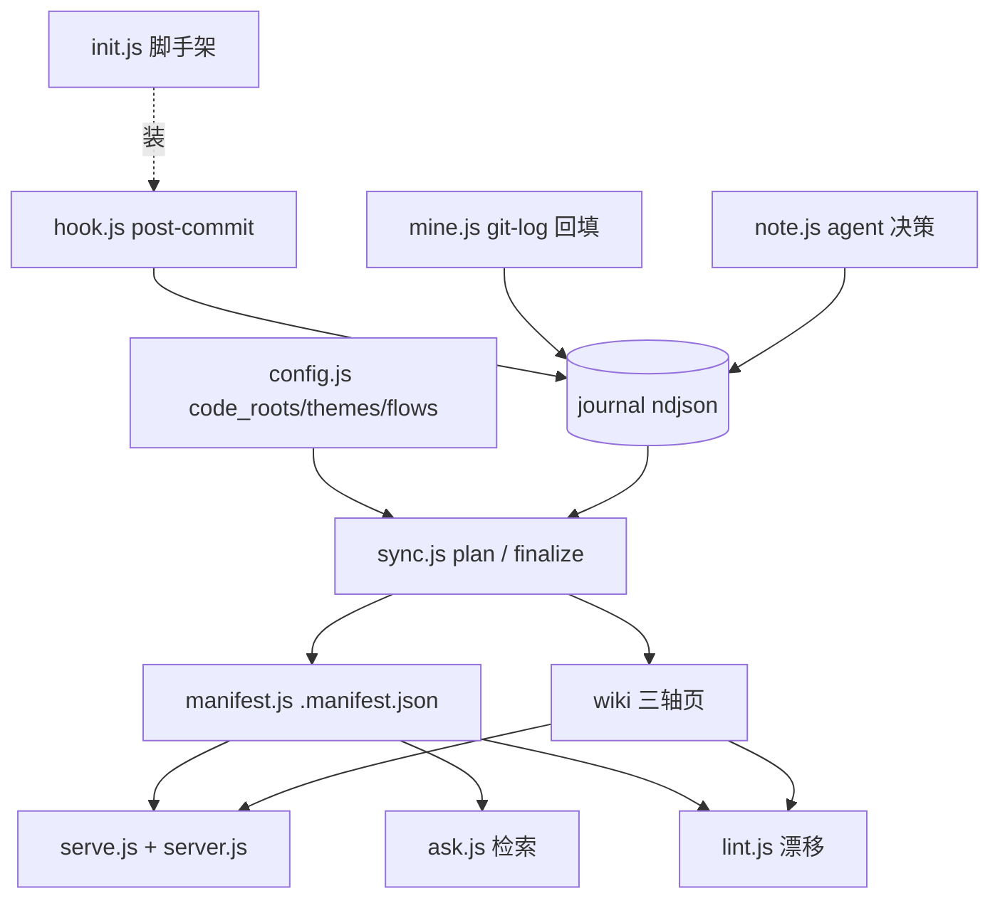

# component: lib

## Current architecture

`lib/` 是 lore 的全部引擎，纯 Node 内置、零依赖。按数据流分四层：

- **捕获（写 journal 原子）**：`hook.js`（post-commit 自动、机械、<50ms、永不阻断 commit）、`mine.js`（`git log` 全历史回填，按 sha 幂等）、`note.js`（agent 决策当下记 `kind:decision`）。三源都经 `journal.js`（append-only ndjson，按日分片、去重）落地。
- **合成（journal + 代码 → wiki）**：`sync.js` 两阶段——`plan` 出 worklist、agent 写页正文、`finalize` 机械盖 front-matter + 折决策历史（journal 占位符）+ 建 INDEX + emit `.manifest.json`（`manifest.js`）。`config.js` 解析 `code_roots` / theme `match` / flow `spans`，驱动三轴打标。
- **消费**：`serve.js`（探测 python→内置 `server.js` 兜底，哑静态服务器 + 浏览器壳）、`ask.js`（按 manifest title+summary 检索，agent 从 wiki 答）。
- **检查**：`lint.js` 只读报漂移（stale / orphan / missing），不自动改。

`init.js` 是一次性脚手架：搭 `.lore/`、自动发现组件写 `config.yml`、拷浏览器壳（含 `mermaid.min.js`）、装 post-commit hook。

## Decision history

- **暂缓单机共享 wiki server，记入 ROADMAP 待头脑风暴** — 现状每 repo 独立 serve、各占端口（7842 先到先得，其余 listen(0) 随机），detached 常驻 → 易堆积、无 stop-all、2+ repo 端口不固定、无中央登记。理想是单机一个常驻 server 聚合本机所有 lore repo、顶层按 repo 分页导航。决定 v0.1 不做：注册表(~/.lore/registry.json)、路由/namespace、跨 repo 只读安全(白名单防穿越)、壳 repo 选择器都需先设计；故记入 docs/ROADMAP.md 中期段待头脑风暴。过渡踏脚石：先做 serve --list/--stop-all + hash(loreDir)→7000-7999 稳定端口。 (2026-06-04)
- **fix(sync): fold journal into exactly-once  token; lint flags survivors** — finalizeSync replaced only the FIRST  via String.replace(string, fn), (036e3ba, 2026-06-04)
- **fix(sync): fold journal into exactly-once  token; lint flags survivors** — finalizeSync replaced only the FIRST - **feat(docs): shell dot + init config example + sync.md note; align INDEX/sidebar axis order** — Co-Authored-By: Claude Opus 4.8 (1M context) <noreply@anthropic.com> (ce24833, 2026-06-05)
- **feat(docs): shell dot + init config example + sync.md note; align INDEX/sidebar axis order** — Co-Authored-By: Claude Opus 4.8 (1M context) <noreply@anthropic.com> (1eb0ad8, 2026-06-05)
- **feat(sync): finalize builds docs axis; AXIS_ORDER + buildIndex include docs** — Co-Authored-By: Claude Opus 4.8 (1M context) <noreply@anthropic.com> (881057c, 2026-06-05)
- **feat(sync): finalize builds docs axis; AXIS_ORDER + buildIndex include docs** — Co-Authored-By: Claude Opus 4.8 (1M context) <noreply@anthropic.com> (2fe6669, 2026-06-05)
- **feat(docs): buildDocsAxis (nuke-rebuild wiki/docs from current files)** — Co-Authored-By: Claude Sonnet 4.6 <noreply@anthropic.com> (55aee3a, 2026-06-05)
- **feat(docs): buildDocsAxis (nuke-rebuild wiki/docs from current files)** — Co-Authored-By: Claude Sonnet 4.6 <noreply@anthropic.com> (171f2b5, 2026-06-05)
- **feat(docs): renderDocsPage (front-matter + source link + entries)** — Co-Authored-By: Claude Sonnet 4.6 <noreply@anthropic.com> (cf993fd, 2026-06-05)
- **feat(docs): renderDocsPage (front-matter + source link + entries)** — Co-Authored-By: Claude Sonnet 4.6 <noreply@anthropic.com> (11d0225, 2026-06-05)
- **feat(docs): pitfallsExtractor (CLAUDE.md Problem/Fix/Prevention)** — Co-Authored-By: Claude Sonnet 4.6 <noreply@anthropic.com> (32f3f87, 2026-06-05)
- **feat(docs): changelogExtractor (versions → one folded spec)** — Co-Authored-By: Claude Sonnet 4.6 <noreply@anthropic.com> (3fdcbb9, 2026-06-05)
- **feat(docs): changelogExtractor (versions → one folded spec)** — Co-Authored-By: Claude Sonnet 4.6 <noreply@anthropic.com> (b1c1ea6, 2026-06-05)
- **feat(docs): docsExtractor (docs/**/*.md → page specs)** (e1f5f2b, 2026-06-05)
- **feat(docs): docsExtractor (docs/**/*.md → page specs)** (65d6ab6, 2026-06-05)
- **feat(config): parseConfigDocsAxis (docs axis sources + glob)** — Co-Authored-By: Claude Sonnet 4.6 <noreply@anthropic.com> (f20e373, 2026-06-05)
- **feat(config): parseConfigDocsAxis (docs axis sources + glob)** — Co-Authored-By: Claude Sonnet 4.6 <noreply@anthropic.com> (75bf160, 2026-06-05)
- **暂缓单机共享 wiki server，记入 ROADMAP 待头脑风暴** — 现状每 repo 独立 serve、各占端口（7842 先到先得，其余 listen(0) 随机），detached 常驻 → 易堆积、无 stop-all、2+ repo 端口不固定、无中央登记。理想是单机一个常驻 server 聚合本机所有 lore repo、顶层按 repo 分页导航。决定 v0.1 不做：注册表(~/.lore/registry.json)、路由/namespace、跨 repo 只读安全(白名单防穿越)、壳 repo 选择器都需先设计；故记入 docs/ROADMAP.md 中期段待头脑风暴。过渡踏脚石：先做 serve --list/--stop-all + hash(loreDir)→7000-7999 稳定端口。 (2026-06-04)
- **fix(sync): fold journal into exactly-once {{LORE_JOURNAL}} token; lint flags survivors** — finalizeSync replaced only the FIRST {{LORE_JOURNAL}} via String.replace(string, fn), (036e3ba, 2026-06-04)
- **fix(sync): fold journal into exactly-once {{LORE_JOURNAL}} token; lint flags survivors** — finalizeSync replaced only the FIRST {{LORE_JOURNAL}} via String.replace(string, fn), (f3578a0, 2026-06-04)
- **feat(ask): searchPages (manifest keyword retrieval) + CLI** — Co-Authored-By: Claude Sonnet 4.6 <noreply@anthropic.com> (a2d92d0, 2026-06-03)
- **feat(sync): planSync flow worklist + SYNC_AXES includes flow** — Co-Authored-By: Claude Opus 4.8 (1M context) <noreply@anthropic.com> (1da0a61, 2026-06-03)
- **feat(hook): captureHead tags flow from config flows** (c673a96, 2026-06-03)
- **feat(mine): thread config flows through mineCommits/mine/CLI** — Co-Authored-By: Claude Sonnet 4.6 <noreply@anthropic.com> (e43c1ac, 2026-06-03)
- **feat(mine): commitAtom flows param → facets.flow** (f1c875a, 2026-06-03)
- **feat(mine): tagFlows (component-membership in flow spans)** (10655b5, 2026-06-03)
- **feat(config): parseConfigFlows (flow id + spans)** (65bacd5, 2026-06-03)
- **feat(sync): finalizeSync + buildIndex generalize to multi-axis (component + theme)** — Co-Authored-By: Claude Opus 4.8 (1M context) <noreply@anthropic.com> (dc6ab17, 2026-06-03)
- **feat(sync): planSync adds theme worklist items (axis field)** — Co-Authored-By: Claude Sonnet 4.6 <noreply@anthropic.com> (f707b63, 2026-06-03)
- **feat(hook): captureHead tags theme from config themes** (81edefb, 2026-06-03)
- **feat(mine): thread config themes through mineCommits/mine/CLI** — Co-Authored-By: Claude Opus 4.8 (1M context) <noreply@anthropic.com> (cbebc0f, 2026-06-03)
- **feat(mine): commitAtom themes param → facets.theme** (9e14cc4, 2026-06-03)
- **feat(mine): tagThemes (case-insensitive keyword substring)** (3caff5a, 2026-06-03)
- **feat(config): parseConfigThemes (theme id + match keywords)** — Co-Authored-By: Claude Sonnet 4.6 <noreply@anthropic.com> (9f9ad5a, 2026-06-03)
- **feat(lint): CLI prints drift report (exit 0, advisory)** — Co-Authored-By: Claude Sonnet 4.6 <noreply@anthropic.com> (5c9b40b, 2026-06-03)
- **fix(lint): use real sha in test; revert unrequested manifest stale change** — Co-Authored-By: Claude Sonnet 4.6 <noreply@anthropic.com> (6e45c4c, 2026-06-03)
- **feat(lint): lintStale + lint orchestrator (config/wiki/git, read-only)** — Co-Authored-By: Claude Sonnet 4.6 <noreply@anthropic.com> (94b8074, 2026-06-03)
- **feat(lint): lintOrphans + lintMissing (page↔code_root diff)** (8ee9658, 2026-06-03)
- **refactor(manifest): export gitCurrentSha + makeCountCommitsSince (for lint reuse)** (fec5607, 2026-06-03)
- **feat(sync): renderDecisionHistory omits sha for commit-less (decision) atoms** (389bb21, 2026-06-03)
- **feat(note): noteAtom + CLI (agent decision atom, source=agent)** — Co-Authored-By: Claude Sonnet 4.6 <noreply@anthropic.com> (51de636, 2026-06-03)
- **feat(init): init installs post-commit hook + config hook: true** — Co-Authored-By: Claude Opus 4.8 (1M context) <noreply@anthropic.com> (36849b2, 2026-06-03)
- **fix(init): installHook resolves common git dir (worktree-safe)** — Co-Authored-By: Claude Opus 4.8 (1M context) <noreply@anthropic.com> (01676f9, 2026-06-03)
- **feat(init): installHook writes post-commit stub (install-if-absent, strategy A)** — Co-Authored-By: Claude Sonnet 4.6 <noreply@anthropic.com> (80b7df1, 2026-06-02)
- **feat(hook): captureHead writes HEAD commit atom (best-effort, source=hook)** (60a2727, 2026-06-02)
- **refactor(mine): export GIT_FORMAT + commitAtom source param (for hook reuse)** — Co-Authored-By: Claude Sonnet 4.6 <noreply@anthropic.com> (1f9a6b2, 2026-06-02)
- **feat(sync): finalizeSync folds journal atoms into decision-history (token + per-page counts)** — Co-Authored-By: Claude Opus 4.8 (1M context) <noreply@anthropic.com> (5b872a2, 2026-06-02)
- **feat(sync): renderDecisionHistory (mechanical ts-desc atom bullets)** — Co-Authored-By: Claude Sonnet 4.6 <noreply@anthropic.com> (494097b, 2026-06-02)
- **feat(mine): CLI entry + init→mine integration (component facets, idempotent)** — Co-Authored-By: Claude Sonnet 4.6 <noreply@anthropic.com> (2c80419, 2026-06-02)
- **feat(mine): mine orchestration with id-based dedup (idempotent)** (e21d14d, 2026-06-02)
- **feat(mine): mineCommits runs git log → commit atoms** (055bc17, 2026-06-02)
- **feat(mine): commitAtom builds full journal atom + component facets** (1167930, 2026-06-02)
- **feat(mine): parseGitLog (RS/US-delimited git log → raw commits)** (868581b, 2026-06-02)
- **feat(mine): pathComponent maps file path to component (longest code_root)** — Co-Authored-By: Claude Opus 4.8 (1M context) <noreply@anthropic.com> (4bab629, 2026-06-02)
- **feat(journal): readAllAtoms + existingIds (recursive ndjson walk)** — Co-Authored-By: Claude Sonnet 4.6 <noreply@anthropic.com> (4498a29, 2026-06-02)
- **feat(journal): appendAtom (append-only ndjson per day)** (75068b3, 2026-06-01)
- **feat(journal): atomPath shards atoms by ISO date** (f411914, 2026-06-01)
- **refactor: extract parseConfigCodeRoots into lib/config.js (shared by sync + mine)** (f6bd6a2, 2026-06-01)
- **feat(sync): CLI plan/finalize subcommands** (0b8eb4f, 2026-06-01)
- **fix(sync): resolve loreDir for repoRoot parity with manifest.js** (f25df5a, 2026-06-01)
- **feat(sync): finalizeSync stamps pages + builds INDEX + emits manifest** — Co-Authored-By: Claude Sonnet 4.6 <noreply@anthropic.com> (0bb9f1f, 2026-06-01)
- **feat(sync): buildIndex renders mechanical component TOC** (f89bf6c, 2026-06-01)
- **feat(sync): stampFrontmatter merges mechanical fields (reuses manifest.parseFrontmatter)** (38bf660, 2026-06-01)
- **feat(sync): planSync builds component worklist from config** — Co-Authored-By: Claude Sonnet 4.6 <noreply@anthropic.com> (1b3846a, 2026-06-01)
- **feat(sync): parseConfigCodeRoots (zero-dep YAML subset)** — Co-Authored-By: Claude Sonnet 4.6 <noreply@anthropic.com> (b877739, 2026-06-01)
- **feat(init): CLI entry (self-locates plugin site/, prints summary)** — Co-Authored-By: Claude Opus 4.8 (1M context) <noreply@anthropic.com> (d362fd1, 2026-06-01)
- **feat(init): init orchestrator (config write-if-absent, shell refresh)** — Co-Authored-By: Claude Sonnet 4.6 <noreply@anthropic.com> (ff39a3d, 2026-06-01)
- **fix(init): quote code_roots containing YAML-special chars** — Adds a fmt predicate that single-quotes any root whose name contains (c7b6015, 2026-06-01)
- **feat(init): renderConfigYaml (component auto + flow/theme seeds + hook:false)** (08f01ff, 2026-06-01)
- **feat(init): discover JS workspaces (dir/* + object form)** (81b798f, 2026-06-01)
- **feat(init): discover Python packages + src layout, ancestor dedup** (86ffd7d, 2026-06-01)
- **feat(init): discoverComponents fallback layer (top-level code dirs)** (30a4401, 2026-06-01)
- **feat(init): ensureGitignore keeps .lore/.state ignored (3-state)** — Co-Authored-By: Claude Sonnet 4.6 <noreply@anthropic.com> (e93d723, 2026-06-01)
- **feat(init): copyShell copies browser shell into .lore/site (overwrite)** — Co-Authored-By: Claude Sonnet 4.6 <noreply@anthropic.com> (cfc2487, 2026-06-01)
- **feat(init): scaffold .lore subdirs (idempotent)** (58d7610, 2026-06-01)
- **feat(shell): nav model, wikilink rewrite, search, meta chips** — Co-Authored-By: Claude Sonnet 4.6 <noreply@anthropic.com> (fe81cca, 2026-06-01)
- **fix(serve): clean CLI error handling + URL spacing + assert sync hint** — Co-Authored-By: Claude Sonnet 4.6 <noreply@anthropic.com> (1410f81, 2026-06-01)
- **feat(serve): start/stop CLI entry with manifest precheck** — Co-Authored-By: Claude Sonnet 4.6 <noreply@anthropic.com> (4cf9152, 2026-06-01)
- **fix(serve): throw on server-never-binds, default now, document edge cases** — Co-Authored-By: Claude Opus 4.8 (1M context) <noreply@anthropic.com> (473f4b7, 2026-06-01)
- **feat(serve): port selection + idempotent start/stop orchestration** — Co-Authored-By: Claude Sonnet 4.6 <noreply@anthropic.com> (2a5cdcb, 2026-05-31)
- **feat(serve): cross-platform process kill (taskkill/SIGTERM)** (617bdbc, 2026-05-31)
- **feat(serve): pid file read/write + liveness check** (72c0219, 2026-05-31)
- **feat(serve): runtime probe chain python3->python->node fallback** (4d66da3, 2026-05-31)
- **fix(manifest): clear git-error message, silence rev-list stderr, normalize loreDir** — Co-Authored-By: Claude Opus 4.8 (1M context) <noreply@anthropic.com> (857d90f, 2026-05-31)
- **feat(manifest): CLI entry wiring real git (rev-parse/rev-list)** (51e5bed, 2026-05-31)
- **refactor(manifest): symmetric file-type filter + deterministic unknown-axis sort** — Co-Authored-By: Claude Opus 4.8 (1M context) <noreply@anthropic.com> (f93be9b, 2026-05-31)
- **feat(manifest): emitManifest with injected git/clock (deterministic)** (741d8f1, 2026-05-31)
- **feat(manifest): derive ordered axes from wiki subdirs** (2b2beba, 2026-05-31)
- **test(manifest): CRLF + NaN-guard regression tests for front-matter parser** — Co-Authored-By: Claude Sonnet 4.6 <noreply@anthropic.com> (94ca472, 2026-05-31)
- **feat(manifest): flat front-matter parser** — Co-Authored-By: Claude Sonnet 4.6 <noreply@anthropic.com> (eace1c1, 2026-05-31) via String.replace(string, fn), (f3578a0, 2026-06-04)
- **feat(ask): searchPages (manifest keyword retrieval) + CLI** — Co-Authored-By: Claude Sonnet 4.6 <noreply@anthropic.com> (a2d92d0, 2026-06-03)
- **feat(sync): planSync flow worklist + SYNC_AXES includes flow** — Co-Authored-By: Claude Opus 4.8 (1M context) <noreply@anthropic.com> (1da0a61, 2026-06-03)
- **feat(hook): captureHead tags flow from config flows** (c673a96, 2026-06-03)
- **feat(mine): thread config flows through mineCommits/mine/CLI** — Co-Authored-By: Claude Sonnet 4.6 <noreply@anthropic.com> (e43c1ac, 2026-06-03)
- **feat(mine): commitAtom flows param → facets.flow** (f1c875a, 2026-06-03)
- **feat(mine): tagFlows (component-membership in flow spans)** (10655b5, 2026-06-03)
- **feat(config): parseConfigFlows (flow id + spans)** (65bacd5, 2026-06-03)
- **feat(sync): finalizeSync + buildIndex generalize to multi-axis (component + theme)** — Co-Authored-By: Claude Opus 4.8 (1M context) <noreply@anthropic.com> (dc6ab17, 2026-06-03)
- **feat(sync): planSync adds theme worklist items (axis field)** — Co-Authored-By: Claude Sonnet 4.6 <noreply@anthropic.com> (f707b63, 2026-06-03)
- **feat(hook): captureHead tags theme from config themes** (81edefb, 2026-06-03)
- **feat(mine): thread config themes through mineCommits/mine/CLI** — Co-Authored-By: Claude Opus 4.8 (1M context) <noreply@anthropic.com> (cbebc0f, 2026-06-03)
- **feat(mine): commitAtom themes param → facets.theme** (9e14cc4, 2026-06-03)
- **feat(mine): tagThemes (case-insensitive keyword substring)** (3caff5a, 2026-06-03)
- **feat(config): parseConfigThemes (theme id + match keywords)** — Co-Authored-By: Claude Sonnet 4.6 <noreply@anthropic.com> (9f9ad5a, 2026-06-03)
- **feat(lint): CLI prints drift report (exit 0, advisory)** — Co-Authored-By: Claude Sonnet 4.6 <noreply@anthropic.com> (5c9b40b, 2026-06-03)
- **fix(lint): use real sha in test; revert unrequested manifest stale change** — Co-Authored-By: Claude Sonnet 4.6 <noreply@anthropic.com> (6e45c4c, 2026-06-03)
- **feat(lint): lintStale + lint orchestrator (config/wiki/git, read-only)** — Co-Authored-By: Claude Sonnet 4.6 <noreply@anthropic.com> (94b8074, 2026-06-03)
- **feat(lint): lintOrphans + lintMissing (page↔code_root diff)** (8ee9658, 2026-06-03)
- **refactor(manifest): export gitCurrentSha + makeCountCommitsSince (for lint reuse)** (fec5607, 2026-06-03)
- **feat(sync): renderDecisionHistory omits sha for commit-less (decision) atoms** (389bb21, 2026-06-03)
- **feat(note): noteAtom + CLI (agent decision atom, source=agent)** — Co-Authored-By: Claude Sonnet 4.6 <noreply@anthropic.com> (51de636, 2026-06-03)
- **feat(init): init installs post-commit hook + config hook: true** — Co-Authored-By: Claude Opus 4.8 (1M context) <noreply@anthropic.com> (36849b2, 2026-06-03)
- **fix(init): installHook resolves common git dir (worktree-safe)** — Co-Authored-By: Claude Opus 4.8 (1M context) <noreply@anthropic.com> (01676f9, 2026-06-03)
- **feat(init): installHook writes post-commit stub (install-if-absent, strategy A)** — Co-Authored-By: Claude Sonnet 4.6 <noreply@anthropic.com> (80b7df1, 2026-06-02)
- **feat(hook): captureHead writes HEAD commit atom (best-effort, source=hook)** (60a2727, 2026-06-02)
- **refactor(mine): export GIT_FORMAT + commitAtom source param (for hook reuse)** — Co-Authored-By: Claude Sonnet 4.6 <noreply@anthropic.com> (1f9a6b2, 2026-06-02)
- **feat(sync): finalizeSync folds journal atoms into decision-history (token + per-page counts)** — Co-Authored-By: Claude Opus 4.8 (1M context) <noreply@anthropic.com> (5b872a2, 2026-06-02)
- **feat(sync): renderDecisionHistory (mechanical ts-desc atom bullets)** — Co-Authored-By: Claude Sonnet 4.6 <noreply@anthropic.com> (494097b, 2026-06-02)
- **feat(mine): CLI entry + init→mine integration (component facets, idempotent)** — Co-Authored-By: Claude Sonnet 4.6 <noreply@anthropic.com> (2c80419, 2026-06-02)
- **feat(mine): mine orchestration with id-based dedup (idempotent)** (e21d14d, 2026-06-02)
- **feat(mine): mineCommits runs git log → commit atoms** (055bc17, 2026-06-02)
- **feat(mine): commitAtom builds full journal atom + component facets** (1167930, 2026-06-02)
- **feat(mine): parseGitLog (RS/US-delimited git log → raw commits)** (868581b, 2026-06-02)
- **feat(mine): pathComponent maps file path to component (longest code_root)** — Co-Authored-By: Claude Opus 4.8 (1M context) <noreply@anthropic.com> (4bab629, 2026-06-02)
- **feat(journal): readAllAtoms + existingIds (recursive ndjson walk)** — Co-Authored-By: Claude Sonnet 4.6 <noreply@anthropic.com> (4498a29, 2026-06-02)
- **feat(journal): appendAtom (append-only ndjson per day)** (75068b3, 2026-06-01)
- **feat(journal): atomPath shards atoms by ISO date** (f411914, 2026-06-01)
- **refactor: extract parseConfigCodeRoots into lib/config.js (shared by sync + mine)** (f6bd6a2, 2026-06-01)
- **feat(sync): CLI plan/finalize subcommands** (0b8eb4f, 2026-06-01)
- **fix(sync): resolve loreDir for repoRoot parity with manifest.js** (f25df5a, 2026-06-01)
- **feat(sync): finalizeSync stamps pages + builds INDEX + emits manifest** — Co-Authored-By: Claude Sonnet 4.6 <noreply@anthropic.com> (0bb9f1f, 2026-06-01)
- **feat(sync): buildIndex renders mechanical component TOC** (f89bf6c, 2026-06-01)
- **feat(sync): stampFrontmatter merges mechanical fields (reuses manifest.parseFrontmatter)** (38bf660, 2026-06-01)
- **feat(sync): planSync builds component worklist from config** — Co-Authored-By: Claude Sonnet 4.6 <noreply@anthropic.com> (1b3846a, 2026-06-01)
- **feat(sync): parseConfigCodeRoots (zero-dep YAML subset)** — Co-Authored-By: Claude Sonnet 4.6 <noreply@anthropic.com> (b877739, 2026-06-01)
- **feat(init): CLI entry (self-locates plugin site/, prints summary)** — Co-Authored-By: Claude Opus 4.8 (1M context) <noreply@anthropic.com> (d362fd1, 2026-06-01)
- **feat(init): init orchestrator (config write-if-absent, shell refresh)** — Co-Authored-By: Claude Sonnet 4.6 <noreply@anthropic.com> (ff39a3d, 2026-06-01)
- **fix(init): quote code_roots containing YAML-special chars** — Adds a fmt predicate that single-quotes any root whose name contains (c7b6015, 2026-06-01)
- **feat(init): renderConfigYaml (component auto + flow/theme seeds + hook:false)** (08f01ff, 2026-06-01)
- **feat(init): discover JS workspaces (dir/* + object form)** (81b798f, 2026-06-01)
- **feat(init): discover Python packages + src layout, ancestor dedup** (86ffd7d, 2026-06-01)
- **feat(init): discoverComponents fallback layer (top-level code dirs)** (30a4401, 2026-06-01)
- **feat(init): ensureGitignore keeps .lore/.state ignored (3-state)** — Co-Authored-By: Claude Sonnet 4.6 <noreply@anthropic.com> (e93d723, 2026-06-01)
- **feat(init): copyShell copies browser shell into .lore/site (overwrite)** — Co-Authored-By: Claude Sonnet 4.6 <noreply@anthropic.com> (cfc2487, 2026-06-01)
- **feat(init): scaffold .lore subdirs (idempotent)** (58d7610, 2026-06-01)
- **feat(shell): nav model, wikilink rewrite, search, meta chips** — Co-Authored-By: Claude Sonnet 4.6 <noreply@anthropic.com> (fe81cca, 2026-06-01)
- **fix(serve): clean CLI error handling + URL spacing + assert sync hint** — Co-Authored-By: Claude Sonnet 4.6 <noreply@anthropic.com> (1410f81, 2026-06-01)
- **feat(serve): start/stop CLI entry with manifest precheck** — Co-Authored-By: Claude Sonnet 4.6 <noreply@anthropic.com> (4cf9152, 2026-06-01)
- **fix(serve): throw on server-never-binds, default now, document edge cases** — Co-Authored-By: Claude Opus 4.8 (1M context) <noreply@anthropic.com> (473f4b7, 2026-06-01)
- **feat(serve): port selection + idempotent start/stop orchestration** — Co-Authored-By: Claude Sonnet 4.6 <noreply@anthropic.com> (2a5cdcb, 2026-05-31)
- **feat(serve): cross-platform process kill (taskkill/SIGTERM)** (617bdbc, 2026-05-31)
- **feat(serve): pid file read/write + liveness check** (72c0219, 2026-05-31)
- **feat(serve): runtime probe chain python3->python->node fallback** (4d66da3, 2026-05-31)
- **fix(manifest): clear git-error message, silence rev-list stderr, normalize loreDir** — Co-Authored-By: Claude Opus 4.8 (1M context) <noreply@anthropic.com> (857d90f, 2026-05-31)
- **feat(manifest): CLI entry wiring real git (rev-parse/rev-list)** (51e5bed, 2026-05-31)
- **refactor(manifest): symmetric file-type filter + deterministic unknown-axis sort** — Co-Authored-By: Claude Opus 4.8 (1M context) <noreply@anthropic.com> (f93be9b, 2026-05-31)
- **feat(manifest): emitManifest with injected git/clock (deterministic)** (741d8f1, 2026-05-31)
- **feat(manifest): derive ordered axes from wiki subdirs** (2b2beba, 2026-05-31)
- **test(manifest): CRLF + NaN-guard regression tests for front-matter parser** — Co-Authored-By: Claude Sonnet 4.6 <noreply@anthropic.com> (94ca472, 2026-05-31)
- **feat(manifest): flat front-matter parser** — Co-Authored-By: Claude Sonnet 4.6 <noreply@anthropic.com> (eace1c1, 2026-05-31)

## Cross-links

- 唯一组件；横切主线见 INDEX 的 theme / flow 轴（按需在 `config.yml` 声明）。
