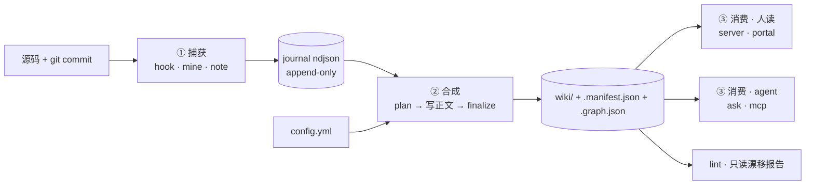

# component: lib

## 概览

**一句话**：`lib/` 是 lore 的**全部引擎**——纯 Node 内置、**零依赖**，把每次代码改动沿「**捕获 → 合成 → 消费**」一条单向流水线变成最新 wiki。

**整条流水线**：



**一个场景看懂「为什么 commit 之后 wiki 就新了」**：

> 你 `git commit` → post-commit `hook` 立刻把这次 commit 落成一条 `journal` 原子（**<50 ms、绝不阻断 commit**）→
> 同步骤顺手 detached spawn 一次 `sync finalize`（机械、零 LLM）→ 决策史按 sha 重折、`.manifest.json` 盖新章、HOME 状态块刷新、漂移页打上诚实的 `stale` → 浏览器壳下一次刷新就看到新决策史 + stale 灯。
>
> 架构正文（`## Current architecture` 那段 prose）**不在这一步**改——它走「代码 prose 指纹动了才重写」的轨道：`plan` 增量列出谁需要重写，agent 在会话里读源码写、或 `auto` 档让 runner 后台跑。

**为什么这么设计**：

- **零依赖** = 装 lore 不污染目标仓库的 `package.json`，所有 lib 模块只用 Node 内置（`node:http` / `node:fs` / `node:child_process`）。`claude` CLI 是**环境能力**、不是 npm 依赖。
- **单向流水线** = 每步幂等、删 `.lore/.state/` 任意文件都能从源重建（journal/manifest 是物化产物、**不是真相源**——真相源是 git commit + 源码 + `config.yml`）。
- **LLM 只占「写正文」一步且只读** = 机械 finalize 不依赖 LLM，故 commit 之后必新；后台 runner 走 `claude -p` 白名单（`Read`/`Grep`/`Glob`），写盘永远是 runner，质量门把关，**LLM 自己无文件写权限**。

想查 BUG 或加端点？展开机制档 👇

## 机制详解

<details>
<summary><b>① 模块清单</b> —— 谁在哪一档</summary>

| 档 | 模块 | 干什么 | 锚点 |
|---|---|---|---|
| 捕获 | [[hook]] | post-commit 钩子；写当次 commit 原子 + 触发后台 finalize；`auto` 档另写 `auto-pending` 时间戳 | `captureHead @ lib/hook.js` · `maybeRefresh @ lib/hook.js` |
| 捕获 | [[mine]] | `git log` 全量回填历史；按 sha 幂等；据 config 打 component/theme/flow facet | `mineCommits @ lib/mine.js` · `tagThemes @ lib/mine.js` · `tagFlows @ lib/mine.js` |
| 捕获 | `note.js` | agent 当场记决策原子（带 why）；`--enrich <sha>` 往已有 commit 骨架追 why | `noteAtom @ lib/note.js` |
| 捕获 | `journal.js` | append-only ndjson；按 ISO 日分片；去重靠 atom `id` | `appendAtom @ lib/journal.js` · `readAllAtoms @ lib/journal.js` · `existingIds @ lib/journal.js` |
| 合成 | [[sync]] | 三步走：plan（增量）→ 写正文（agent）→ finalize（机械）；finalize 在 hook 里每 commit 跑 | `planSync @ lib/sync.js` · `finalizeSync @ lib/sync.js` · `stampFrontmatter @ lib/sync.js` |
| 合成 | `config.js` | 解析 component / theme / flow / docs / **deep（源文件级子页）** 五种轴声明；零依赖 YAML 子集 | `parseConfigCodeRoots @ lib/config.js` · `parseConfigThemes @ lib/config.js` · `parseConfigFlows @ lib/config.js` · `parseConfigDeep @ lib/config.js` · `parseConfigLanguage @ lib/config.js` |
| 合成 | [[fold]] | 同 id 合并（why 追加、refs 并集、ts 最早）；丢 amend/rebase 留下的 unreachable orphan；剥 git trailer 噪声 | `foldAtoms @ lib/fold.js` · `stripTrailers @ lib/fold.js` |
| 合成 | [[manifest]] | 物化壳和 agent 用的索引（含**诚实**的 `stale`）；front-matter 解析共用 | `emitManifest @ lib/manifest.js` · `parseFrontmatter @ lib/manifest.js` · `makeCountCommitsSince @ lib/manifest.js` |
| 合成 | `graph.js` | atom/page 节点 + facet/refs_related 边；给 agent 顺图谱推理用 | `buildGraph @ lib/graph.js` · `neighbors @ lib/graph.js` · `resolvePagePath @ lib/graph.js` |
| 合成 | [[fingerprint]] | prose 指纹（`prose_sha` + `code_sha`）；解耦「正文新鲜度」与「机械 finalize」——故 finalize 可无脑跑 | `proseHash @ lib/fingerprint.js` · `readFingerprints @ lib/fingerprint.js` · `writeFingerprints @ lib/fingerprint.js` |
| 合成 | `home.js` | HOME 首页 + 状态块（版本/sha/轴/语言）；finalize 用哨兵区原位换 | `buildHomeStatus @ lib/home.js` · `finalizeHomeText @ lib/home.js` · `defaultHomePage @ lib/home.js` |
| 合成 | `docs.js` | `docs/**/*.md` + `CHANGELOG.md` + `CLAUDE.md` 踩坑 → docs 轴；nuke-rebuild、零 LLM | `buildDocsAxis @ lib/docs.js` |
| 合成 | `i18n.js` + `translate.js` | 双语翻译页；防陈旧靠源 hash（哨兵区不入源 hash） | `discoverTranslations @ lib/i18n.js` · `translationSourceHash @ lib/i18n.js` |
| 合成 | `syncstate.js` | `.state/` per-machine 偏好：档位（`manual`/`notify`/`auto`）、重写队列、auto-pending、runner pid、auto-runs 历史 | `readSyncConfig @ lib/syncstate.js` · `readRewriteRequests @ lib/syncstate.js` · `writeAutoPending @ lib/syncstate.js` · `appendAutoRun @ lib/syncstate.js` |
| 合成 | `runner.js` | `auto` 档后台 LLM 重写器：纯函数 ticker 判定 + 质量门 + claude `-p` 只读后端 + runner 写盘 | `shouldRunAuto @ lib/runner.js` · `qualityGate @ lib/runner.js` · `runAuto @ lib/runner.js` · `claudeBackend @ lib/runner.js` |
| 消费 | [[server.js]]（仓库根） | 零依赖 http；静态 serve 壳与 wiki + 写 API + Host/路径穿越防护；ticker 跑 `shouldRunAuto` | `createServer @ server.js` · `createPortalServer @ server.js` |
| 消费 | `serve.js` | start/stop 生命周期；python/node 运行时探测；按 loreDir 哈希取稳定端口 | `startServer @ lib/serve.js` · `runtimeProbe @ lib/serve.js` |
| 消费 | `registry.js` | `~/.lore/servers.json` 中央登记；`list` / `stop-all` | `readServerRegistry @ lib/registry.js` |
| 消费 | `portal.js` | 单机门户（固定端口 `7842`）；聚合本机所有 lore 仓库；只读、仅绑 `127.0.0.1` | `startPortal @ lib/portal.js` |
| 消费 | `repos.js` | `~/.lore/repos.json` 仓库登记；portal 据此发现各仓 | `readRepos @ lib/repos.js` |
| 消费 | `ask.js` | 关键词检索（关 manifest）；CLI + 给 mcp 用 | `searchPages @ lib/ask.js` |
| 消费 | `mcp.js` | 零依赖 stdio MCP server；顺 `.graph.json` 推理；导 `lore_ask` / `lore_page` / `lore_neighbors` | `serveMcp @ lib/mcp.js` |
| 检查 | `lint.js` | 只读漂移报告：stale / orphan / missing / mermaid 语法五检；CLI exit 0（advisory） | `lint @ lib/lint.js` · `mermaidIssues @ lib/lint.js` |
| 装机 | `init.js` | 一次性脚手架；不参与运行时流水线 | 见 ④ |

</details>

<details>
<summary><b>② 流水线契约</b> —— 阶段间靠什么对齐</summary>

- **journal 是 append-only ndjson、按 ISO 日分片**：三个源（`hook` / `mine` / `note`）都只 `appendAtom`、不修改既有行；幂等靠 atom `id`（commit sha 或决策 hash）。**严禁在 journal 上直接编辑**——决策史展示的「折叠」在读取层（`foldAtoms`）做、不污染原子。
- **plan 是增量、finalize 是机械**：`planSync` 按 `prose_sha` 比对 git 变更，只列「代码动过」的 component 深度页（HOME/theme/flow 默认全列）；`finalizeSync` **不读源码不调 LLM**，仅盖 frontmatter / 重折决策史哨兵区 / 重建 INDEX / 写 manifest + graph + docs 轴 + HOME 状态块，故 hook 可在每次 commit 后无脑 detached spawn 它。
- **manifest 的 `stale` 是诚实的**：`stale` 来自 `git rev-list <prose_sha>..HEAD -- <code_root>` 的 count，**永远不在 finalize 里清零**——只有 prose 真的被重写、`prose_sha` 在 `fingerprints.json` 推进了，下次 finalize 才会归零。`auto` 档跑完 runner 后由 finalize 自然降。
- **LLM 只读、runner 写盘**：`claudeBackend` 起 `claude -p --allowedTools Read,Grep,Glob` 子进程，整篇页面吐 stdout；runner 收下跑 `qualityGate`（非空 → frontmatter `title+summary` 完整 → `{{LORE_JOURNAL}}` token 或 `LORE_JOURNAL:START` 哨兵在 → 全部 ```mermaid 块过 `mermaidIssues` → `newText.length ≥ oldText.length / 3` 防截断），过门才写 wiki。
- **stale pid = 无锁**：runner 防叠跑读 `.state/runner.pid`，但进程已死的 pid 视作无锁——杀进程不留死锁，删 pid 文件无副作用。
- **三个轴 + docs + deep**：当前 sync 支持 `component` / `theme` / `flow` + `docs`（机械、零 LLM）+ `deep`（源文件级 component 子页，如 `lib` 下的 `sync` / `manifest` …）。加新轴要同改 `config.js` 解析、`sync.js` 的 `SYNC_AXES`、`manifest.js` 的 `AXIS_ORDER` 三处。

</details>

<details>
<summary><b>③ 不变量 / 边界</b> —— 改 lib 之前先记住</summary>

- **零依赖不破**：`lib/**/*.js` 只允许 `import 'node:*'` 与同目录 sibling；引第三方 npm 包 = 违反产品承诺，需先在 ROADMAP 立项。
- **hook 永不挡 commit**：`captureHead` + `maybeRefresh` 都被外层 `try/catch` 吞掉错（`hook.js` CLI 块 `process.exit(0)`），任何新增 hook 行为必须保持 best-effort——**绝不让 commit 因为 lore 失败而失败**。
- **`.state/` 任一文件可重建**：删 `fingerprints.json` → 下次 sync 视作全 stale 重算；删 `auto-pending.json` / `runner.pid` / `auto-runs.ndjson` → runner 自然忽略；`sync.json` 丢了回默认 `notify` 档；物化产物（`wiki/.manifest.json`、`.graph.json`）从 journal + 源码重建。
- **portal 只读靠结构**：`createPortalServer` 整段 `404` 掉 `/<repo>/api/*`，不靠运行时 mode 判断——给门户加任何写功能前先想清楚跨 repo 写意味着什么（详见 [[server.js]] 机制档 ④）。
- **server 的 Host 闸不可绕**：写 API 入口先 `localHost(req)`，拦 DNS 重绑定攻击；测 `403` 要用 `node:http` 注入伪 Host（`fetch` 的 Host 是 forbidden header）。
- **鸟瞰页 vs 深度页**：`component/<code_root>.md`（本页就是 `lib`）汇总决策史 + 模块导览；`component/<子模块>.md`（如 [[sync]]）按完整两档写、不放 `## Decision history` token（决策史汇总在鸟瞰页）。深度页由 `config.yml` 的 `axes.component.deep.<root>: [子模块…]` 声明，`planSync` 列出 `kind:'deep'` 项。

</details>

<details>
<summary><b>④ 一次性脚手架</b> —— init 的角色</summary>

`init.js` **不参与运行时流水线**，是 `/lore:init` 的实现：

- 建 `.lore/` 子目录骨架（`mkdir -p`，idempotent）；
- 自动发现组件：JS workspaces（`workspaces: dir/*` 或 object 形式）→ Python packages + `src/` 布局 → 兜底顶层 code 目录，按 ancestor dedup；
- 渲染 `config.yml`（component 自动 + theme/flow 种子 + `hook: false`），含 YAML 特殊字符的 root 自动单引号；
- 拷贝 `site/`（vendored `mermaid.min.js` 在内）覆盖写到 `.lore/site/`；
- 装 post-commit hook：`installHook` resolve **common git dir**（worktree-safe），尊重 `core.hooksPath` 的默认值，install-if-absent 策略 A；
- 把 repo 登记进 `~/.lore/repos.json`（best-effort，portal 据此发现）；
- 保 `.lore/.state/` 走 gitignore 三态。

跑完一次就退场——之后所有 wiki 变化走 hook → sync 流水线。

锚点：`init @ lib/init.js` · `discoverComponents @ lib/init.js` · `installHook @ lib/init.js` · `renderConfigYaml @ lib/init.js` · `ensureGitignore @ lib/init.js`。

</details>

## Decision history

<!-- LORE_JOURNAL:START -->
- **feat(hook): auto mode stamps pending timestamp (mechanical finalize unchanged)** (1444530, 2026-06-10)
- **feat(runner): claudeBackend (read-only LLM, stdout) + runAuto pipeline + CLI** (963c6d8, 2026-06-10)
- **feat(runner): shouldRunAuto ticker predicate + mechanical qualityGate** (27e6698, 2026-06-10)
- **feat(syncstate): auto mode + config/pending/pid/runs state (B2)** — B1 'auto rejected' assertions flipped (syncstate throw + server 400 → 200) (f2a8209, 2026-06-10)
- **feat(note): enrich mode — append why to an existing commit skeleton (append-only, fold merges)** — /lore:note --enrich <sha> --why ... resolves short shas via rev-parse, (ddd27b9, 2026-06-10)
- **feat(lint): mermaid syntax heuristics (5th check) + fix orphan/unfolded false positives** — - mermaidIssues/lintMermaid: catch reserved node ids (graph[...]), broken (eef82cd, 2026-06-10)
- **feat(manifest): docs-axis group ordering + frontmatter group/paired_plan passthrough (impl)** — Prior commit 077b120 carried the red test only — parallel Edit+Bash misfire, (e3e69a3, 2026-06-10)
- **feat(docs): materialize group + paired_plan into docs-page frontmatter** (f9b6762, 2026-06-10)
- **feat(docs): docGroup heuristic + spec/plan pairing by date+slug** (d382804, 2026-06-10)
- **fix(journal): strip git trailers from decision-history why (Co-Authored-By noise)** — stripTrailers lives in fold.js (data-cleaning layer): mine sanitizes new (ef50bd9, 2026-06-10)
- **fix(serve): surface runtime on reuse; warn when --node is ignored by a live non-node server** (b87d275, 2026-06-09)
- **docs(serve): mention --node in usage line** (cd6eead, 2026-06-09)
- **feat(serve): --node flag forces bundled Node server (enables control API on monolingual repos)** (3abe597, 2026-06-09)
- **feat(server): finalize-spawn + rewrite-request queue API (safeWikiPage-guarded)** — Polish from prior reviews: echo sanitized mode value, symmetric page guard (852c5d5, 2026-06-09)
- **feat(hook): manual mode skips commit-time auto finalize** (432ba94, 2026-06-09)
- **feat(syncstate): rewrite-request queue (ndjson append, per-page dedupe)** — Also align spec wording: sync.json write is whole-file overwrite (torn reads (79a30f2, 2026-06-09)
- **feat(syncstate): per-machine sync mode read/write (.state/sync.json, default notify)** (c44e73d, 2026-06-09)
- **feat(manifest): component pages ordered by componentOrder + group field (pipeline order)** (a29c43f, 2026-06-09)
- **refactor(sync): consume parseConfigDeep .order (grouped-deep schema)** (3d63da4, 2026-06-09)
- **feat(config): parseConfigDeep returns {order, groups} (grouped deep map + flat back-compat)** (6d42790, 2026-06-09)
- **feat(sync): finalize maps deep pages to per-file staleScopes (honest per-module stale)** (7e37b19, 2026-06-08)
- **feat(sync): planSync lists per-file deep-page worklist items (incremental by source file)** (b94e048, 2026-06-08)
- **feat(config): parseConfigDeep — per-file deep-page declarations** (6335e61, 2026-06-08)
- **feat(init): auto-register repo in ~/.lore/repos.json on init CLI (best-effort)** (57a30e7, 2026-06-07)
- **feat(portal): portal lifecycle CLI (start/stop/list) on fixed port 7842** (e7de56d, 2026-06-07)
- **feat(repos): ~/.lore/repos.json repo registry for portal discovery** (6a45fe5, 2026-06-07)
- **fix(meta): docs pages show last-updated only (no atoms/code_sha chips)** (e6a87e3, 2026-06-07)
- **fix(home): omit empty HOME sections instead of INDEX fallback** (88c0515, 2026-06-07)
- **fix(i18n): exclude sentinel regions from translation source hash** (179ae87, 2026-06-07)
- **feat(serve): stable per-repo port + registry list/stop-all** (21e2bf7, 2026-06-07)
- **feat(registry): ~/.lore/servers.json server registry** (cb31cf4, 2026-06-07)
- **feat(mcp): zero-dep stdio MCP server — lore_ask/page/neighbors** (d3c3f90, 2026-06-07)
- **feat(graph): neighbors + resolvePagePath query helpers** (939b988, 2026-06-07)
- **feat(sync): emit wiki/.graph.json (agent graph) in finalizeSync** (43d4277, 2026-06-06)
- **refactor(manifest): runManifestCli returns { manifestPath, manifest }** (b219e9e, 2026-06-06)
- **feat(graph): buildGraph — atom/page nodes + facet/refs_related edges** (00251a1, 2026-06-06)
- **fix(sync): foldJournal warns only on first migration, not literal in-content tokens** — dogfood 暴露：决策史里若有 commit message 字面引用 {{LORE_JOURNAL}}（讲该 token 的 (94c1269, 2026-06-06)
- **fix(sync): rebuild decision-history section idempotently (sentinel region)** — foldJournal 从一次性 token 替换改为 ## Decision history section 整段重建 + (bb4c05f, 2026-06-06)
- **feat(sync): fold journal atoms in finalizeSync (orphan-free decision history)** — finalizeSync 先 foldAtoms(rawAtoms, {reachableShas: rev-list --all}) 再喂下游：决策史去重 + HOME/INDEX 计数一致。6 个旧单元测试改用真实可达 sha 的 fixture（realSha helper），反映 journal commit sha 是真实 commit 的前提；断言意图不变。 (cb06d75, 2026-06-06)
- **feat(fold): drop unreachable (amend/rebase orphan) commit atoms** (632d5b8, 2026-06-06)
- **feat(fold): foldAtoms merge-by-id (why append, refs union, ts earliest)** (9f73a55, 2026-06-06)
- **fix(config): parseConfigLanguage tolerates comment + CRLF on language: line** — v0.5.0's block regex required `language:` to end in whitespace+newline, so (988d48e, 2026-06-06)
- **feat(serve): prefer node server for bilingual repos** (4974cb2, 2026-06-05)
- **feat(translate): add sidecar translation command** (e2b85b9, 2026-06-05)
- **feat(manifest): read language and preferences** (4477a26, 2026-06-05)
- **feat(init): include language defaults** (36b7101, 2026-06-05)
- **feat(sync): generate human home page** (19aa253, 2026-06-05)
- **feat(manifest): expose home and translations** (ee22de0, 2026-06-05)
- **feat(i18n): add translation sidecar helpers** (b04feb8, 2026-06-05)
- **feat(config): parse wiki language preferences** (5d99c32, 2026-06-05)
- **feat(manifest): sort docs axis pages by last_updated desc** (9f8cc7a, 2026-06-05)
- **feat(docs): buildDocsAxis returns specs sorted by date desc** (c7187a7, 2026-06-05)
- **feat(docs): renderDocsPage embeds full body + plain-text source ref (no 404)** (2c3158e, 2026-06-05)
- **feat(docs): extractors carry source body for embedding** (cd62734, 2026-06-05)
- **fix(docs): no empty docs axis when zero specs; tolerate trailing-slash glob** (93aa86f, 2026-06-05)
- **feat(docs): shell dot + init config example + sync.md note; align INDEX/sidebar axis order** (1eb0ad8, 2026-06-05)
- **feat(sync): finalize builds docs axis; AXIS_ORDER + buildIndex include docs** (2fe6669, 2026-06-05)
- **feat(docs): buildDocsAxis (nuke-rebuild wiki/docs from current files)** (171f2b5, 2026-06-05)
- **feat(docs): renderDocsPage (front-matter + source link + entries)** (11d0225, 2026-06-05)
- **feat(docs): pitfallsExtractor (CLAUDE.md Problem/Fix/Prevention)** (32f3f87, 2026-06-05)
- **feat(docs): changelogExtractor (versions → one folded spec)** (b1c1ea6, 2026-06-05)
- **feat(docs): docsExtractor (docs/**/*.md → page specs)** (65d6ab6, 2026-06-05)
- **feat(config): parseConfigDocsAxis (docs axis sources + glob)** (75bf160, 2026-06-05)
- **feat(init): copy vendored mermaid.min.js into .lore/site/** (283c1cf, 2026-06-04)
- **暂缓单机共享 wiki server，记入 ROADMAP 待头脑风暴** — 现状每 repo 独立 serve、各占端口（7842 先到先得，其余 listen(0) 随机），detached 常驻 → 易堆积、无 stop-all、2+ repo 端口不固定、无中央登记。理想是单机一个常驻 server 聚合本机所有 lore repo、顶层按 repo 分页导航。决定 v0.1 不做：注册表(~/.lore/registry.json)、路由/namespace、跨 repo 只读安全(白名单防穿越)、壳 repo 选择器都需先设计；故记入 docs/ROADMAP.md 中期段待头脑风暴。过渡踏脚石：先做 serve --list/--stop-all + hash(loreDir)→7000-7999 稳定端口。 (2026-06-04)
- **fix(init): install post-commit hook when core.hooksPath is the repo default** — installHook treated any non-empty core.hooksPath as "managed elsewhere" (6ae43a0, 2026-06-04)
- **fix(sync): fold journal into exactly-once {{LORE_JOURNAL}} token; lint flags survivors** — finalizeSync replaced only the FIRST {{LORE_JOURNAL}} via String.replace(string, fn), (f3578a0, 2026-06-04)
- **feat(ask): searchPages (manifest keyword retrieval) + CLI** (a2d92d0, 2026-06-03)
- **feat(sync): planSync flow worklist + SYNC_AXES includes flow** (1da0a61, 2026-06-03)
- **feat(hook): captureHead tags flow from config flows** (c673a96, 2026-06-03)
- **feat(mine): thread config flows through mineCommits/mine/CLI** (e43c1ac, 2026-06-03)
- **feat(mine): commitAtom flows param → facets.flow** (f1c875a, 2026-06-03)
- **feat(mine): tagFlows (component-membership in flow spans)** (10655b5, 2026-06-03)
- **feat(config): parseConfigFlows (flow id + spans)** (65bacd5, 2026-06-03)
- **feat(sync): finalizeSync + buildIndex generalize to multi-axis (component + theme)** (dc6ab17, 2026-06-03)
- **feat(sync): planSync adds theme worklist items (axis field)** (f707b63, 2026-06-03)
- **feat(hook): captureHead tags theme from config themes** (81edefb, 2026-06-03)
- **feat(mine): thread config themes through mineCommits/mine/CLI** (cbebc0f, 2026-06-03)
- **feat(mine): commitAtom themes param → facets.theme** (9e14cc4, 2026-06-03)
- **feat(mine): tagThemes (case-insensitive keyword substring)** (3caff5a, 2026-06-03)
- **feat(config): parseConfigThemes (theme id + match keywords)** (9f9ad5a, 2026-06-03)
- **feat(lint): CLI prints drift report (exit 0, advisory)** (5c9b40b, 2026-06-03)
- **fix(lint): use real sha in test; revert unrequested manifest stale change** (6e45c4c, 2026-06-03)
- **feat(lint): lintStale + lint orchestrator (config/wiki/git, read-only)** (94b8074, 2026-06-03)
- **feat(lint): lintOrphans + lintMissing (page↔code_root diff)** (8ee9658, 2026-06-03)
- **refactor(manifest): export gitCurrentSha + makeCountCommitsSince (for lint reuse)** (fec5607, 2026-06-03)
- **feat(sync): renderDecisionHistory omits sha for commit-less (decision) atoms** (389bb21, 2026-06-03)
- **feat(note): noteAtom + CLI (agent decision atom, source=agent)** (51de636, 2026-06-03)
- **feat(init): init installs post-commit hook + config hook: true** (36849b2, 2026-06-03)
- **fix(init): installHook resolves common git dir (worktree-safe)** (01676f9, 2026-06-03)
- **feat(init): installHook writes post-commit stub (install-if-absent, strategy A)** (80b7df1, 2026-06-02)
- **feat(hook): captureHead writes HEAD commit atom (best-effort, source=hook)** (60a2727, 2026-06-02)
- **refactor(mine): export GIT_FORMAT + commitAtom source param (for hook reuse)** (1f9a6b2, 2026-06-02)
- **feat(sync): finalizeSync folds journal atoms into decision-history (token + per-page counts)** (5b872a2, 2026-06-02)
- **feat(sync): renderDecisionHistory (mechanical ts-desc atom bullets)** (494097b, 2026-06-02)
- **feat(mine): CLI entry + init→mine integration (component facets, idempotent)** (2c80419, 2026-06-02)
- **feat(mine): mine orchestration with id-based dedup (idempotent)** (e21d14d, 2026-06-02)
- **feat(mine): mineCommits runs git log → commit atoms** (055bc17, 2026-06-02)
- **feat(mine): commitAtom builds full journal atom + component facets** (1167930, 2026-06-02)
- **feat(mine): parseGitLog (RS/US-delimited git log → raw commits)** (868581b, 2026-06-02)
- **feat(mine): pathComponent maps file path to component (longest code_root)** (4bab629, 2026-06-02)
- **feat(journal): readAllAtoms + existingIds (recursive ndjson walk)** (4498a29, 2026-06-02)
- **feat(journal): appendAtom (append-only ndjson per day)** (75068b3, 2026-06-01)
- **feat(journal): atomPath shards atoms by ISO date** (f411914, 2026-06-01)
- **refactor: extract parseConfigCodeRoots into lib/config.js (shared by sync + mine)** (f6bd6a2, 2026-06-01)
- **feat(sync): CLI plan/finalize subcommands** (0b8eb4f, 2026-06-01)
- **fix(sync): resolve loreDir for repoRoot parity with manifest.js** (f25df5a, 2026-06-01)
- **feat(sync): finalizeSync stamps pages + builds INDEX + emits manifest** (0bb9f1f, 2026-06-01)
- **feat(sync): buildIndex renders mechanical component TOC** (f89bf6c, 2026-06-01)
- **feat(sync): stampFrontmatter merges mechanical fields (reuses manifest.parseFrontmatter)** (38bf660, 2026-06-01)
- **feat(sync): planSync builds component worklist from config** (1b3846a, 2026-06-01)
- **feat(sync): parseConfigCodeRoots (zero-dep YAML subset)** (b877739, 2026-06-01)
- **feat(init): CLI entry (self-locates plugin site/, prints summary)** (d362fd1, 2026-06-01)
- **feat(init): init orchestrator (config write-if-absent, shell refresh)** (ff39a3d, 2026-06-01)
- **fix(init): quote code_roots containing YAML-special chars** — Adds a fmt predicate that single-quotes any root whose name contains (c7b6015, 2026-06-01)
- **feat(init): renderConfigYaml (component auto + flow/theme seeds + hook:false)** (08f01ff, 2026-06-01)
- **feat(init): discover JS workspaces (dir/* + object form)** (81b798f, 2026-06-01)
- **feat(init): discover Python packages + src layout, ancestor dedup** (86ffd7d, 2026-06-01)
- **feat(init): discoverComponents fallback layer (top-level code dirs)** (30a4401, 2026-06-01)
- **feat(init): ensureGitignore keeps .lore/.state ignored (3-state)** (e93d723, 2026-06-01)
- **feat(init): copyShell copies browser shell into .lore/site (overwrite)** (cfc2487, 2026-06-01)
- **feat(init): scaffold .lore subdirs (idempotent)** (58d7610, 2026-06-01)
- **feat(shell): nav model, wikilink rewrite, search, meta chips** (fe81cca, 2026-06-01)
- **fix(serve): clean CLI error handling + URL spacing + assert sync hint** (1410f81, 2026-06-01)
- **feat(serve): start/stop CLI entry with manifest precheck** (4cf9152, 2026-06-01)
- **fix(serve): throw on server-never-binds, default now, document edge cases** (473f4b7, 2026-06-01)
- **feat(serve): port selection + idempotent start/stop orchestration** (2a5cdcb, 2026-05-31)
- **feat(serve): cross-platform process kill (taskkill/SIGTERM)** (617bdbc, 2026-05-31)
- **feat(serve): pid file read/write + liveness check** (72c0219, 2026-05-31)
- **feat(serve): runtime probe chain python3->python->node fallback** (4d66da3, 2026-05-31)
- **fix(manifest): clear git-error message, silence rev-list stderr, normalize loreDir** (857d90f, 2026-05-31)
- **feat(manifest): CLI entry wiring real git (rev-parse/rev-list)** (51e5bed, 2026-05-31)
- **refactor(manifest): symmetric file-type filter + deterministic unknown-axis sort** (f93be9b, 2026-05-31)
- **feat(manifest): emitManifest with injected git/clock (deterministic)** (741d8f1, 2026-05-31)
- **feat(manifest): derive ordered axes from wiki subdirs** (2b2beba, 2026-05-31)
- **test(manifest): CRLF + NaN-guard regression tests for front-matter parser** (94ca472, 2026-05-31)
- **feat(manifest): flat front-matter parser** (eace1c1, 2026-05-31)
<!-- LORE_JOURNAL:END -->

## Cross-links

- 深度页：[[sync]] · [[manifest]] · [[fingerprint]] · [[hook]] · [[fold]] · [[mine]] · [[server.js]]
- 同档其他：[[HOME]]（认知入口）· [[INDEX]]（目录）
