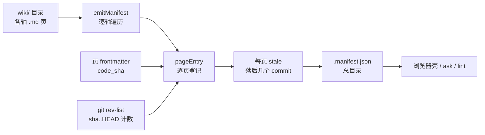
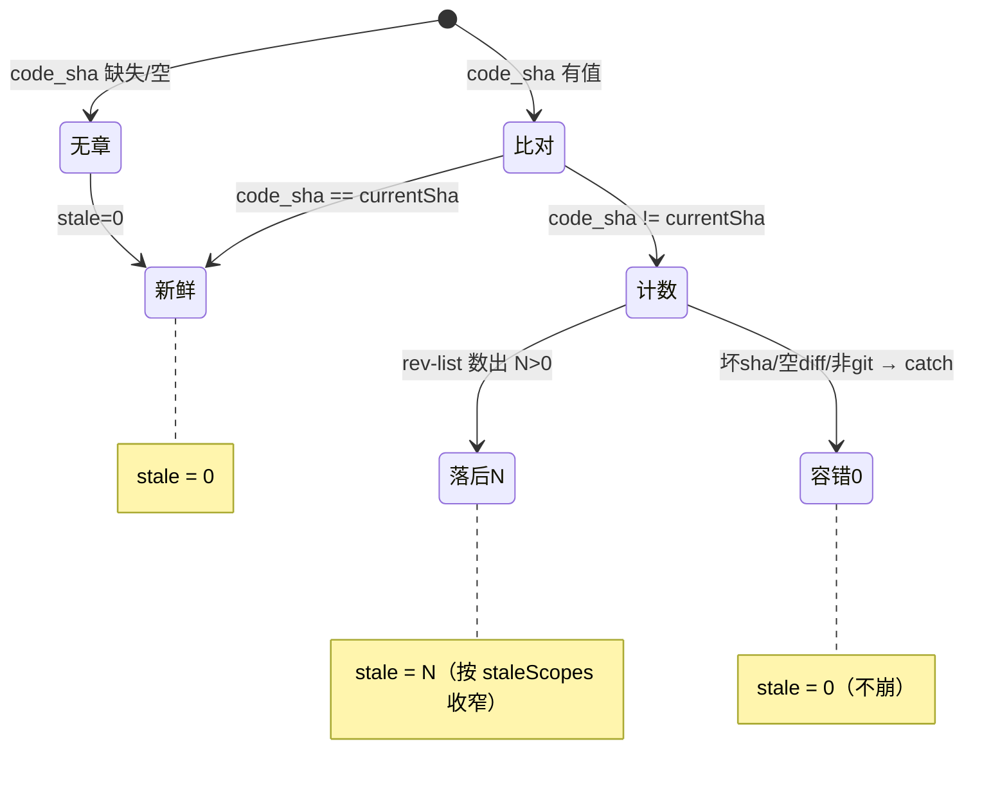

# component: manifest

## 概览

**一句话**：`manifest.js` 是 wiki 的**前台导览员 + 体检医生**——把 wiki 目录里散落的页扫成一份**总目录**（`.manifest.json`），顺手给每页量一次「**新鲜度**」：这页的正文落后代码多少个 commit 了（这个数叫 `stale`）。

类比：像图书馆每天闭馆后把书架重新登记一遍，做一份「书目卡」，并在每张卡上盖一个「内容是否过期」的章。书目卡给前台（浏览器壳）、检索（ask）、巡检（lint）共用；它自己**不写任何一页正文**，只登记和盖章。

**它在流水线的位置**（finalize 的最后一棒）：



**一个场景看懂「stale 从哪来」**：

> 假设 `component/sync.md` 这页的 frontmatter 里写着 `code_sha: 7e37b19`（这是 finalize 上次盖的章，意思是「这页正文反映的是 `7e37b19` 那一刻的代码」）。
> 现在你又往 `lib/sync.js` 提了 3 个 commit，HEAD 走到了 `35acc10`，但**没重写**那页架构正文。
> manifest 跑起来：读出页里 `code_sha = 7e37b19` ≠ 当前 HEAD `35acc10` → 调 `countCommitsSince('7e37b19', ['lib/sync.js'])` → 底层 `git rev-list --count 7e37b19..HEAD -- lib/sync.js` 数出 **3** → 这页 `stale = 3`。
> 浏览器壳就能显示「sync 这页落后正文 3 个 commit，该重写了」。等你真重写正文、finalize 把章盖到 `35acc10`，下次 manifest 一跑 `code_sha == HEAD`，`stale` 归零。

这里有个关键巧思：那 3 个 commit 不是全仓数的，是**按这页负责的源码范围**（`['lib/sync.js']`，叫 `staleScopes`）数的——只有真正动了 sync 源码的 commit 才算「让 sync 页过期」。你改 `lib/graph.js` 一万次，sync 页的 `stale` 纹丝不动。这就是「诚实的 per-module stale」。

**为什么这么设计**：
- **纯机械、零 LLM**：登记和盖章不需要判断力，所以能在每次 commit 后**后台自动跑**（提交即刷新目录），不烧 token。
- **stale 不靠人工维护**：新鲜度是「页里盖的 sha」对「当前 HEAD」**当场算**出来的，不是谁手写的字段——代码一动，下次扫描自动反映，不会撒谎。
- **退化不崩**：非 git 仓库 / 坏 sha / 空 diff 一律当 `stale = 0`（不是报错），让目录在任何环境都能产出。

想查 BUG 或改 manifest？展开下面机制档 👇

## 机制详解

<details open>
<summary><b>⓪ 调用入口 & I/O</b> —— 谁触发、读写哪些文件</summary>

**谁触发**：
- `finalizeSync @ lib/sync.js` 在盖章末尾调 `runManifestCli`（提交后台刷新即走这条）。
- CLI 直跑：`node lib/manifest.js <loreDir>`（`import.meta.url` 自启块，调试/手动重建用）。

**读**（`runManifestCli @ lib/manifest.js`）：
- `<loreDir>/wiki/**/*.md` —— 遍历每轴每页，取 frontmatter。
- `<loreDir>/config.yml` —— 经 `parseConfigLanguage` 取 `language`（缺省 `{default:'en', available:['en']}`）。
- `<loreDir>/.state/preferences.json` —— 经 `readPreferences` 取用户偏好（如选定语言）。
- `git rev-parse` / `git rev-list`（cwd = `<loreDir>/..` 即 repo 根）—— 取 HEAD sha、数 commit。

**写**：
- `<loreDir>/wiki/.manifest.json` —— 唯一产物，`JSON.stringify(…, 2) + '\n'`。

**入参里的 `staleScopes`**：`runManifestCli(loreDir, nowIso, staleScopes)` 第三参，形如 `{ 'component/sync.md': ['lib/sync.js'] }`，由 `finalizeSync` 构造后透传。不传则每页按**全仓**数 stale。

</details>

<details>
<summary><b>① 接口 / 能力面</b> —— 导出与签名</summary>

| 导出 | 签名 | 干什么 | 锚点 |
|---|---|---|---|
| `runManifestCli` | `(loreDir, nowIso, staleScopes={}) → {manifestPath, manifest}` | 总入口：装配依赖 → emit → 写 `.manifest.json` | `runManifestCli @ lib/manifest.js` |
| `emitManifest` | `({wikiDir, currentSha, countCommitsSince, now, axes?, language?, preferences?, staleScopes?}) → manifest对象` | 纯函数核心：遍历轴 → 每页 `pageEntry` → 组装总目录 | `emitManifest @ lib/manifest.js` |
| `pageEntry`（内部） | `(wikiDir, axisId, id, currentSha, countCommitsSince, language, staleScopes) → page条目` | 登记单页：读 frontmatter、算 stale、挂翻译 | `pageEntry @ lib/manifest.js` |
| `parseFrontmatter` | `(text) → {data, body}` | 解扁平 YAML frontmatter；`atoms/commits/stale` 强转数字 | `parseFrontmatter @ lib/manifest.js` |
| `deriveAxes` | `(subdirNames) → [{id, label}]` | 按固定顺序排轴 + 首字母大写 label | `deriveAxes @ lib/manifest.js` |
| `gitCurrentSha` | `(repoRoot) → shortSha` | `git rev-parse --short HEAD`；失败抛清晰错误 | `gitCurrentSha @ lib/manifest.js` |
| `makeCountCommitsSince` | `(repoRoot) → (sha, pathspec?) → number` | 工厂：返回「数 `sha..HEAD` commit 数」的闭包，可按 pathspec 收窄 | `makeCountCommitsSince @ lib/manifest.js` |

> `gitCurrentSha` / `makeCountCommitsSince` 是注入到 `emitManifest` 的 git 探针——核心函数只认这两个回调，不直接碰 git，所以 `emitManifest` 在测试里可塞假回调、完全离线可测。

</details>

<details>
<summary><b>② 模块内数据流</b> —— step-by-step</summary>

`runManifestCli`（`runManifestCli @ lib/manifest.js`）顺序：

1. 算 `repoRoot = <loreDir>/..`、`wikiDir = <loreDir>/wiki`。
2. 读 `config.yml`（存在才读）→ `parseConfigLanguage` 出 `language`；读 `.state` → `readPreferences` 出 `preferences`。
3. 装配探针：`gitCurrentSha(repoRoot)` 取当前 HEAD；`makeCountCommitsSince(repoRoot)` 造计数闭包。
4. 调 `emitManifest({...})` 拿 manifest 对象 → 写 `wiki/.manifest.json` → 返回 `{manifestPath, manifest}`。

`emitManifest`（`emitManifest @ lib/manifest.js`）顺序：

1. `readdirSync(wikiDir)` 拿一级条目：子目录 → 候选轴；根级 `HOME.md`/`INDEX.md` → 根轴。
2. 轴定义 = 入参 `axes` ?? `deriveAxes([...rootAxes, ...subdirs])`（按 `AXIS_ORDER` 排，未知轴字母序垫后）。
3. 逐轴：
   - 根轴（HOME/INDEX）：存在对应文件就 `pageEntry(wikiDir, '', axisId, …)`（axis 传空串）。
   - 普通轴：`readdirSync(轴目录)` 取 `.md`，**过滤掉翻译 sidecar**（`isTranslationSidecar`），字母序排，逐个 `pageEntry`。
   - 若是 `docs` 轴：页按 `last_updated` **倒序**重排（新文档在前），其余轴保持字母序。
4. 每页 `pageEntry`：读文件 → `parseFrontmatter` → 取 `code_sha` → **算 stale**（见 ④）→ `discoverTranslations` 挂翻译 → 组装 page 条目。
5. 返回 `{generated, current_code_sha, language, user_preferences, axes:[{id,label,pages}]}`。

</details>

<details>
<summary><b>③ 关键数据契约</b> —— 状态长什么样</summary>

**`.manifest.json` 顶层 schema**：

```json
{
  "generated": "2026-06-08T08:14:00Z",
  "current_code_sha": "35acc10",
  "language": { "default": "en", "available": ["en"] },
  "user_preferences": { "language": "en" },
  "axes": [ { "id": "component", "label": "Component", "pages": [ /* page条目 */ ] } ]
}
```

**page 条目字段**（`pageEntry @ lib/manifest.js` 产出）：

| 字段 | 来源 | 含义 |
|---|---|---|
| `id` | 文件名去 `.md` | 页标识（如 `sync`） |
| `axis` | 所在轴 id | 根轴页此处为空串 `''` |
| `title` / `summary` | frontmatter，缺省 `id` / `''` | 展示用 |
| `last_updated` | frontmatter，缺省 `''` | docs 轴排序键 |
| `path` | 相对 wikiDir | 如 `component/sync.md` |
| `lang` | frontmatter `lang`，缺省 `language.default` | 本页语言 |
| `translations` | `discoverTranslations` | 该页的 sidecar 译本数组（含各自 `stale:bool`） |
| `stale` | **当场算**，见 ④ | 落后正文几个 commit；0 = 新鲜 |
| `code_sha` | frontmatter `code_sha`，缺省 `''` | finalize 盖的「这页对应的代码 sha」 |
| `synthesized_from` | `{atoms, commits}` | provenance：合成自几条 atom / 几个 commit |
| `group` | **frontmatter 优先**（docs 物化写入），pageGroups map 兜底（component finalize 构造），缺省 `''` | 侧栏分组小标题（component：捕获/合成；docs：项目状态/设计与计划/notes） |
| `paired_plan` | frontmatter `paired_plan`，缺省 `''` | docs 轴 spec↔plan 配对：spec 页指向其 plan 页 id（壳渲染 plan 徽标，被配对 plan 不占侧栏行） |

> 轴顺序契约（`AXIS_ORDER`）：`HOME → INDEX → component → flow → theme → docs`，未知轴字母序垫在最后——保证跨平台**确定性**（同输入字节级一致）。
>
> **轴内排序**两个特例：component 轴按 `componentOrder`（鸟瞰 code_root 置顶 + deep 流水线序，不在序里的字母序垫后）；docs 轴**组间固定序**（项目状态 0 → 设计与计划 1 → notes 2 → 其他值 3 垫底）+ 组内 `last_updated` 降序——**排序单一来源在 manifest，壳不重排**。

</details>

<details>
<summary><b>④ stale 判定三态</b> —— 新鲜度怎么定出来</summary>

`pageEntry` 里一行定 stale（`pageEntry @ lib/manifest.js`）：



- **无章**（`code_sha` falsy）：`stale = 0`——没盖过章的页不判过期。
- **新鲜**（`code_sha === currentSha`）：短路返回 `0`，**不调 git**（省一次子进程）。
- **落后**（异 sha）：`countCommitsSince(code_sha, staleScopes[rel])` → `git rev-list --count code_sha..HEAD [-- pathspec]`。`pathspec` 来自 `staleScopes[页路径]`：有则按该页负责的源码文件数（per-module 诚实），无则全仓数。
- **容错**：`makeCountCommitsSince` 内 `try/catch`，任何 git 失败（sha 不可达、非 git、空 diff）一律 `return 0`——目录照出。

</details>

<details>
<summary><b>⑤ 边界 / 坑</b> —— 查 BUG 必看</summary>

- **`code_sha` 盖的是 prose_sha，不是 HEAD**：finalize 只在 agent **重写正文**时把 `code_sha` 推到当前 HEAD（见 [[fingerprint]] / [[sync]]）；只机械刷新时保持旧值。所以 `stale` 反映的是「**正文**落后多少」，不是「文件落后多少」。若你以为 `code_sha` 该等于 HEAD 却看到 stale>0，多半是正文确实没重写——这是设计，不是 BUG。
- **`staleScopes` 缺 key → 退化成全仓数**：`staleScopes[rel]` 取不到时 `pathspec` 为 `undefined`，`git rev-list` 不加 `--`，数的是全仓 commit。深度页若漏配 scope，stale 会偏大（任何 commit 都算数）。
- **翻译 sidecar 不进 pages**：`*.{lang}.md` 被 `isTranslationSidecar` 过滤，只作为母页的 `translations[]` 出现。母页的 `lang` 落 `language.default`；改 `available` 列表会改变哪些后缀算 sidecar。
- **frontmatter 解析很宽容**：`parseFrontmatter` 跳过无 `:` 的行（不抛）、`atoms/commits/stale` 非数字强转 `0`、支持 CRLF。坏 frontmatter 不会让整次 emit 崩，但字段会静默退化成缺省。
- **极速连续 commit**：两个后台 finalize 可能叠跑 → 各自全量重扫、最后写赢、**无锁**（YAGNI，与 sync 同决策）。
- **非 git 仓**：`gitCurrentSha` 是唯一会**抛**的地方（`git rev-parse failed …`）；这是有意的——没 HEAD 就没法定 `current_code_sha`，整份目录无意义。`countCommitsSince` 反而吞错。

</details>

<details>
<summary><b>⑥ 故障地图</b> —— 症状 → 定位</summary>

| 症状 | 大概率原因 | 看哪 |
|---|---|---|
| 某页 `stale` 始终为 0，明明改了源码 | 该页 `code_sha` 缺失/为空，或恰等于 HEAD | `pageEntry @ lib/manifest.js`（短路分支）+ 页 frontmatter |
| 某页 `stale` 偏大，随便改别处也涨 | `staleScopes` 缺该页 key → 退化全仓数 | `finalizeSync` 造 `staleScopes`（[[sync]]）+ ④ |
| `stale` 永远 0（全仓） | repo 不可达 / sha 坏 → `countCommitsSince` catch | `makeCountCommitsSince @ lib/manifest.js` |
| `runManifestCli` 抛 `git rev-parse failed` | 目标不是 git 仓 / 无 commit | `gitCurrentSha @ lib/manifest.js` |
| 译本页混进 `pages[]` | `available`/`default` 与文件后缀不匹配 | `isTranslationSidecar`（[[lib]] → i18n） |
| docs 轴顺序不对 | `last_updated` 缺失/格式不可比 | `emitManifest` docs 排序分支 |
| 数字字段成了字符串 | 该 key 不在 `NUMERIC_KEYS` | `parseFrontmatter @ lib/manifest.js` |

</details>

<details>
<summary><b>⑦ 测试锚点</b> —— 行为契约在哪验</summary>

全在 `test/manifest.test.js`：

| 测什么 | 测试名 |
|---|---|
| frontmatter 扁平键 + 数字强转 + CRLF + 坏行不崩 | `parseFrontmatter extracts…` / `…CRLF…` / `…malformed…` / `…coerces…0` |
| 轴排序（已知序 + 未知字母序 + INDEX/HOME 优先） | `deriveAxes orders…` / `…unknown axes…` / `…HOME before INDEX…` |
| 轴→页 + stale + provenance | `emitManifest builds axes->pages with stale + provenance` |
| 字节级确定性 | `emitManifest is deterministic… (byte-identical)` |
| 缺 summary 优雅退化 | `emitManifest tolerates a page missing summary` |
| docs 轴按 last_updated 倒序、别轴保持字母序 | `…docs axis pages sorted by last_updated desc…` |
| 非 git 抛清晰错 / CLI 写出 `.manifest.json` | `runManifestCli throws…not a git repo` / `manifest CLI writes…` |
| git 探针真实工作 + 返回结构 | `gitCurrentSha + makeCountCommitsSince…` / `runManifestCli returns {…}` |
| **per-page scoped stale**（核心） | `countCommitsSince scopes to a pathspec` + `emitManifest uses staleScopes to scope per-page stale` |
| 译本隐藏 + 语言/偏好透传 | `…attaches language metadata and hides translation sidecars` / `runManifestCli reads language config…` |
| 页携带自身 axis | `pageEntry: manifest pages carry their axis` |

</details>

<details>
<summary><b>⑧ 不变量</b> —— 任何时候都该成立</summary>

- **确定性**：同输入 → 字节级相同 `.manifest.json`（轴序、页序、JSON 缩进全固定）。
- **emit 纯函数**：`emitManifest` 只认注入的 `currentSha` / `countCommitsSince`，不自行碰 git/时钟/随机——可离线、可重放测试。
- **只读 wiki、只写一个文件**：除 `wiki/.manifest.json` 外不改任何 wiki 页；不写正文。
- **退化优先**：除「非 git → `gitCurrentSha` 抛」外，所有缺失/坏数据都退化成缺省值，绝不让单页坏数据炸掉整份目录。
- **stale 当场算、不落盘到正文**：page 条目里的 `stale` 是运行时算的快照；页 frontmatter 里那个 `stale` 字段（若有）不被 manifest 信任，以 HEAD 对比为准。

</details>

## 依赖 / 邻居

- **依赖**：`i18n`（`discoverTranslations` · `isTranslationSidecar` · `readPreferences`）· `config`（`parseConfigLanguage`）· `node:child_process`（git 探针）。
- **被调**：`finalizeSync`（[[sync]] 盖章末棒，透传 `staleScopes`）· CLI 自启块 · hook 提交后台刷新。
- **下游消费 `.manifest.json`**：浏览器壳（`serve` / `server`）· `ask`（检索）· `lint`（漂移报告）。
- **相关页**：[[sync]]（造 `staleScopes`、何时推 `code_sha`）· [[fingerprint]]（prose 指纹决定 `code_sha` 推不推）。

## Cross-links

- [[lib]]（鸟瞰页）· [[sync]] · [[fingerprint]]
