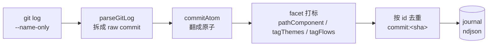

# component: mine

## 概览

**一句话**：`mine.js` 是引擎的 **git 历史考古队**——一次性把整部 `git log` **全量挖出来**，每个 commit 翻成一条 journal 原子，再按「文件路径属于哪个组件 / commit 文案命中哪条主题 / 这些组件穿过哪条数据流」给原子贴上 facet 标签。它是 journal 的**冷启动回填器**：新接入一个老仓库时，一跑就把多年历史灌成结构化原子。

**它在流水线的位置**：



**为什么要它**：journal 的另外两个来源——`hook`（提交即记一条）、`note`（agent 当场记决策）——都只覆盖**接入 lore 之后**的事。一个跑了三年的仓库，前面的历史全是空白。mine 负责把这段**过去**补回来：读 `git log` 全量回填，让 wiki 一上来就有完整的决策史可折。

**一个场景看懂它怎么干活**：

> 假设仓库 `config.yml` 声明了 `code_roots: [lib]`、一条主题 `quality`（关键词含 `accuracy`）、一条数据流 `pipeline`（`spans: [lib]`）。
> 历史里有这么一个 commit：sha `9e14cc4`、文案 `feat(mine): improve accuracy`、改了 `lib/mine.js` 和 `README.md`。mine 把它翻成一条原子：
>
> - **`pathComponent`** 看每个文件落在哪个 `code_root` 下：`lib/mine.js` → 组件 `lib`；`README.md` 不在任何 root 下 → 丢弃。去重排序后 `facets.component = ["lib"]`。
> - **`tagThemes`** 把 `subject + body` 拼起来小写后做子串匹配：命中 `accuracy` → `facets.theme = ["quality"]`。
> - **`tagFlows`** 看这条原子的组件集 `{lib}` 和每条 flow 的 `spans` 有没有交集：`pipeline` 的 spans 含 `lib` → `facets.flow = ["pipeline"]`。
>
> 最终落进 journal 的是一条 `id: "commit:9e14cc4"`、`kind: "commit"`、`facets: { component:["lib"], theme:["quality"], flow:["pipeline"] }` 的原子。**第二次再跑 mine，这条 id 已经在 journal 里 → 直接跳过**，不会重复写。

**为什么这么设计**：① **幂等回填**——回填是「把存量历史灌进来」，天然要能反复跑（首次没灌全、config 改了重灌、CI 里重跑）；按 `commit:<sha>` 这个稳定 id 去重，跑一百次结果一样。② **确定性**——同样的 git log + 同样的 config，产出字节级一致的原子（facet 都 `sort()` 过、不依赖时间/随机）；这让 mine 的输出可测、可 diff。③ **打标在挖的时候一次做完**——facet 是「这条历史属于哪个组件/主题/流」的索引，下游 `finalize` 折决策史时直接按 facet 过滤，不用回头再算。

想查 BUG 或改 mine？展开下面机制档 👇

## 机制详解

<details>
<summary><b>⓪ 调用入口 & I/O</b> —— 谁触发、读写什么</summary>

**触发路径**：

- **CLI**：`/lore:mine` 命令跑 `node lib/mine.js [repoRoot]`（默认 `process.cwd()`）。入口块（`process.argv[1] === fileURLToPath(import.meta.url)` 守卫 @ `lib/mine.js`）读 `.lore/config.yml`，解析出 `codeRoots / themes / flows`，调 `mine(...)`，打印 `✓ mined N new commit atom(s) (M already present, S scanned)`。
- **init 之后**：`/lore:init` 脚手架完成后，通常紧接着跑 `/lore:mine` 做首次回填（见 `test/mine.test.js` 的 `CLI integration: init + mine` 用例）。

**I/O**：

| 方向 | 对象 | 说明 |
|---|---|---|
| 读 | `git log --no-merges --name-only`（@ `mineCommits`） | 子进程 `execFileSync('git', …)`，`maxBuffer: 64MB`（大仓全量历史可能很长） |
| 读 | `.lore/config.yml` | 仅 CLI 入口读；`code_roots` / `theme.values` / `flow.values`。缺文件 → 空 facet，打印 `run /lore:init` 提示 |
| 读 | `.lore/journal/**/*.ndjson` | `existingIds` 收已有原子 id，做幂等去重 |
| 写 | `.lore/journal/<YYYY>/<MM>/<YYYY-MM-DD>.ndjson` | `appendAtom` 按原子 `ts` 的日期分片、**append-only** 追加一行 JSON |

mine **只写 journal**，不碰 wiki、不碰源码。

</details>

<details>
<summary><b>① 接口 / 能力面</b> —— 导出与签名</summary>

| 导出 | 签名 | 干什么 | 锚点 |
|---|---|---|---|
| `GIT_FORMAT` | `string` 常量 | git `--pretty=format`：`%x1e` (RS) 起头、字段间 `%x1f` (US) 分隔（`%H` sha · `%aI` 作者 ISO 时间 · `%s` subject · `%b` body） | `GIT_FORMAT @ lib/mine.js` |
| `mineCommits` | `(repoRoot, codeRoots, themes=[], flows=[]) → atom[]` | 跑 git log → `parseGitLog` → 每条 `commitAtom`，返回**未去重**的原子数组 | `mineCommits @ lib/mine.js` |
| `parseGitLog` | `(stdout) → {sha,ts,subject,body,files}[]` | 把 RS/US 分隔的 git log 文本拆成 raw commit；空串 → `[]` | `parseGitLog @ lib/mine.js` |
| `commitAtom` | `(raw, codeRoots, source='miner:commits', themes=[], flows=[]) → atom` | 一条 raw commit → 完整 schema 原子（含三轴 facet） | `commitAtom @ lib/mine.js` |
| `pathComponent` | `(filePath, codeRoots) → name \| null` | 文件路径 → 命中的**最长** `code_root` 的末段名；无命中 → `null` | `pathComponent @ lib/mine.js` |
| `tagThemes` | `(text, themes) → id[]` | `text` 小写后子串匹配每条 theme 的 `match` 关键词，命中则收 id，`sort()` | `tagThemes @ lib/mine.js` |
| `tagFlows` | `(components, flows) → id[]` | 组件集 ∩ 每条 flow 的 `spans` 非空 → 收 flow id，`sort()` | `tagFlows @ lib/mine.js` |
| `mine` | `({repoRoot,journalDir,codeRoots,themes,flows}) → {scanned,added,skipped}` | 编排：挖原子 → 按 id 去重 → `appendAtom`，返回计数 | `mine @ lib/mine.js` |

**复用点**：`hook.js` 进口 `parseGitLog / commitAtom / GIT_FORMAT` 三件套，只换 `source='hook'` + 把 `git log` 收窄成 `-1 HEAD`，单 commit 复用同一套打标逻辑（见「依赖 / 邻居」）。

</details>

<details>
<summary><b>② 数据流</b> —— 模块内 step-by-step</summary>

`mineCommits`（@ `lib/mine.js`）顺序：

1. `execFileSync('git', ['log','--no-merges','--pretty=format:'+GIT_FORMAT,'--name-only'])` 拿整部历史文本（`--no-merges` 跳过 merge commit；`--name-only` 让每条 commit 后跟变更文件名清单）。
2. `parseGitLog(stdout)`：先 `split('\x1e')`（按 RS 切成一条条 commit）→ `.slice(1)`（**丢掉首段空串**，因为每条记录前都有 RS）→ 每条 `split('\x1f')` 拆出 `[sha, ts, subject, body, filesBlob]` → `filesBlob` 按换行拆、trim、滤空 → `files[]`。
3. 每条 raw 喂 `commitAtom(raw, codeRoots, 'miner:commits', themes, flows)`：
   - `component`：`raw.files.map(pathComponent).filter(Boolean)` → `new Set` 去重 → `sort()`。
   - `theme`：`tagThemes(subject + ' ' + body, themes)`。
   - `flow`：`tagFlows(component, flows)`（注意吃的是**已算好的 component 数组**，不是文件）。

`mine`（@ `lib/mine.js`）在 `mineCommits` 之上加去重 append：

4. `existingIds(journalDir)` 收 journal 里已有的全部原子 id 进一个 `Set`。
5. 逐原子：`seen.has(a.id)` → `skipped++` 跳过；否则 `appendAtom` 写一行、`seen.add(a.id)`、`added++`。
6. 返回 `{ scanned: 总数, added, skipped }`。

</details>

<details>
<summary><b>③ 数据契约</b> —— 原子长什么样</summary>

`commitAtom` 产出的 commit 原子（落进 journal ndjson 的一行）：

```json
{
  "id": "commit:9e14cc4",
  "ts": "2026-06-03T00:00:00Z",
  "kind": "commit",
  "commit": "9e14cc4",
  "title": "feat(mine): improve accuracy",
  "why": "<commit body 多行原文>",
  "what_changed": "",
  "facets": { "component": ["lib"], "flow": ["pipeline"], "theme": ["quality"] },
  "refs": { "files": ["lib/mine.js", "README.md"], "pitfall": null, "related": [] },
  "source": "miner:commits",
  "enriched": false,
  "confidence": "EXTRACTED"
}
```

契约要点：

- **`id` 是幂等键**：`commit:<sha>`，下游去重、`fold` 折叠都按它。
- **`facets` 三轴恒为数组**（可空 `[]`，永不缺键），且都 `sort()` 过 → 确定性。`refs.files` 保留**全部**变更文件（含不属于任何组件的，如 `README.md`），只有 `facets.component` 做了过滤；`refs.pitfall=null`、`refs.related=[]` 是占位，留给 `note` / 富化阶段填。
- **`source`** 区分来源：mine 写 `miner:commits`，hook 复用 `commitAtom` 时传 `hook`。
- **`enriched:false` / `confidence:"EXTRACTED"`**：标明这是**机械抽取**的原子（非 agent 人工富化），下游可据此分级。`why = commit body` 原文、`what_changed` 留空（机械挖挖不出语义 diff）。

</details>

<details>
<summary><b>④ facet 打标规则</b> —— 三轴各按什么贴</summary>

| facet 轴 | 输入 | 匹配规则 | 输出 |
|---|---|---|---|
| `component` | commit 变更文件路径 | 路径 `=== root` 或以 `root + '/'` 开头；多 root 命中取**最长**那个；取末段名（`split('/').pop()`） | 去重 `sort()` 后的组件名数组 |
| `theme` | `subject + ' ' + body` | 整段**小写**后，子串包含该 theme 任一 `match` 关键词（关键词也小写） | 命中的 theme id `sort()` |
| `flow` | 该原子**已算好的** `component` 数组 | 组件集与该 flow 的 `spans` 有交集 | 命中的 flow id `sort()` |

打标顺序有依赖：**先算 `component`，`flow` 吃 `component` 的结果**（flow 是「组件穿过的数据流」，不是直接看文件）。所以一个 commit 若只改了不属于任何 `code_root` 的文件 → `component` 空 → `flow` 必然也空，但 `theme` 仍可能命中（theme 只看文案，与文件无关）。

</details>

<details>
<summary><b>⑤ 边界 / 坑</b> —— 查 BUG 必看</summary>

- **RS/US 分隔解析靠 `GIT_FORMAT` 起头的 `%x1e`**：`parseGitLog` 先 `split('\x1e').slice(1)` 砍掉首段空串——**因为每条记录前都有 RS**，第一条之前那段必为空。若改了 `GIT_FORMAT` 不再以 `%x1e` 起头，或字段顺序变，解析会整体错位（`subject/body/files` 串位）。RS=`\x1e`、US=`\x1f` 选的是文本里几乎不会自然出现的控制字符，规避 commit message 里的换行/制表把字段切碎。
- **`pathComponent` 取最长 `code_root`**：`code_roots: ['src', 'src/pkg']` 时，`src/pkg/core.py` 命中 `pkg`（更长者赢）而非 `src`——保证嵌套组件归属到最具体的那个。
- **前缀误匹配已防住**：判定用 `=== root || startsWith(root + '/')`，所以 `libfoo/x.js` **不会**误匹配 `code_root: lib`（`libfoo` 不是 `lib/…`）。
- **按 id 幂等**：去重只看 `id`（即 `commit:<sha>`）。**不看内容**——若某 sha 的原子已在 journal，即便后来 facet 规则变了（改了 config 的 theme/flow），重跑 mine 也**不会更新**那条旧原子（它被 skip 了）。要让旧历史吃上新 facet，得先清掉 journal 再重挖，或靠下游 `fold` 层处理。
- **`README.md` 之类无归属文件**：`pathComponent` 返回 `null`、被 `filter(Boolean)` 滤掉，所以 `facets.component` 不含它们；但它们仍完整保留在 `refs.files` 里（diff 溯源不丢）。
- **merge commit 被 `--no-merges` 跳过**：合并节点不产原子（避免重复计入两边历史）。
- **大仓 buffer**：`maxBuffer: 64MB`；超长历史若撑爆会抛 `ENOBUFS`（hook 的单 commit 路径只给 16MB，因为只取 HEAD）。
- **缺 config**：CLI 入口对缺 `.lore/config.yml` 容忍——`codeRoots/themes/flows` 退化为空，原子照样产出但 facet 全空，并打印 `run /lore:init for component tagging` 提示。

</details>

<details>
<summary><b>⑥ 故障地图</b> —— 症状 → 定位</summary>

| 症状 | 大概率原因 | 看哪 |
|---|---|---|
| 原子 `facets.component` 全空 | config 没填 `code_roots` / 没读到 config | CLI 入口读 config 那段 + `pathComponent` |
| 某文件没被归类，但你以为该归 | 路径前缀不严格相等（`libfoo` vs `lib`），或该 root 不是最长命中 | `pathComponent @ lib/mine.js` |
| `theme` 该命中却空 | `match` 关键词大小写/拼写、或文案根本没这词（只匹配 subject+body，不看 diff 内容） | `tagThemes @ lib/mine.js` |
| `flow` 空但 `component` 有值 | flow 的 `spans` 和该原子组件无交集 | `tagFlows @ lib/mine.js`（吃的是 component 数组） |
| 重跑改了 config 但旧原子 facet 没变 | 按 id 幂等 → 旧 sha 被 skip，不重算 | `mine @ lib/mine.js` 去重分支 |
| 解析后字段串位 / 乱码 | `GIT_FORMAT` 被改、或 commit 里混入 RS/US 控制字符 | `GIT_FORMAT` + `parseGitLog @ lib/mine.js` |
| `ENOBUFS` / git log 截断 | 历史太长撑爆 `maxBuffer` | `mineCommits` 的 `execFileSync` 选项 |
| 重复原子写进 journal | journal 路径不对导致 `existingIds` 读不到已有原子 | `existingIds` / `appendAtom @ lib/journal.js` |

</details>

<details>
<summary><b>⑦ 测试锚点</b> —— 想验证哪条行为看哪个用例</summary>

全部在 `test/mine.test.js`：

- **`pathComponent` 三连**：前缀匹配取末段（`pathComponent: prefix match`）· 最长命中赢（`longest match wins`）· 无命中 `null` 且前缀名不误匹配（`no match → null`，含 `libfoo/x.js` 不匹配 `lib`）。
- **`parseGitLog`**：多行 body + 文件清单解析（`parses commits with multi-line body and files`，用例里手搓 `RS/US` fixture）· 空串 → `[]`（`empty stdout → []`）。
- **`commitAtom`**：全 schema + component 去重排序、`README.md` 排除（`builds full-schema atom`）· 无命中组件 → 空 facet（`no matching component`）· `source` 参数覆盖默认（`source param overrides default`）· `themes` 参数 → `facets.theme`（`themes param tags facets.theme`）· `flows` 参数 → `facets.flow`（`flows param tags facets.flow`）。
- **`mineCommits`**（真 git repo）：产带 component facet 的原子、id 形如 `commit:[0-9a-f]{40}`（`returns commit atoms…from a real repo`）· 传 themes/flows 穿透（`passes themes`/`passes flows`）。
- **`mine`**：首跑全 added、重跑全 skipped（`re-run is idempotent (dedup by id)`）。
- **`tagThemes`**：子串大小写不敏感、`sort` 去重（`substring case-insensitive`）· 空文案、不改入参（`empty text / does not mutate input`）。
- **`tagFlows`**：组件 ∩ spans 命中、`sort`（`component∩spans non-empty`）· 不改入参（`does not mutate input`）。
- **CLI 集成**：`init` + `node lib/mine.js` 端到端，回填 1 原子带 component facet，重跑 0 新增、原子数不变（`CLI integration: init + mine`）· CLI 读 config themes / flows（`mine CLI reads config themes` / `flows`）。

</details>

<details>
<summary><b>⑧ 不变量</b> —— 改 mine 别破的硬约束</summary>

- **append-only**：mine 只 `appendAtom`（追加一行 ndjson），从不改写/删除已有原子。
- **按 sha 幂等**：同一 commit 跑多少次 mine，journal 里最多一条 `commit:<sha>`；`mine` 的 `{added,skipped}` 反映这点（二跑 `added:0, skipped:N`）。
- **确定性**：同 git log + 同 config → 字节级一致的原子（facet 全 `sort()`、不掺时间/随机/路径顺序依赖）。
- **facet 形状恒定**：`facets.{component,flow,theme}` 永远是数组（可空），永不缺键、永不 `null`。
- **纯函数不改入参**：`tagThemes` / `tagFlows` 不 mutate 传入的 `themes` / `flows` 数组（有专门测试守着）。
- **只写 journal**：mine 不碰 wiki、不碰源码——零侵入。

</details>

## 依赖 / 邻居

- **依赖**：`journal`（`appendAtom` / `existingIds` 落盘与去重）· `config`（`parseConfigCodeRoots` / `parseConfigThemes` / `parseConfigFlows` 解析三轴声明）。
- **被复用**：`hook.js` 进口 `parseGitLog` / `commitAtom` / `GIT_FORMAT` —— post-commit 时复用同一套打标逻辑，只把 git log 收窄到 `-1 HEAD`、`source` 改 `hook`，单 commit 记一条原子。mine 与 hook 是「**全量回填**」与「**增量追加**」的一对：mine 补过去，hook 跟现在，两者产出的原子结构同构、按同一 id 幂等共存于一条 journal。
- **下游**：mine 写进 journal 的原子，由 `fold` 折叠去重（按 id），再被 `sync` 的 finalize 按 `facets` 折进各页 `## Decision history`。

## Cross-links

- [[lib]]（鸟瞰页）· [[hook]]（增量追加 · 复用 commitAtom）· [[fold]]（读取层按 id 折叠原子）
