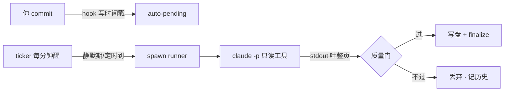

# component: runner

## 概览

**一句话**：`runner.js` 是 auto 档的**夜班编辑**——趁你不在，把过期的 wiki 页拿给一个只能「看」不能「改」的 LLM 重写，稿子过了质检才替换原页。

**它在流水线的位置**：

**一个场景看懂「只读 LLM」**：

> 后台的 claude 只拿到 `Read,Grep,Glob` 三个工具——它能读源码、能搜，但**一个字也写不了盘**。
> 新页面全文从 stdout 吐出来，由 runner（确定性代码）接住、跑完五道质检（非空？frontmatter 完整？
> 决策史哨兵没丢？mermaid 图语法过？没腰斩？）才落盘。LLM 哪怕被注入了坏念头，攻击面也是零。

想看触发条件和质量门细节？展开机制档 👇

## 机制详解

<b>① 接口 / 能力面</b> —— 导出与签名

| 导出 | 签名 | 干什么 | 锚点 |
|---|---|---|---|
| `shouldRunAuto` | `({config, pendingTs, lastRunDate, now, runnerAlive}) → {run, reason}` | ticker 判定纯函数（静默期/schedule/防叠跑） | `shouldRunAuto @ lib/runner.js` |
| `qualityGate` | `(newText, oldText) → {ok, reason?}` | 写盘前四道机械质检 | `qualityGate @ lib/runner.js` |
| `claudeBackend` | `() → {rewritePage({page, repoRoot, timeoutMs}) → Promise<string>}` | claude CLI 后端（唯一实现；接口留 codex/裸 API 位） | `claudeBackend @ lib/runner.js` |
| `runAuto` | `(loreDir, {backend, maxPages, timeoutMs, spawnFn, now}) → {pages, total_ms}` | 主流程（全注入可测） | `runAuto @ lib/runner.js` |
| `tickAuto` | `(loreDir, {spawnFn}) → {run, reason}` | ticker 单 repo 判定+触发（永不抛） | `tickAuto @ lib/runner.js` |
| CLI | `node lib/runner.js <loreDir>` | 手动触发一次（调试/立即重写） | — |

<b>② 触发链路</b> —— 三个条件谁先满足

`tickAuto` 每分钟被宿主（per-repo server CLI 或 portal `__run`，portal 接管全部登记仓库）调用：

1. `mode !== 'auto'` 或 runner 活着（`runner.pid` + `isAlive`）→ 不跑。
2. **静默期**：`auto-pending.json` 时间戳距今 ≥ `debounce_minutes`（默认 10）→ 跑（reason `debounce`）。期间再 commit 会重写时间戳 = 重新计时，风暴自然合并。
3. **排队即意图**：重写队列非空时，最新排队时间视同 pending——只点「✍ 排队」不 commit 也会在静默期后触发。
4. **schedule**：`HH:MM` 到点且今天没跑过（比对 `auto-runs` 最后一条的日期）→ 跑（reason `schedule`）。

触发后清 pending、detached spawn runner（windowsHide——Windows 不弹窗）。

<b>③ runAuto 主流程</b> —— step by step

1. `writeRunnerPid`（锁），try/finally 保证 `clearRunnerPid`。
2. 工单 = `planSync` 的 component worklist，**rewrite 队列页置顶**（user-requested 优先），去重后截前 `max_pages`（默认 5）页。
3. 逐页**串行**：`backend.rewritePage`（超时默认 10 分钟 kill）→ `qualityGate(new, old)` → 过门写盘 + 从队列移除该页；不过门丢弃、页保持原样。每页记 `{page, ok, reason?, ms}`。
4. `appendAutoRun` 历史落盘；**有页成功才** spawn finalize（盖章/指纹推进/manifest——stale 归零靠它）。

<b>⑤ 边界 / 坑</b> —— 查 BUG 必看

- **LLM 零写权限是架构不变量** ←（决策见 docs 轴 superpowers-specs-2026-06-10-lore-auto-rewrite-design）：`claude -p --allowedTools Read,Grep,Glob`，页面全文走 stdout，写盘权在 runner——质量门天然在写盘前。给 backend 加写工具 = 破坏安全模型，别做。
- **finalize 刻意不看档位**：manual 档关的是「自动」，手动 ⟳ 正是 manual 的用法——`server.js` finalize 端点注释同款提醒。
- **stdout 可能混入日志**：`claudeBackend` 取首个 `---`（frontmatter 起点）到文末作为页面体；提取不到 → 质量门以 `frontmatter missing` 拒。
- **失败不重试**：超时/CLI 缺失/质量门不过都只记 reason 入历史，下轮 stale 仍在自然重试——重试风暴比漏一轮更糟。
- **run 级原子性**：跑到一半用户切 manual，当前 run 跑完不中断；ticker 下轮看 mode 已变不再触发。
- **质量门防截断阈值是「≥ 旧文 1/3」**：中文 `length` 按 UTF-16 码元计——测试 fixture 踩过「旧文不够长撑不起比例」的坑（B2 实测）。

## 依赖 / 邻居

- **依赖**：[[syncstate]]（锁/队列/历史/配置）· `lint`（mermaidIssues 复用为第五检）· `manifest`（parseFrontmatter）· `sync`（planSync 工单 + finalize 收尾）· `serve`（isAlive）
- **被调**：server.js CLI ticker · portal `__run` ticker（每 tick 重读 registry，新仓库自动纳入）
- **相关页**：[[syncstate]]（状态层）· [[sync]]（finalize）· [[hook]]（pending 来源）

## Cross-links

- [[lib]]（鸟瞰页）· [[syncstate]] · [[sync]]

> 深度页不放 `## Decision history`：决策史汇总在鸟瞰页 [[lib]]。
