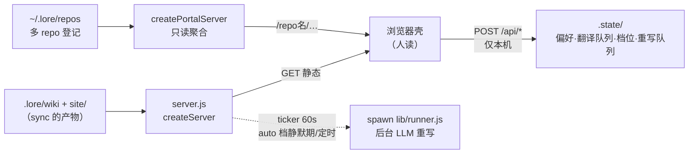

# component: server.js

## 概览

**一句话**：`server.js` 是 lore 的**本地 Web 门面**——浏览器里看到的一切（壳、wiki 页、控制台按钮背后的接口）都从这里出去，且永远只听 `127.0.0.1`。

**它在流水线的位置**：

**B2 之后的第四个角色**：per-repo 进程还是 **auto 档的调度宿主**——CLI 块挂一个 60 秒 ticker，用 `shouldRunAuto @ lib/runner.js` 判「静默期到了 / schedule 到点 / runner 没在跑」，满足就 detached spawn `lib/runner.js`（后台 LLM 重写）。serve 没开 = auto 不触发（可接受降级，下次开 serve 补跑过期 pending）。**portal 进程不带 ticker**——聚合只读，不替任何 repo 跑 runner。

**为什么一个文件三种角色**：静态伺服（壳+wiki）、写 API（本机控制）、聚合门户（多 repo）共享同一套路径安全逻辑（`serveStatic` 防穿越）。拆三个文件会复制安全代码；合在一起，**门户复用 per-repo 的静态语义但砍掉全部写面**——只读由结构保证，不靠运行时判断。

**一个场景看懂「为什么浏览器能改档位」**：

> 你在壳里点「手动档」→ 壳 `POST /api/sync/mode`。server 先查 **Host 头是不是本机**
> （`localHost`，防恶意网页用 DNS 重绑定假冒 127.0.0.1）→ 校验枚举 → 写 `.state/sync.json`。
> 下次 commit 时 hook 读同一个文件决定要不要自动刷新——**浏览器点击真的改变了 git hook 的行为**，
> 而这条链路从头到尾出不了你这台机器。

想查 BUG 或加端点？展开机制档 👇

## 机制详解

<b>① 接口 / 能力面</b> —— 导出与签名

| 导出 | 签名 | 干什么 | 锚点 |
|---|---|---|---|
| `createServer` | `(rootDir, {spawnFn}) → http.Server` | per-repo：静态 + 全部写 API | `createServer @ server.js` |
| `createPortalServer` | `(repoMap) → http.Server` | 聚合门户：`/<name>/…` 路由，**零写面** | `createPortalServer @ server.js` |
| `serveStatic` | `(rootDir, rel, res) → void` | 共享静态语义：穿越防护 + dir→index + MIME | `serveStatic @ server.js` |
| CLI | `node server.js <rootDir> <port>` | 被 `lib/serve.js` spawn 为常驻进程 | 文件尾 |

<b>② 请求路由</b> —— 一个请求进来怎么走

`createServer` 的判定顺序（`createServer @ server.js`）：

1. **POST /api/\* 总闸**：`!localHost(req)` → 403（任何写 API 之前）
2. `POST /api/preferences` → 写 `.state/preferences.json`（语言偏好）
3. `POST /api/translation-requests` → append `.state/translation-requests.ndjson`（翻译排队）
4. `GET /api/sync/status` → `{mode, last_finalize, config, runner_running}`（config=debounce/schedule/max_pages 全配置；runner_running 查 `.state/runner.pid` 活性——壳灯 🔵 busy 态的数据源）
5. `POST /api/sync/mode` → 枚举校验写 `.state/sync.json`（manual/notify/**auto** 三档全合法，B2 起）
6. `POST /api/sync/finalize` → detached spawn `lib/sync.js finalize`（不 gate 档位——手动刷新正是 manual 档的用法）
7. `GET/POST /api/sync/rewrite-requests` → 重写排队（`safeWikiPage` 防越狱）
8. `GET /api/sync/runs` → `.state/auto-runs.ndjson` 最近 20 条（console 任务历史表）
9. 其余 → `serveStatic`（壳 / wiki / mermaid.min.js）

门户（`createPortalServer`）：`/` 出 repo 列表页；`/<name>/api/…` **一律 404**（只读铁律）；`/<name>/<rel>` → 该 repo 的 `serveStatic`。

<b>③ 安全模型</b> —— 三道闸

- **绑定面**：CLI 只 `listen(port, '127.0.0.1')` —— 外网根本连不上。
- **Host 闸**（`localHost @ server.js`）：写 API 校验 Host 头 ∈ {127.0.0.1, localhost, [::1]} —— 拦 DNS 重绑定（远端网页把自己域名解析到 127.0.0.1 来 POST）。403 测试用 `node:http` 注入伪 Host 钉死（fetch 的 host 是 forbidden header，测不到这个闸）。
- **路径闸**：`serveStatic` 的 normalize+startsWith 防目录穿越；`safeWikiPage` 双层（白名单正则 + normalize 越狱检查）守 rewrite 排队的 page 参数。

<b>④ 边界 / 坑</b> —— 查 BUG 必看

- **spawn 的异步 error 必须吞**（`child.once('error', ...)` @ finalize 端点）：EMFILE 类异步失败走 ChildProcess 事件而非 try/catch，不接住会击落常驻 server。
- **finalize 端点刻意不 gate 档位**——manual 关的是「自动」，手动 ⟳ 正是 manual 档的用法。别给它补 mode 检查（端点注释有同款警告）。
- **python 退化形态**：单语 repo 默认 python 静态 server（`lib/serve.js` probe）→ 本文件不在场、全部 API 404 → 壳降级只读。`/lore:serve --node` 强制启用本文件。
- **portal 安全靠结构**：`hasOwnProperty` 查 repoMap（防 `__proto__` 假命中）+ api 前缀整段 404。给门户加写功能前先想清楚跨 repo 写意味着什么。
- **ticker 永不击落 server**：整个 tick 回调包 try/catch；`shouldRunAuto` 动态 import（判定链不进 `createServer` 工厂，测试建 server 零定时器）；`.unref()` 让进程能正常退出。runner 防叠跑靠 `.state/runner.pid` 活性检查（LLM 重写不幂等，必须防叠）。

## 依赖 / 邻居

- **依赖**：`lib/i18n.js`（translationSourceHash）· `lib/syncstate.js`（档位/重写队列）· Node 内置 http/fs/path
- **被调**：`lib/serve.js`（spawn 为常驻进程，双语或 `--node` 时选中）· `lib/portal.js`（聚合门户入口）
- **相关页**：[[lib]]（引擎鸟瞰）· [[sync]]（finalize 被本文件 spawn）· [[hook]]（读同一个 sync.json）

## Cross-links

- [[lib]] · [[sync]] · [[hook]] · [[manifest]]

## Decision history

<!-- LORE_JOURNAL:START -->
- **feat(portal): route /api per repo + take over auto ticker — console fully operational behind portal** — v0.6 'portal read-only' flipped by user need: all local APIs extracted into (14ec7cc, 2026-06-11)
- **fix(portal): repo-list page follows shell theme (shared CSS vars + same localStorage key, with its own switcher)** (89f7615, 2026-06-11)
- **feat(shell): repo switcher on per-repo serve too — jumps via portal** — Per-repo server now serves /repos.json (central registry + portal port + (cc3326e, 2026-06-11)
- **feat(portal): in-shell repo switcher + home button** — GET /repos.json (read-only list, zero-write invariant intact); shell detects (9d34c3f, 2026-06-11)
- **fix(server): 301 trailing-slash redirect on directory requests (white-screen root cause)** — User hit http://127.0.0.1:7001/site (no trailing slash): serveStatic served (1003574, 2026-06-11)
- **fix: no-cache static headers (module-cache white screen), windowsHide all detached spawns, config edit UI** — - serveStatic sends Cache-Control: no-cache — stale shell.mjs in the browser (c01c63b, 2026-06-11)
- **feat(server): status config/runner_running, GET runs, 60s auto ticker (per-repo only)** (469ac6d, 2026-06-10)
<!-- LORE_JOURNAL:END -->
