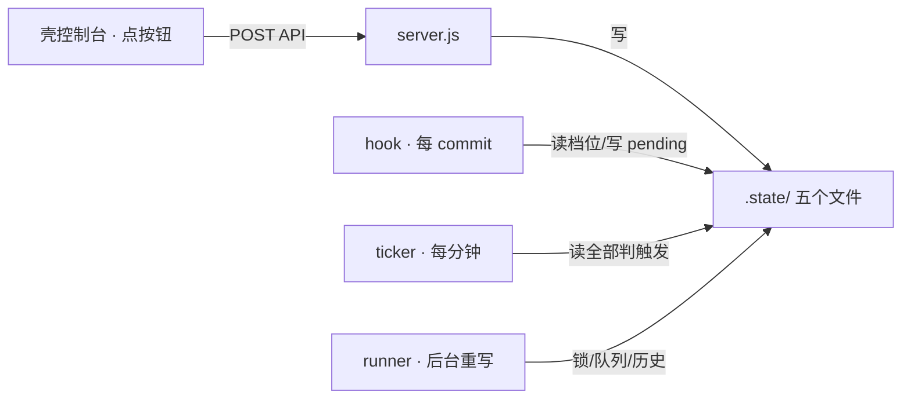

# component: syncstate

## 概览

**一句话**：`syncstate.js` 是同步控制台和自动重写的**记忆抽屉**——档位、auto 参数、重写队列、runner 锁、任务历史五样东西都放在 `.lore/.state/` 里，谁要用谁来拿。

**它在流水线的位置**：

**一个场景看懂「per-machine 档位」**：

> 你在工作机上把 lore 切到「全自动」，同一仓库 clone 到演示机——演示机还是默认「提醒」档。
> 因为档位存在 `.state/sync.json`（gitignored，不随 git 走）：**档位是「这台机器怎么干活」的偏好，
> 不是仓库事实**。删掉这个文件？回默认 notify，啥也不会坏。

想看每个文件的精确语义？展开机制档 👇

## 机制详解

<b>① 接口 / 能力面</b> —— 导出与签名

| 导出 | 签名 | 干什么 | 锚点 |
|---|---|---|---|
| `readSyncMode` / `writeSyncMode` | `(stateDir) → 'manual'\|'notify'\|'auto'` / `(stateDir, mode)` | 档位读写（写校验枚举，非法 throw） | `readSyncMode @ lib/syncstate.js` |
| `readSyncConfig` / `writeSyncConfig` | `(stateDir) → {mode, debounce_minutes, schedule, max_pages}` | auto 参数全配置视图（缺省兜底） | `readSyncConfig @ lib/syncstate.js` |
| `appendRewriteRequest` / `readRewriteRequests` | `(stateDir, {page}) → {queued}` / `→ [{ts,page}]` | 重写队列（同页未消化去重） | `appendRewriteRequest @ lib/syncstate.js` |
| `writeAutoPending` / `readAutoPending` / `clearAutoPending` | `(stateDir, ts)` / `→ ts\|null` | auto 触发的 commit 时间戳 | `writeAutoPending @ lib/syncstate.js` |
| `writeRunnerPid` / `readRunnerPid` / `clearRunnerPid` | `(stateDir, pid)` / `→ pid\|null` | runner 防叠跑锁 | `writeRunnerPid @ lib/syncstate.js` |
| `appendAutoRun` / `readAutoRuns` | `(stateDir, run)` / `(stateDir, limit) → [run]`（新在前） | 任务历史 ndjson | `appendAutoRun @ lib/syncstate.js` |

<b>② 五个文件的契约</b> —— 谁写谁读

| 文件 | 形状 | 写者 | 读者 |
|---|---|---|---|
| `sync.json` | `{mode, debounce_minutes?, schedule?, max_pages?}` | 控制台 POST mode/config | hook（分流）、ticker、status API |
| `rewrite-requests.ndjson` | 每行 `{ts, page}` | 控制台「✍ 排队」 | `/lore:sync` 会话消化、runner（auto 档） |
| `auto-pending.json` | `{since: ts}` | hook（auto 档每 commit） | ticker（判静默期，触发后清） |
| `runner.pid` | `{pid}` | runner 起跑写、跑完清 | ticker（防叠跑）、status API（灯 busy 态） |
| `auto-runs.ndjson` | 每行 `{ts, pages:[{page,ok,reason?,ms}], total_ms}` | runner 每 run 一条 | console 任务历史表、ticker（schedule 判「今天跑过没」） |

<b>⑤ 边界 / 坑</b> —— 查 BUG 必看

- **`sync.json` 是整文件覆写，不是原子 rename** ←（决策见 docs 轴 superpowers-specs-2026-06-09-lore-sync-console-design）：撕裂读（写一半被读）由读侧兜底——`readSyncMode` 对缺文件/坏 JSON/未知枚举一律回 `'notify'`（安全默认：不会误进 manual 停自动、也不会误进 auto 烧 LLM）。文件几十字节、写频率极低，rename 在 Windows 跨分区还有兼容坑，不值得。
- **`readSyncConfig` 对未知字段忽略、非法值回默认**（schedule 必须 `HH:MM`、debounce/max_pages 必须有限数字）——B1 的 `{mode}` 旧形状天然兼容。
- **队列去重以「读侧过滤后视图」为准**：append 前先 `readRewriteRequests`（坏行已滤）再查重——torn append 产生的坏行不会永久阻塞该页重新排队。
- **`appendRewriteRequest` 对空/非字符串 page 直接 `{queued:false}`**：与读侧过滤谓词对称把门（server 端 `safeWikiPage` 在前是第一道，这里是纵深）。
- **runner.pid 的 stale 检测在消费侧**：ticker 用 `isAlive(pid)` 判活——进程崩了没清锁不会永久卡死 auto。

## 依赖 / 邻居

- **依赖**：仅 `node:fs` / `node:path`（零内部依赖——状态层是最底层）
- **被调**：`hook`（档位分流+pending）· `server.js`（全部控制 API）· `runner`（锁/队列/历史）· ticker（server CLI 与 portal）
- **相关页**：[[hook]]（分流消费）· [[runner]]（最大消费者）· [[sync]]（finalize 与档位无关——机械刷新不看档位）

## Cross-links

- [[lib]]（鸟瞰页）· [[runner]] · [[hook]]

> 深度页不放 `## Decision history`：决策史汇总在鸟瞰页 [[lib]]。
