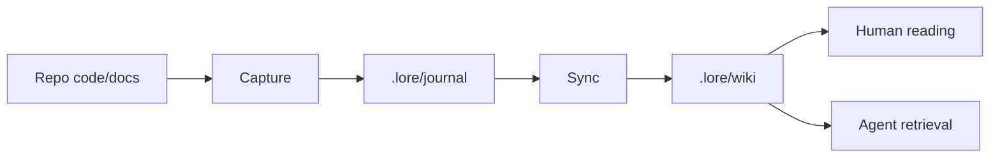

> 源文档：`docs/superpowers/specs/2026-06-06-lore-human-home-translation-design.md`

# lore Human HOME + Persistent Translation Layer 设计

- 日期：2026-06-06
- 状态：设计已批准，待实施计划
- 基线代码：`v0.4.1` / `fb44b80 fix(shell): show last_updated date on docs sidebar links`
- 北极星：人读友好的代码仓库 wiki + agent 友好的 wiki/graph，二者缺一不可

## 背景

`lore` 目前已经具备 capture -> synthesize -> consume 的基本闭环：

- `.lore/journal` 是耐久层，记录 commit/note/mine 得到的原子。
- `.lore/wiki` 是可重建物化视图，当前有 `component`、`flow`、`theme`、`docs` 轴。
- v0.3.x/v0.4.x 把 `docs/**/*.md`、`CHANGELOG.md`、`CLAUDE.md` pitfalls 纳入 docs 轴，并把 docs 页升级为嵌入原文全文、按 `last_updated` 降序显示。

这些更新让“数据够不够”不再是最大问题。现在最大的缺口是“人第一次打开之后怎么读”：当前 INDEX 更像目录，而不是导读；页面之间的关系依靠用户自己拼；双语缺失让中文用户阅读英文 repo 或英文用户阅读中文 wiki 时成本很高。

本轮设计把首页导读和双语层一起纳入架构。graph 侧保留元数据接口，但不在本轮实现完整图数据库或可视化 graph。

## 用户已确认的方向

人读优先级：

1. A：新人 5 分钟懂全貌
2. C：排查时快速定位
3. B：追溯为什么
4. D：项目史叙事

HOME 顺序：

1. 一句话定位
2. 状态 chips
3. 核心知识流图
4. 理解项目 / 排查问题入口
5. 关键决策 / 时间线入口

双语策略：

- 主语言跟 repo/用户配置走。
- 用户可以手动切换语言。
- 切换后持久化保存。
- 需要翻译时可以从页面主动触发。
- 翻译结果必须持久保留，不是一次性浏览器状态。

## 目标

### 目标 1：把 HOME 变成第一阅读入口

新增 `.lore/wiki/HOME.md` 作为默认打开页面。它不是目录替代品，而是“认知入口”：

- 用一句话回答“这个仓库是什么”。
- 用状态 chips 回答“这份 wiki 新不新、覆盖了哪些轴、当前语言是什么”。
- 用一张核心知识流图解释 capture -> synthesize -> consume。
- 给出两类入口：理解项目、排查问题。
- 给出关键决策和时间线入口，而不是在首页堆满历史。

`INDEX.md` 继续存在，职责收窄为完整目录。

### 目标 2：建立持久化双语模型

新增 repo 级语言配置、用户级语言偏好、页面级翻译 sidecar：

- repo 默认语言写入 `.lore/config.yml`。
- 用户当前语言偏好写入 `.lore/.state/preferences.json`，浏览器也用 `localStorage` 做即时持久化。
- 默认语言页面保持现有路径，例如 `component/lib.md`。
- 非默认语言页面使用 sidecar，例如 `component/lib.zh.md` 或 `component/lib.en.md`。
- manifest 暴露每页可用翻译、stale 状态、源 hash。

### 目标 3：翻译可由页面触发，但生成仍保持 agent 可审查

当前 `lore` 的 server 是本地只读静态服务。直接让浏览器调用 LLM 并写 wiki 会把安全、密钥、审查和确定性都搅在一起。

本轮采用两段式：

1. 页面点击“翻译本页”后，向本地 Node server 写入 `.lore/.state/translation-requests.ndjson`。
2. agent/命令读取请求，生成 sidecar 翻译页，再运行 finalize 更新 manifest。

这样页面触发是持久的，翻译产物也是持久的，同时仍保留 agent 审查和 git diff。

## 非目标

- 不实现完整 graph 存储、图查询语言或图可视化。
- 不自动翻译整个 repo。
- 不默认翻译 `.lore/journal` 原子、commit 原文、CHANGELOG 原文。它们可以被页面摘要引用，也可以由用户逐页触发翻译。
- 不把浏览器变成直接 LLM 客户端。
- 不改变 `.lore/journal` 作为耐久层、`.lore/wiki` 作为物化视图的基本分层。

## HOME 设计

### 文件与路由

新增根页面：

```text
.lore/wiki/HOME.md
```

manifest 里新增 `HOME` 轴，并排在 `INDEX` 之前：

```json
{
  "axes": [
    { "id": "HOME", "label": "Home", "pages": [{ "id": "HOME", "path": "HOME.md" }] },
    { "id": "INDEX", "label": "INDEX", "pages": [{ "id": "INDEX", "path": "INDEX.md" }] },
    { "id": "component", "label": "Component", "pages": [] },
    { "id": "flow", "label": "Flow", "pages": [] },
    { "id": "theme", "label": "Theme", "pages": [] },
    { "id": "docs", "label": "Docs", "pages": [] }
  ]
}
```

浏览器 `firstPageKey()` 不再落到 INDEX，而是自然打开 manifest 的第一个页面，也就是 `HOME/HOME`。

### HOME 内容结构

HOME 采用 agent prose + deterministic slots：

```markdown
---
title: Home
summary: human-readable orientation map for this repository
---
# lore

一句话定位。

{{LORE_HOME_STATUS}}

## Knowledge flow



## Understand the project

- [[lib]]
- [[changelog]]

## Debug a problem

- [[docs-ROADMAP]]
- [[pitfalls]]

## Decisions and timeline

- [[changelog]]
```

`{{LORE_HOME_STATUS}}` 由 finalize 机械替换。agent 负责一句话定位、入口选择、图的语义表达；程序负责时间、sha、轴数量、语言和翻译状态，避免状态漂移。

### HOME 状态块

状态块以 Markdown 列表输出，shell 继续复用现有 renderer：

```markdown
## Status

- Version: `0.4.1`
- Code: `fb44b80`
- Updated: `2026-06-06`
- Axes: `component 2` · `flow 1` · `theme 1` · `docs 29`
- Freshness: `fresh`
- Language: `zh` default · `en` available
- Translations: `12 ready` · `3 stale` · `4 missing`
```

shell 可以逐步把这段渲染成 chips，但第一版不依赖新 Markdown 语法。

## 双语设计

### repo 语言配置

`.lore/config.yml` 增加可选块：

```yaml
language:
  default: zh
  available: [zh, en]
```

规则：

- `default` 是 repo 的主语言。
- `available` 必须包含 `default`。
- 缺省时使用 `{ default: en, available: [en] }`，保持旧 repo 行为稳定。
- init 生成的示例配置包含 language 块，用户可以手动改。

### 用户偏好

用户语言偏好有两个持久层：

- 浏览器即时层：`localStorage["lore-language"]`，切换后立即生效。
- repo 本地状态层：`.lore/.state/preferences.json`，供 server、agent 和下一次浏览器启动读取。

文件形态：

```json
{
  "language": "zh"
}
```

`.lore/.state/` 已经在 `.gitignore` 中，用户偏好不进 git。

### 页面 sidecar

默认语言页面沿用原路径：

```text
.lore/wiki/component/lib.md
```

非默认语言页面使用同目录 sidecar：

```text
.lore/wiki/component/lib.en.md
.lore/wiki/component/lib.zh.md
```

sidecar frontmatter：

```markdown
---
title: Lib
summary: Core library
lang: en
translation_of: component/lib.md
translation_source_hash: sha256:9b1a...
last_updated: 2026-06-06
---
# Lib

Translated body...
```

主页面 frontmatter 可以不写 `lang`；manifest 会把它解释为 repo default language。

### manifest 语言字段

manifest 顶层新增：

```json
{
  "language": {
    "default": "zh",
    "available": ["zh", "en"]
  },
  "user_preferences": {
    "language": "en"
  }
}
```

页面 entry 新增：

```json
{
  "id": "lib",
  "path": "component/lib.md",
  "lang": "zh",
  "translations": [
    {
      "lang": "en",
      "path": "component/lib.en.md",
      "stale": false,
      "source_hash": "sha256:9b1a..."
    }
  ]
}
```

sidecar `.md` 不作为普通页面进入 sidebar，避免出现 `lib` 和 `lib.en` 两个主导航项。

### stale 规则

`translation_source_hash` 使用源页正文 hash：

1. 去掉 frontmatter。
2. 保留正文 Markdown。
3. 标准化 CRLF 为 LF。
4. trim 末尾空白。
5. `sha256:` + hex。

当源页正文变化，sidecar 标记 `stale: true`。第一版采用保守策略：HOME 状态块变化也会让 HOME 翻译 stale。后续可以把机械状态块排除在 hash 之外，但本轮先保证正确性。

### 页面切换行为

打开页面时：

1. shell 读取 manifest 的 repo default language。
2. shell 读取 `localStorage["lore-language"]`；如果没有，则读取 manifest 里的 `.state/preferences.json` 投影；如果也没有，则用 repo default。
3. 如果当前语言等于 page.lang，加载 page.path。
4. 如果当前语言存在非 stale sidecar，加载 sidecar path。
5. 如果 sidecar 缺失或 stale，仍显示默认语言页面，并显示翻译操作状态。

切换语言时：

- 立即写 `localStorage`。
- 如果 Node server API 可用，写 `.lore/.state/preferences.json`。
- 重新 route 当前页。

### 页面触发翻译

浏览器点击翻译按钮后，Node server 写入：

```json
{"ts":"2026-06-06T02:00:00.000Z","page":"component/lib.md","target_lang":"en","source_hash":"sha256:9b1a..."}
```

路径：

```text
.lore/.state/translation-requests.ndjson
```

随后 agent 运行翻译命令，生成 sidecar：

```bash
node lib/translate.js plan .lore component/lib.md en
node lib/translate.js finalize .lore component/lib.md en
```

`plan` 输出源正文、目标路径、hash 和翻译要求；agent 写目标文件；`finalize` 校验 sidecar frontmatter 并更新 manifest。

## agent-friendly graph 预留

本轮不做 graph 存储，但新增字段为 graph 留接口：

- HOME 把核心知识流作为 Mermaid 文本保存在 wiki，可以被 agent 读取。
- manifest 的 `translations`、`lang`、`translation_of` 是显式边。
- 后续 graph 可以从 manifest 生成：
  - `Page --translated_to--> PageTranslation`
  - `HOME --orients--> Axis`
  - `Page --wikilinks_to--> Page`
  - `Page --synthesized_from--> JournalAtom`

## 安全与兼容

- 所有 API 只绑定 `127.0.0.1`。
- API 只能写 `.lore/.state/preferences.json` 和 `.lore/.state/translation-requests.ndjson`。
- sidecar 文件仍由 agent/命令写入 `.lore/wiki`，不是浏览器直接写。
- Python 静态 server 无法提供 API；启用双语触发后，`lore serve` 优先使用内置 Node server。
- 旧 `.lore/wiki` 没有 HOME 时，`finalize` 会写一个机械 HOME scaffold，保证可打开。

## 测试策略

- config：`parseConfigLanguage` 默认值、显式值、去重、default 自动加入 available。
- manifest：HOME 轴排序、sidecar 不进入 sidebar、translations stale 判定。
- sync：`planSync` 输出 HOME work item；`finalizeSync` 写 HOME、替换 `{{LORE_HOME_STATUS}}`、INDEX 仍存在。
- shell：语言选择、localized path resolution、missing/stale translation fallback。
- server：preferences API 和 translation request API 只能写 `.state`。
- translate：plan 输出稳定，finalize 校验 hash 并更新 manifest。

## 成功标准

- 新 repo 或 sync 后打开 `/site/` 首屏是 HOME，不是目录。
- 读者 5 分钟内能从 HOME 理解项目定位、核心数据流、下一步该点哪里。
- 用户切换语言后刷新浏览器仍保持该语言。
- 页面缺翻译时能从页面触发翻译请求，请求持久化在 `.lore/.state/translation-requests.ndjson`。
- agent 生成 sidecar 后，manifest 暴露翻译；shell 自动加载目标语言页面。
- 默认语言页面、翻译 sidecar、manifest 都是文本文件，可 diff、可审查、可重建。

