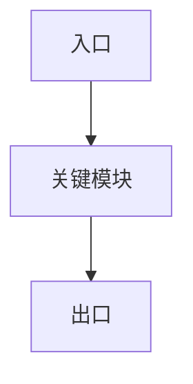

# /lore:sync

把代码合成进 wiki：每个 `config.yml` 的 `code_root` 产一页 `component/<name>.md`（「当前架构」段由你读源码写），再机械建 `INDEX.md` + `.manifest.json`。本版产 component + theme + flow 三轴页。

## 用法

- `/lore:sync` —— 在当前仓库根目录合成 wiki

## 行为（O1 两阶段）

本命令编排 `lib/sync.js`：

1. **plan**（机械）：
   ```bash
   node "${CLAUDE_PLUGIN_ROOT}/lib/sync.js" plan "$(pwd)/.lore"
   ```
   输出 worklist JSON：`{ codeRoots, worklist:[{component, codeRoot, path, priorExists}] }`。
   worklist 空 → 提示先 `/lore:init`（或编辑 `.lore/config.yml` 填 `code_roots`），停止。

2. **合成**（你来，逐 worklist 项）：读该 `codeRoot` 的实际源码，写 `.lore/wiki/<path>`，格式：
   ```markdown
   ---
   title: <组件显示名>
   summary: <一行语义摘要>
   ---
   # component: <name>

   ## Current architecture

   <先放一张 mermaid 架构图（flowchart：入口 / 关键模块 / 依赖方向，~5-15 节点），再写架构 prose：入口、关键模块、数据流、职责。非泛词。>

   ## Decision history

   {{LORE_JOURNAL}}

   ## Cross-links

   - [[<相关 sibling 组件>]]
   ```

对每个 `axis:'theme'` 的 worklist 项，写 `.lore/wiki/theme/<id>.md` —— 同 component 页结构，但讲「这条横切主线怎么演进」：

   ```markdown
   ---
   title: <主线显示名>
   summary: <一行摘要>
   ---
   # theme: <id>

   ## Current state

   <这条主线的当前状态/约束/为什么重要>

   ## Decision history

   {{LORE_JOURNAL}}

   ## Cross-links

   - [[<相关组件或主题>]]
   ```

   finalize 会把标了该 theme 的 journal 原子自动折进 `{{LORE_JOURNAL}}`（按 `facets.theme` 过滤）。

对每个 `axis:'flow'` 的 worklist 项，写 `.lore/wiki/flow/<id>.md` —— 讲「这条数据流端到端怎么跑」（入口 → 各阶段经过哪些组件 → 出口）：

   ```markdown
   ---
   title: <数据流显示名>
   summary: <一行摘要>
   ---
   # flow: <id>

   ## End-to-end path

   <先放一张 mermaid 数据流图（flowchart LR：入口 → 各阶段(组件) → 出口），再写 prose：关键转换/约束>

   ## Decision history

   {{LORE_JOURNAL}}

   ## Cross-links

   - [[<spans 里的组件>]]
   ```

   finalize 折标了该 flow 的原子（原子的 component ∈ flow 的 spans → 自动标）。

对 `axis:'HOME'` 的 worklist 项，写 `.lore/wiki/HOME.md` —— 全仓库的人读「认知入口」（不是目录；目录仍是 `INDEX`）。

   ### HOME page

   When the worklist contains `{ "axis": "HOME", "id": "HOME" }`, write `.lore/wiki/HOME.md` in this order:

   1. One-sentence repository positioning.
   2. `{{LORE_HOME_STATUS}}` on its own line.
   3. A `## Knowledge flow` section with a Mermaid diagram.
   4. A `## Understand the project` section with wikilinks.
   5. A `## Debug a problem` section with wikilinks.
   6. A `## Decisions and timeline` section with wikilinks.

   Do not write mechanical status values by hand; finalize replaces the `{{LORE_HOME_STATUS}}` token and refreshes it in place on every re-sync via a sentinel region.

3. **finalize**（机械）：
   ```bash
   node "${CLAUDE_PLUGIN_ROOT}/lib/sync.js" finalize "$(pwd)/.lore"
   ```
   盖机械 front-matter（`code_sha`/`last_updated`/`atoms`/`commits`）+ 建 `INDEX.md` + 写 `.manifest.json`。

## 给 agent 的提示

- 只写 `title` + `summary` 半 front-matter；**别手写 `code_sha`/计数/日期** —— finalize 自动盖。
- 「当前架构」段读真实源码写，别套泛词。
- 「决策历史」段写占位符 `{{LORE_JOURNAL}}` —— finalize 自动用 journal 原子机械填充（按 component facet 过滤、ts 倒序）。先跑 `/lore:mine` 让 journal 有料。
- 「交叉链接」段用 worklist 的全组件列表，链相关 sibling。
- 跑完提示 `/lore:serve` 浏览。
- theme 页讲横切主线（质量/性能/时效…）的演进，决策历史 token 自动折该 theme 的原子；先确保 config 的 `theme.values` 填了 + 跑过 `/lore:mine` 让原子带 theme facet。
- flow 页讲一条数据流端到端怎么跑（入口→阶段→出口）；先在 config 的 `flow.values` 用 `spans:[组件…]` 声明、跑过 `/lore:mine` 让原子带 flow facet。
- **docs 轴**（若 config 声明 `axes.docs`）由 finalize **机械生成**（读当前 `docs/**/*.md` + `CHANGELOG.md` + `CLAUDE.md` 踩坑 → `wiki/docs/<id>.md`，nuke-rebuild）。你（agent）**不用**写 docs 页。
- **出图**：component 页「Current architecture」顶部放一张 mermaid 架构图（入口/关键模块/依赖），flow 页「End-to-end path」顶部放数据流图（入口→各阶段(组件)→出口）。据真实代码画、~5-15 节点、保持可读；图是文本 → git 可 diff、随历史演进。坏语法不阻断页面但会丢该图；label 避免裸 `"`/`<`（壳已转义，简洁优先）。
- 零侵入：只写 `.lore/wiki/`，绝不改业务源码。

**出图速记**（component=架构图，flow=数据流图，各放该页首段顶部）：


