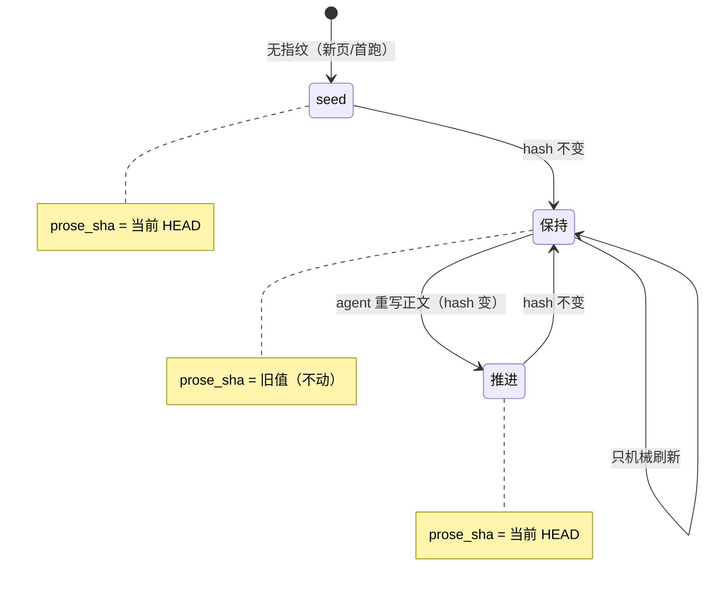

# GOLDEN PAGE 样例 —— component: sync

> 这是 lore「内容质量（C）」设计探索的 **golden page 标杆**，不是正式 wiki 页。
> 目的：把「**概览档 + 折叠机制档 + 代码锚点**」两档结构落成真实 markdown，作为 C 内容标准的具象。
> 对照物：现状 `.lore/wiki/component/lib.md` 里 `sync` 只得到「三步走 + 一句话」。
>
> 评判这页时请重点感受：① 概览档能不能让人 30 秒进入；② 机制档展开后够不够查 BUG/改代码；
> ③ 代码锚点 `file:line` 能不能一跳到源码；④ 同一页同时喂饱「想了解的人/agent」和「查 BUG 的人/agent」。

---

```markdown
---
title: sync —— 合成总装线
summary: plan 列工单 → agent 写正文 → finalize 机械盖章；prose 指纹让 stale 诚实、增量只重写动过的页
---
# component: sync

## 概览

**一句话**：`sync.js` 是引擎的**总装线调度员**——自己不生产零件，负责按顺序把 journal、源码、各模块的产出**拼装**成 wiki 页。

**它在流水线的位置**：

```mermaid
flowchart LR
  plan["plan 列工单<br/>机械·增量"] --> write["agent 写正文<br/>LLM·读源码"] --> finalize["finalize 盖章<br/>机械·零LLM"]
  finalize --> manifest[".manifest.json<br/>诚实 stale"]
  finalize --> graph[".graph.json<br/>agent 图谱"]
  finalize --> fp[".state/fingerprints.json<br/>prose 指纹"]
```

**两阶段为什么分开**：写正文要 LLM（贵、慢、有判断），盖章纯机械（决策史 / 计数 / stale）。
分开后，机械部分能在 commit 后**后台自动跑**（提交即刷新），prose 只按需增量重写——省钱省时。

**一个场景看懂「诚实 stale」**：

> 你改了 `lib/a.js` 一行、**没动**架构正文，commit。finalize 算这页正文的 hash → 和上次**一样**
> → `prose_sha` **保持旧值** → frontmatter `code_sha` 停在旧 sha → manifest 算出 `stale = 1`：
> **「这页正文落后 1 个 commit」**——诚实地提醒你「该重写正文了」。
> 反过来你重写了正文 → hash 变 → `prose_sha` 推到当前 → `stale` 归零。

想查 BUG 或改 sync？展开下面机制档 👇

## 机制详解

<details>
<summary><b>① 接口 / 能力面</b> —— 导出与签名</summary>

| 导出 | 签名 | 干什么 | 锚点 |
|---|---|---|---|
| `planSync` | `(loreDir, {all=false}) → {codeRoots,themes,flows,worklist}` | 列「要重写哪些页」（增量） | `lib/sync.js:17` |
| `finalizeSync` | `(loreDir, now, {warn}) → {stamped,indexWritten,manifestPath}` | 机械盖章总入口 | `lib/sync.js:172` |
| `foldJournal` | `(text, md, {page,warn}) → text` | 幂等重建决策史哨兵区 | `lib/sync.js:120` |
| `stampFrontmatter` | `(text, {codeSha,…}) → text` | 盖机械 frontmatter | `lib/sync.js:70` |

</details>

<details>
<summary><b>② finalize 数据流</b> —— 模块内 step-by-step</summary>

`finalizeSync`（`lib/sync.js:172-286`）顺序：

1. 读 journal → `foldAtoms` 去重 / 丢 amend·rebase orphan（`:178-180`）
2. 读旧指纹（`:185`），逐页：`foldJournal` 折决策史 → 对**折叠后文本**算 `proseHash` → `resolveProseSha` 定 `prose_sha` → `stampFrontmatter` 盖 `code_sha = prose_sha`（`:206-224`）
3. HOME 同走指纹逻辑（`:240-258`）；INDEX 纯机械、不进指纹（`:260-267`）
4. 写回指纹 + **GC 孤儿**（`nextFingerprints` 只装本轮处理过的页 → 已删页天然丢弃，`:269-270`）
5. 构造 `staleScopes`：component→`[code_root]`、flow→`spans` 各 root（`:272-280`）
6. `runManifestCli` 出 manifest + 写 `.graph.json`（`:282-284`）

</details>

<details>
<summary><b>③ 关键数据契约</b> —— 状态长什么样</summary>

`.state/fingerprints.json`：

```json
{ "component/sync.md": { "prose_hash": "sha256:…", "prose_sha": "3fbb170" } }
```

- `prose_hash` = `translationSourceHash(正文)`，**剥掉 frontmatter + 决策史哨兵区** → 只反映 agent 写的架构正文（`lib/fingerprint.js:13`）。改日期 / 决策史 / 状态块都不变它。
- `prose_sha` = 正文**上次重写**时的 HEAD；frontmatter `code_sha` 盖的就是它 → `stale = code_sha..HEAD 的 commit 数`（按 code_root scoped，`lib/manifest.js:93`）。

</details>

<details>
<summary><b>④ 指纹状态机</b> —— seed / 保持 / 推进</summary>

`resolveProseSha`（`lib/sync.js:187-193`）三态：



</details>

<details>
<summary><b>⑤ 边界 / 坑</b> —— 查 BUG 必看</summary>

- **对「折叠后」文本算 hash，不是读入文本**（`lib/sync.js:182-184`）：`{{LORE_JOURNAL}}` token ↔ 哨兵区形态在首次 finalize 跳变；若对读入文本算，seed 后第一次机械刷新会被误判成「正文变了」而错误推进 `prose_sha`。←（A 期实测发现的坑）
- **极速连续 commit**：两个 detached finalize 可能叠跑 → 幂等全量重建、最后写赢、无锁（YAGNI，spec 决策）。
- **坏 fingerprints JSON / 非 git**：`readFingerprints → {}`、`reachableShaSet → null` → 退化不崩。

</details>

## 依赖 / 邻居

- **依赖**：`fold` · `fingerprint` · `manifest` · `graph` · `journal` · `config` · `docs` · `home` · `i18n`
- **被调**：`/lore:sync` 命令 · `hook.js` 的 `maybeRefresh`（提交即 finalize）
- **相关页**：[[manifest]]（stale 计算）· [[fingerprint]]（指纹层）· [[hook]]（提交刷新）

## Decision history

{{LORE_JOURNAL}}

## Cross-links

- [[lib]]（鸟瞰页）· [[manifest]] · [[fingerprint]] · [[hook]]
```

---

## 这页示范了哪些 C 标准（对照检查表）

| C 维度 | 在本页的落点 |
|---|---|
| **两档深度** | 「概览」段（默认展开）+ 「机制详解」段（`<details>` 折叠）|
| **切换 = `<details>`** | 5 个机制小节各自折叠，点开即深挖，markdown 原生、壳零改 |
| **① 接口/能力面** | 机制档导出签名表 |
| **② 数据流（模块内）** | 概览主干图 + 机制档 finalize 6 步 |
| **③ 数据契约** | 机制档 fingerprints schema |
| **④ 设计意图（为什么）** | 概览「两阶段为什么分开」+ 场景串讲 + 决策史 token |
| **⑤ 依赖/邻居** | 末段 + graph 可遍历 |
| **代码锚点** | 全程 `lib/sync.js:NN` —— 人查 BUG / agent 精确定位都能一跳到源码 |
| **两层粒度** | 本页是 `sync` **深度页**；`lib` 留作**鸟瞰页**，钻取关系见 Cross-links |
